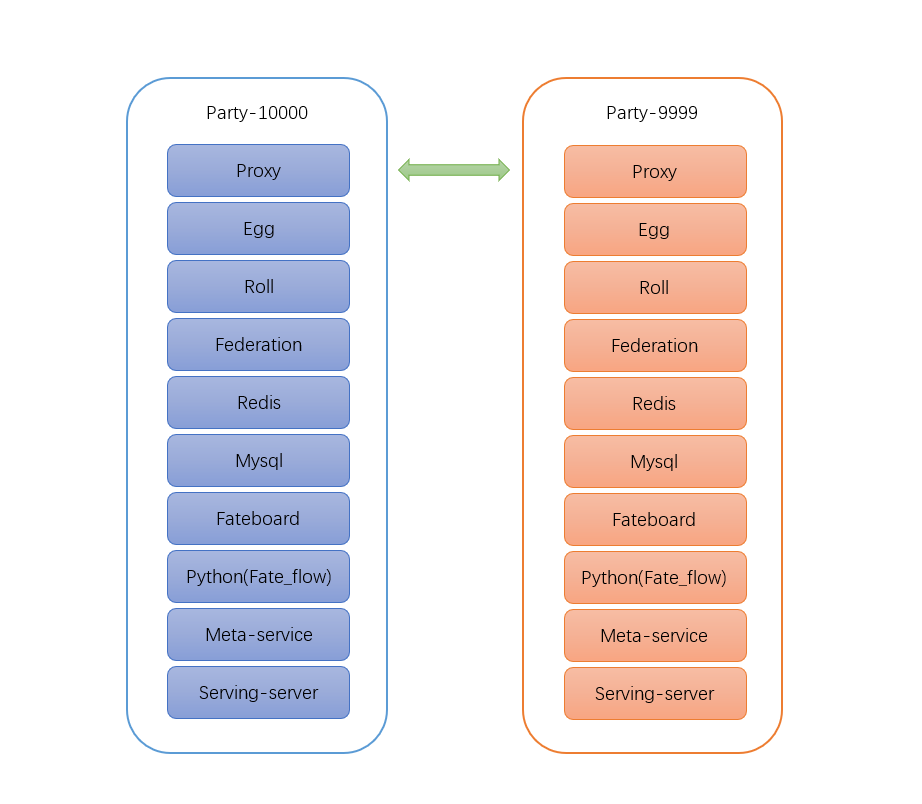

## 使用Docker Compose 部署 FATE

### 前言

[FATE](https://www.fedai.org/ )是一个联邦学习框架，能有效帮助多个机构在满足用户隐私保护、数据安全和政府法规的要求下，进行数据使用和建模。项目地址：（https://github.com/FederatedAI/FATE/） 本文档介绍使用Docker Compose部署FATE集群的方法。

### Docker Compose 简介

Compose是用于定义和运行多容器Docker应用程序的工具。通过Compose，您可以使用YAML文件来配置应用程序的服务。然后，使用一个命令，就可以从配置中创建并启动所有服务。要了解有关Compose的所有功能的更多信息，请参阅[相关文档](https://docs.docker.com/compose/#features)。

使用Docker compose 可以方便的部署FATE，下面是使用步骤。

### 目标

两个可以互通的FATE实例，每个实例均包括FATE所有组件。



### 准备工作

1. 三个主机（物理机或者虚拟机，一个部署机，两个运行机，都是Centos7系统）；
2. 所有主机安装Docker 版本 : 18+；
3. 所有主机安装Docker-Compose 版本: 1.24+；
4. 部署机可以联网，所以主机相互之间可以网络互通；
5. 运行机已经下载FATE 的各组件镜像（离线构建镜像参考文档[构建镜像](https://github.com/FederatedAI/FATE/tree/contributor_1.0_docker/docker-build)）。

如果运行机没有FATE组件的镜像，可以通过以下命令从Docker Hub获取镜像：

```bash
$ docker pull federatedai/egg:1.2.0-release
$ docker pull federatedai/fateboard:1.2.0-release
$ docker pull federatedai/meta-service:1.2.0-release
$ docker pull federatedai/python:1.2.0-release
$ docker pull federatedai/roll:1.2.0-release
$ docker pull federatedai/proxy:1.2.0-release
$ docker pull federatedai/federation:1.2.0-release
$ docker pull redis:5
$ docker pull mysql:8
```

检查所有镜像是否下载成功。
```bash
$ docker images
REPOSITORY                         TAG 
federatedai/egg                    1.2.0-release
federatedai/fateboard              1.2.0-release
federatedai/serving-server         1.2.0-release
federatedai/meta-service           1.2.0-release
federatedai/python                 1.2.0-release
federatedai/roll                   1.2.0-release
federatedai/proxy                  1.2.0-release
federatedai/federation             1.2.0-release
redis                              5
mysql                              8
```
### 下载部署脚本

在部署机器上下载合适的KubeFATE版本，可参考 [releases pages](https://github.com/FederatedAI/KubeFATE/releases)，然后解压到KubeFATE目录。


### 修改镜像配置文件

默认情况下，脚本在部署期间会从 [Docker Hub](https://hub.docker.com/search?q=federatedai&type=image)中下载镜像。

```bash
PREFIX=federatedai
TAG=1.2.0-release
```
我们这里采用从Docker Hub下载镜像。如果在运行机器上已经下载或导入了所需镜像，部署将会变得非常容易。

### 离线部署

当我们的运行机器处于无法连接外部网络的时候，就无法从Docker Hub下载镜像，建议使用[Harbor](https://goharbor.io/)作为本地镜像仓库。安装Harbor请参考[文档](https://github.com/FederatedAI/KubeFATE/blob/master/registry/install_harbor.md)。在`.env`文件中，将`RegistryURI`变量更改为Harbor的IP。如下面 192.168.10.1是Harbor IP的示例。
```bash
$ cd KubeFATE/
$ vi .env

...
RegistryURI=192.168.10.1/federatedai
...
```

### 用Docker Compose部署FATE

####  配置需要部署的实例数目

部署脚本提供了部署多个FATE实例的功能，下面的例子我们部署在两个机器上，每个机器运行一个FATE实例。根据需求修改配置文件`kubeFATE\docker-deploy\parties.conf`。

下面是修改好的文件，分别是在主机*192.168.7.1*上的节点`10000`和主机*192.168.7.2*上的`9999`。

```
user=root                             #运行机运行FATE实例的用户
dir=/data/projects/fate               #docker-compose部署目录
partylist=(10000 9999)                #组织id
partyiplist=(192.168.7.1 192.168.7.2) #id对应节点ip
exchangeip=192.168.7.1                      #通信组件标识
```

**注意**: 默认情况下，运行partylist中第一个party的主机会同时运行exchange组件，该组件的默认监听端口为9371

在运行部署脚本之前，需要确保部署机器可以ssh免密登录到两个运行节点主机上。user代表免密的用户。

#### 执行部署脚本

进入目录`kubeFATE\docker-deploy`，然后运行：

```bash
$ bash generate_config.sh          # 生成部署文件
$ bash docker_deploy.sh all        # 在各个party上部署FATE
```
脚本将会生成10000、9999两个组织（Party）和exchange的部署文件，然后打包成tar文件。接着把tar文件`confs-10000.tar`、`confs-9999.tar`和`confs-exchange.tar`分别复制到party对应的主机上并解包，解包后的文件默认在`/data/projects/fate`目录下。然后脚本将远程登录到这些主机并使用docker compose命令启动FATE实例。

命令成功执行返回后，登录其中任意一个主机：

```bash
$ ssh root@192.168.7.1
```

使用以下命令验证实例状态，

```bash
$ docker ps
````
输出显示如下，若各个组件都是运行（up）状态，说明部署成功。

```
CONTAINER ID        IMAGE                                 COMMAND                  CREATED             STATUS              PORTS                                 NAMES
f8ae11a882ba        fatetest/fateboard:1.2.0-release      "/bin/sh -c 'cd /dat…"   5 days ago          Up 5 days           0.0.0.0:8080->8080/tcp                confs-10000_fateboard_1
d72995355962        fatetest/python:1.2.0-release         "/bin/bash -c 'sourc…"   5 days ago          Up 5 days           9360/tcp, 9380/tcp                    confs-10000_python_1
dffc70fc68ac        fatetest/egg:1.2.0-release            "/bin/sh -c 'cd /dat…"   7 days ago          Up 7 days           7778/tcp, 7888/tcp, 50001-50004/tcp   confs-10000_egg_1
dc23d75692b0        fatetest/roll:1.2.0-release           "/bin/sh -c 'cd roll…"   7 days ago          Up 7 days           8011/tcp                              confs-10000_roll_1
7e52b1b06d1a        fatetest/meta-service:1.2.0-release   "/bin/sh -c 'java -c…"   7 days ago          Up 7 days           8590/tcp                              confs-10000_meta-service_1
50a6323f5cb8        fatetest/proxy:1.2.0-release          "/bin/sh -c 'cd /dat…"   7 days ago          Up 7 days           0.0.0.0:9370->9370/tcp                confs-10000_proxy_1
4526f8e57004        redis:5                               "docker-entrypoint.s…"   7 days ago          Up 7 days           6379/tcp                              confs-10000_redis_1
586f3f2fe191        fatetest/federation:1.2.0-release     "/bin/sh -c 'cd /dat…"   7 days ago          Up 7 days           9394/tcp                              confs-10000_federation_1
ec434dcbbff1        mysql:8                               "docker-entrypoint.s…"   7 days ago          Up 7 days           3306/tcp, 33060/tcp                   confs-10000_mysql_1
```

####  验证部署

docker-compose上的FATE启动成功之后需要验证各个服务是否都正常运行，我们可以通过验证toy_example示例来检测。

选择192.168.7.1这个节点验证，使用以下命令验证：

```bash
#在192.168.7.1上执行下列命令
$ docker exec -it confs-10000_python_1 bash     #进入python组件容器内部
$ cd /data/projects/fate/python/examples/toy_example               #toy_example目录
$ python run_toy_example.py 10000 9999 1        #验证
```

如果测试通过，屏幕将显示类似如下消息：

```
"2019-08-29 07:21:25,353 - secure_add_guest.py[line:96] - INFO: begin to init parameters of secure add example guest"
"2019-08-29 07:21:25,354 - secure_add_guest.py[line:99] - INFO: begin to make guest data"
"2019-08-29 07:21:26,225 - secure_add_guest.py[line:102] - INFO: split data into two random parts"
"2019-08-29 07:21:29,140 - secure_add_guest.py[line:105] - INFO: share one random part data to host"
"2019-08-29 07:21:29,237 - secure_add_guest.py[line:108] - INFO: get share of one random part data from host"
"2019-08-29 07:21:33,073 - secure_add_guest.py[line:111] - INFO: begin to get sum of guest and host"
"2019-08-29 07:21:33,920 - secure_add_guest.py[line:114] - INFO: receive host sum from guest"
"2019-08-29 07:21:34,118 - secure_add_guest.py[line:121] - INFO: success to calculate secure_sum, it is 2000.0000000000002"
```

有关测试结果的更多详细信息，请参阅"python/examples/toy_example/README.md"这个文件 。

### 删除部署

如果想要彻底删除在运行机器上部署的FATE，可以分别登录节点，然后运行命令：

```bash
$ cd ~/confs-<id>/  # <id> 组织的id，本例中代表10000或者9999
$ docker-compose down
$ rm -rf ../confs-<id>/               # 删除docker-compose部署文件
```

### 可能遇到的问题

1.运行

```bash
$ docker exec -it confs-10000_python_1 bash
```

进入docker容器后马上又弹出来了。

解决办法：稍等一会再尝试。

因为python服务依赖其他所有服务的正常运行，然而第一次启动的时候MySQL需要初始化数据库，python服务的容器会出现几次重启，当MySQL等其他服务都运行正常之后，就可以正常执行了。

2.采用docker hub下载镜像速度可能较慢。

解决办法：可以自己构建镜像，自己构建镜像参考[这里](https://github.com/FederatedAI/FATE/tree/master/docker-build)。

3.运行脚本`bash docker_deploy.sh all`的时候提示需要输入密码

解决办法：检查免密登陆是否正常。ps:直接输入对应主机的用户密码也可以继续运行。
