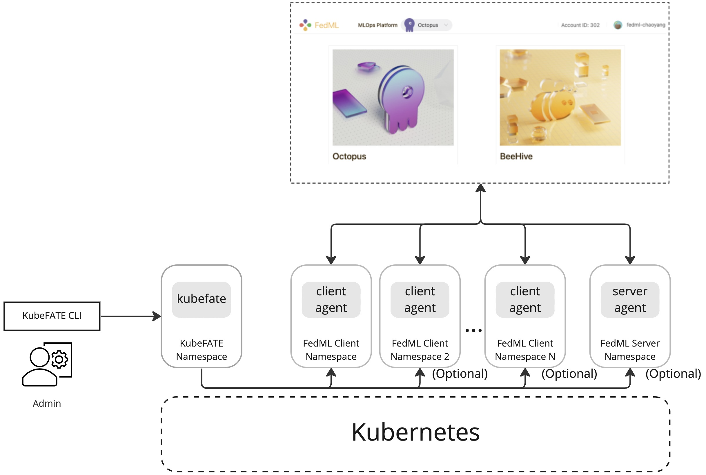

## Deploy FedML Agent to Kubernetes Clusters via KubeFATE

### Overview
This document provides guide on how to run FedML client and server agent on Kubernetes using KubeFATE. KubeFATE uses Helm charts to facilitate the deployment process, with which we can get all the benefits provided by Kubernetes natively. And it provides additional values including:

* Declarative deployment definitions for application installing and upgrading.
* Easy management via the KubeFATE CLI.
* Additional status check making sure the deployment is successful.
* Log aggregation for convenient debugging and monitoring.

The overall architecture for FedML with KubeFATE is shown in the below diagram

<div style="text-align:center">

</div>

The high-level steps are:

1. The user install KubeFATE service in the Kubernetes cluster.
2. The user install KubeFATE CLI program in the local machine.
3. The user define the FedML client deployment yaml and use KubeFATE to deploy it.
4. The FedML client will register to the FedML public cloud MLOps platform.
5. Optionally, the user can deploy more client instances and server instances in the same Kubernetes cluster.
6. The user can now use the MLOps platform to orchestrate federated learning trainings.

### Prerequisites

* A running Kubernetes cluster and permissions to create KubeFATE services and namespaces required by future deployments. For the permissions KubeFATE needs, check its [rbac yaml](https://github.com/FederatedAI/KubeFATE/blob/master/k8s-deploy/rbac-config.yaml) file.
* Basic knowledge of [FedML](https://github.com/FedML-AI/FedML) and [KubeFATE](https://github.com/FederatedAI/KubeFATE).

### Deploy KubeFATE Service and CLI
Download the KubeFATE "k8s" deployment package from the KubeFATE [release page](https://github.com/FederatedAI/KubeFATE/releases). Follow the KubeFATE K8s deploy guide ([service guide](https://github.com/FederatedAI/KubeFATE/blob/master/k8s-deploy/README.md), [cli guide](https://github.com/FederatedAI/KubeFATE/blob/master/docs/KubeFATE_CLI_user_guide.md)) to install KubeFATE service. For the service deployment, we can stop after the "Preparing domain name and deploying KubeFATE in Kubernetes" section. For the cli guide, we can stop after the "Verify the KubeFATE CLI works properly" section.

In general this includes the following steps:

1. Deploy KubeFATE service by applying the resources defined in the "rbac-config" and "kubefate" yaml files.
2. Make sure an ingress controller is deployed that can expose KubeFATE service. Otherwise we need to change the kubefate service type to NodePort or LoadBalancer to expose it.
3. Download and install the KubeFATE cli program and configure the local config yaml file to set the server address to the exposed KubeFATE service address.
4. Use `kubefate version` to verify the cli can work with the service.

### (Optional) Build and Upload FedML Charts
KubeFATE internally uses Helm chart to deploy FML application. By default, KubeFATE will download the FedML charts automatically from its GitHub repo. Alternatively, we can build the chart packages locally and upload them to KubeFATE service, which is useful in scenarios like air-gapped environment. To support deploying FedML client, use the following command to package and upload FedML client charts to the KubeFATE service:

```bash
$ helm package <REPO_ROOT>/helm-charts/FedML-Client
$ kubefate chart upload -f fedml-client-<version>.tgz
```

After uploading the chart, use the `kubefate chart list` command to verify the chart is successfully imported. The output should contain an item looks like

```bash
UUID                       NAME           	VERSION             	APPVERSION                   
<OTHERS OMITTED>                                
<some uuid>                fedml-client   	0.7.355             	release        
```

If we want to deploy the FedML server too, we need to package the server chart and use `kubefate chart upload -f fedml-server-<version>.tgz` to upload it.

### Deploy the FedML Edge Client
Prepare a yaml file, for example, "fedml_client.yaml", as below:

```yaml
name: edge-client-1
namespace: fedml-edge-client-1
chartName: fedml-client
chartVersion: 0.7.355
  # registry: ""
  # pullPolicy: IfNotPresent
  # imagePullSecrets:
# - name: myregistrykey
# ingressClassName: nginx
modules:
  - client

    # ingress:
    # client:
    # annotations: {}
    # hosts:
    # - host: chart-example.local
    #   paths:
    # - path: /
    #   pathType: ImplementationSpecific
    # tls:
    #  - secretName: chart-example-tls
    #    hosts:
  #      - chart-example.local

client:
  fedmlAccountId: <your account id>
    # fedmlVersion: "release"
    # fedmlClientOsName: "Linux"
    # replicaCount: 1
    # volume:
    # clientHomeDirHostPath: "/home/fedml-client"
    # clientHomeDirMountPath: "/home/fedml/fedml-client"
    # nameOverride: ""
    # fullnameOverride: ""
    # serviceAccount:
    # create: true
    # annotations: {}
    # name: ""
    # type: ClusterIP
    # port: 9988
    # podAnnotations:
    # nodeSelector:
    # tolerations:
    # affinity:
    # resources:
    # autoscaling:
    # enabled: false
    # minReplicas: 1
    # maxReplicas: 10
    # targetCPUUtilizationPercentage: 80
    # targetMemoryUtilizationPercentage: 80
    # podSecurityContext: {}
    # fsGroup: 2000
    # securityContext: { }
    # capabilities:
    #   drop:
    #   - ALL
    # readOnlyRootFilesystem: true
    # runAsNonRoot: true
  # runAsUser: 1000
```

The layout of the file is the typically called the "cluster yaml" for KubeFATE. You can change the name and namespace fields according to your needs. And the `fedmlAccountId` id field should be set to your account id in the FedML MLOps platform. For the meanings of the other fields, please refer to the helm chart values file. Typically, we don’t need to change the default settings.

And, if the Kubernetes namespace doesn't exist, we need to create it beforehand:
```bash
$ kubectl create ns <your namespace>
```

Now we can install the above defined FedML client:

```bash
$ kubefate cluster install -f fedml_client.yaml
```

The above command will give a `job_UUID` we can use to check the status:

```bash
# View deployment status
$ kubefate job describe ${job_UUID}
```

When the job status is `Success`, it indicates that the deployment succeeded. Login to your MLOps account and the client should be listed under the "Edge Device" page.

#### Check Deployed Client Status

After the deployment, we can use the follow command to get the UUID of the deployed instance:

```bash
$ kubefate cluster list
```

Locate the UUID of the "cluster" and then we can get the detailed status of it by:

```bash
$ kubefate cluster describe <UUID>
```

And check the logs of this instance:
```bash
$ kubefate cluster logs <UUID>
```

The `logs` subcommand can be useful during the future training process.

### (Optional) Deploy FedML Server

We can optionally deploy FedML server instance that can be used in a FedML "Run". As described above, we can optionally package and upload the FedML server chart. And then we prepare the "cluster yaml" for server deployment as:

```yaml
name: edge-server-1
namespace: fedml-edge-server-1
chartName: fedml-server
chartVersion: 0.7.355
  # registry: ""
  # pullPolicy: IfNotPresent
  # imagePullSecrets:
# - name: myregistrykey
# ingressClassName: nginx
modules:
  - server

    # ingress:
    # server:
    # annotations: {}
    # hosts:
    # - host: chart-example.local
    #   paths:
    # - path: /
    #   pathType: ImplementationSpecific
    # tls:
    #  - secretName: chart-example-tls
    #    hosts:
  #      - chart-example.local

server:
  fedmlAccountId: <your account id>
    # fedmlVersion: "release"
    # fedmlServerOsName: "Linux"
    # replicaCount: 1
    # volume:
    # serverHomeDirHostPath: "/home/fedml-server"
    # serverHomeDirMountPath: "/home/fedml/fedml-server"
    # nameOverride: ""
    # fullnameOverride: ""
    # serviceAccount:
    # create: true
    # annotations: {}
    # name: ""
    # type: ClusterIP
    # port: 9999
    # podAnnotations:
    # nodeSelector:
    # tolerations:
    # affinity:
    # resources:
    # autoscaling:
    # enabled: false
    # minReplicas: 1
    # maxReplicas: 10
    # targetCPUUtilizationPercentage: 80
    # targetMemoryUtilizationPercentage: 80
    # podSecurityContext: {}
    # fsGroup: 2000
    # securityContext: { }
    # capabilities:
    #   drop:
    #   - ALL
    # readOnlyRootFilesystem: true
    # runAsNonRoot: true
  # runAsUser: 1000
```

The configurable parameters are almost the same as the client deployment. And we can use the same `kubefate chart install`, `kubefate cluster describe`, `kubefate cluster logs` commands to check its status.

After it has been successfully deployed, we can choose this server instance when creating new FedML "Run"s.

### Next Steps

We can follow same steps to deploy FedML clients and servers to other namespaces in same Kubernetes cluster, or to other Kubernetes clusters (which requires installing KubeFATE in those clusters too). Once we and our collaborators have deployed all the instances we need, we can start FedML training in the MLOps platform. This can be done by following the MLOps platform's [official document](https://open.fedml.ai/octopus/userGuides/index). We can now skip the "2. Install FedML Agent: fedml login $account_id" section as now we have used KubeFATE to achieve that.
