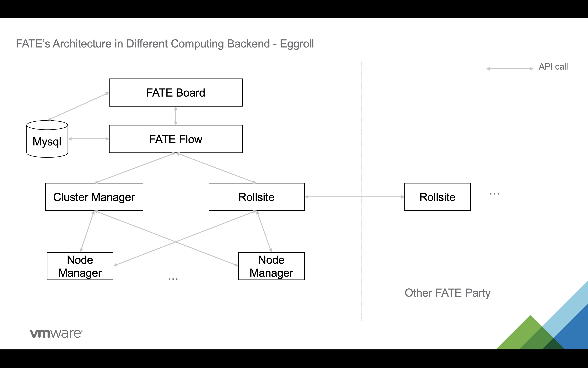
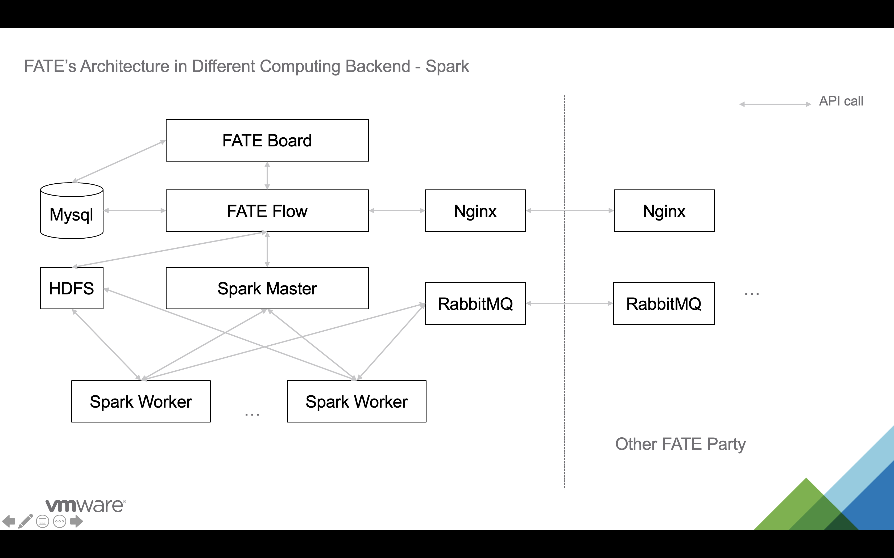

# Overview

Originally, the FATE use the underlying [EggRoll]("https://github.com/WeBankFinTech/eggroll") as the underlying computing engine, the
following picture illustrates the overview architecture.

<div align="center">
  
</div>

As the above figure show, the EggRoll provide both computing and storage resource. However it will be little different while using different backend.

In FATE v1.5.0 a user can select Spark as the underlying computing engine, however, spark
it self is a in-memory computing engine without the ability to persist data. Thus to use FATE on Spark a HDFS is also needed to be included to provide persistence capability. For example, a user need to upload their data to HDFS through FATE before further processing; the output data of every component will be also stored to the HDFS.

**Currently the verifed Spark version is [2.4.1](https://archive.apache.org/dist/spark/spark-2.4.1/spark-2.4.1-bin-hadoop2.7.tgz) and the Hadoop is [2.7.4](https://archive.apache.org/dist/hadoop/common/hadoop-2.7.4/hadoop-2.7.4.tar.gz)**

The following picture shows the architecture of FATE on Spark:
<div align="center">
  
</div> 

In current implementation, the `fate_flow` service uses the `spark-submit` binary tool to submit job to the Spark cluster. With the configuration of the fate's job, a user can also specify the configuration for the spark application, here is an example:
```
{
  "initiator": {
    "role": "guest",
    "party_id": 10000
  },
  "job_parameters": {
    "spark_run": {
      "executor-memory": "4G",
      "total-executor-cores": 4
    },
    ...
```

The above configuration limit the maximum memory and the cores that can be used by the executors. For more about the supported "spark_run" parameters please refer to this [page](https://spark.apache.org/docs/latest/submitting-applications.html)