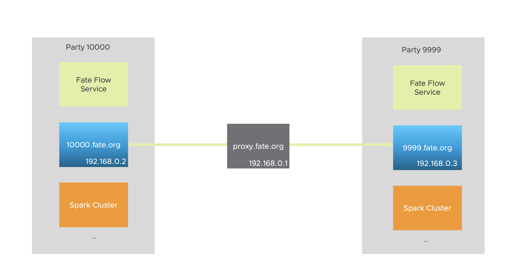

# FATE On Spark With Pulsar

## Overview

FATE supports using [Spark](https://spark.apache.org/) as a computing engine since v1.5.0 Along with Spark, it also requires HDFS and RabbitMQ as storage and transmission service respectively, to compose a functional FATE cluster. In v1.6.0, the FATE also supports to use [Pulsar](https://pulsar.apache.org/admin-rest-api/?version=2.7.0&apiversion=v2#tag/clusters) as the transmission engine, a user can switch the transmission engine easily. Ideally, the Pulsar provides better throughput and scalability, more importantly, organizations can compose FATE clusters of star network using Pulsar. The overall architecture of "FATE on Spark with Pulsar" is as the following diagram:

<div style="text-align:center", align=center>

</div>

## Configuration and Usage

### Update Config of the FATE Flow service
For more details of the Pulsar Deployment, a user can refer to this [Deployment Guide](https://github.com/FederatedAI/FATE/blob/develop-1.6/cluster-deploy/doc/fate_on_spark/pulsar_deployment_guide.md). After the Pulsar cluster is running, a user needs to update the configuration of the "fate flow" service. The update splits into two parts. They are:

- "conf/service_conf.yaml" 
``` yml
...
  hdfs:
    name_node: hdfs://fate-cluster
    # default /
    path_prefix:
  pulsar:
    host: 192.168.0.1
    port: 6650
    mng_port: 8080
    # default conf/pulsar_route_table.yaml
    route_table:
  nginx:
    host: 127.0.0.1
    http_port: 9300
    grpc_port: 9310
...
```

Where `pulsar.host` fills in the IP or domain name of the Pulsar broker, `pulsar.port` and `pulsar.mng_port` fill in the broker’s "brokerServicePort" and "webServicePort" respectively.

- "conf/pulsar_route_table.yaml"
``` yml
9999:
  # host can be a domain like 9999.fate.org
  host: 192.168.0.4
  port: 6650
  sslPort: 6651
  # set proxy address for this pulsar cluster
  proxy: ""

10000:
  # host can be a domain like 10000.fate.org
  host: 192.168.0.3
  port: 6650
  sslPort: 6651
  proxy: ""

default:
  # compose host and proxy for the party that does not exist in the routing table
  # in this example, the host for party 8888 will be 8888.fate.org
  proxy: "proxy.fate.org:443"
  domain: "fate.org"
  port: 6650
  sslPort: 6651
```

In this file, a user needs to fill in the address of each participant's pulsar service. For point-to-point deployment, only the Pulsar's `host` and `port` are required. The `proxy`, `sslPort`, and `default` fields are used to support star network deployment, which requires work with SSL certificates. For more details, please refer to the star network deployment below.

### Submit Job Using Pulsar

When submitting a task, the user can declare in the config file to use Pulsar as a transmission service. An example is as follows:
``` json
   "job_parameters": {
     "common": {
       "job_type": "train",
       "spark_run": {
         "num-executors": 1,
         "executor-cores": 2
       },
       "pulsar_run": {
         "producer": {
            ...
         },
         "consumer": {
            ...
         }
       }
     }
   }
```

In above configuration, the `backend: 2` specifies the use of Pulsar as the transmission service. In `pulsar_run`, a user can also specify the parameters when creating "producer" and "consumer". 

Generally, there is no need to set such a configuration. As for the available parameters, please refer to the [`create_producer`](https://pulsar.apache.org/api/python/2.7.0-SNAPSHOT/#pulsar.Client.create_producer) and [`subscribe`](https://pulsar.apache.org/api/python/2.7.0-SNAPSHOT/#pulsar.Client.subscribe) methods in the Pulsar python client.

## Deployment of Star Network

Using Pulsar as a transmission engine can support star deployment. Its central node is an SNI (Server Name Indication) proxy. The `SNI` proxy process is as follows:

1. The client sends a TLS Client Hello request to the proxy server, with the SNI field in the request, which declares the domain name or hostname of the remote server that the client wants to connect to.
2. The proxy server establishes a TCP tunnel with the remote server according to the SNI field and its routing information and forwards the client's TLS Hello.
3. The remote server sends a TLS Server Hello to the client and then completes the TLS handshake.
4. The TCP link is established and the client and remote server communicate normally.

### Details of the Deployment

Next, we will create a federated learning network based on the SNI proxy model. Since certificates are required, a user can unify domain name suffix for this network, such as "fate.org". In this way, each entity in the network can be identified by `${party_id}.fate.org`. For example, the CN of the certificate used by party 10000 is "10000.fate.org".

#### Deployment Plan
Host | IP | OS | Application | Service
--- | --- | --- | --- | --- |
proxy.fate.org | 192.168.0.1 | CentOS 7.2/Ubuntu 16.04 | ats | ats
10000.fate.org | 192.168.0.2 | CentOS 7.2/Ubuntu 16.04 | pulsar | pulsar
9999.fate.org | 192.168.0.3  | CentOS 7.2/Ubuntu 16.04 | pulsar | pulsar

The architecture is shown in the following diagram. The Pulsar service "10000.fate.org" belongs to the organization with ID 10000, and the pulsar service "9999.fate.org" belongs to the organization with ID 9999, and "proxy.fate.org" is ats Service is the center of the star network.

<div style="text-align:center", align=center>

</div>

#### Certificate Generation

Since the SNI proxy is based on TLS, it is necessary to configure the certificate for the ATS and Pulsar services.

##### Generate CA's Certificate

Enter the following command to create a directory for the CA, and put the openssl configuration file in the directory.

``` bash
$ mkdir my-ca
$ cd my-ca
$ wget https://raw.githubusercontent.com/apache/pulsar/master/site2/website/static/examples/openssl.cnf
$ export CA_HOME=$(pwd)
```

Enter the following commands to create the necessary directories, keys, and certificates.

``` bash
$ mkdir certs crl newcerts private
$ chmod 700 private/
$ openssl genrsa -aes256 -out private/ca.key.pem 4096
$ touch index.txt
$ echo 1000 > serial
$ chmod 400 private/ca.key.pem
$ openssl req -config openssl.cnf -key private/ca.key.pem \
    -new -x509 -days 7300 -sha256 -extensions v3_ca \
    -out certs/ca.cert.pem
$ chmod 444 certs/ca.cert.pem
```

Once the above commands are completed, the CA-related certificates and keys have been generated, they are:

- certs/ca.cert.pem   the certification of CA
- private/ca.key.pem  the key of CA

##### Generate a certificate for "10000.fate.org"

1. Create the directory

```
$ mkdir 10000.fate.org
```

2. Generate private key

```
$ openssl genrsa -out 10000.fate.org/broker.key.pem 2048
```

3. Transform format

```
$ openssl pkcs8 -topk8 -inform PEM -outform PEM \
      -in 10000.fate.org/broker.key.pem -out 10000.fate.org/broker.key-pk8.pem -nocrypt
```

4. Enter the following commands to generate a certificate request, where the `common name` is set to "10000.fate.org"
```
$ openssl req -config openssl.cnf \
    -key 10000.fate.org/broker.key.pem -new -sha256 -out 10000.fate.org/broker.csr.pem
```

5. Enter the following commands to sign the certificate with CA's private key

```
$ openssl ca -config openssl.cnf -extensions server_cert \
    -days 1000 -notext -md sha256 \
    -in 10000.fate.org/broker.csr.pem -out 10000.fate.org/broker.cert.pem
```

At this time, the certificate "broker.cert.pem" and a key "broker.key-pk8.pem" are stored in the "10000.fate.org" directory.

##### Generate a certificate for "9999.fate.org"

The generation of the "9999.fate.org" certificate is consistent with the above steps, however, the Common Name in the step 4 is "9999.fate.org".

The following operation assume that the certificate of "9999.fate.org" has been generated.

##### Generate a certificate for "proxy.fate.org"
The generation of the "proxy.fate.org" certificate is the same as the above steps, the conversion in step 3 can be omitted, and the Common Name in step 4 is "proxy.fate.org".

The following operation assume that the certificate of "proxy.fate.org" has been generated.

#### Deploy Apache Traffic Server

##### Install Apache Traffic Server

1. Log in to the "proxy.fate.org" host and prepare the dependencies according to this [document](https://github.com/apache/trafficserver/tree/9.0.0).

2. Download

``` bash
$ wget https://apache.claz.org/trafficserver/trafficserver-9.0.0.tar.bz2
```

3. Install

``` bash
$ mkdir /opt/ts
$ tar xf trafficserver-9.0.0.tar.bz2
$ cd trafficserver-9.0.0
$ ./configure --prefix /opt/ts
$ make                   
$ make install
$ echo 'export LD_LIBRARY_PATH=$LD_LIBRARY_PATH:/opt/ts/lib' >> ~/.profile
$ source ~/.profile
```

Once the processes were finished, the traffic server will be installed in the "/opt/ts" directory and the configuration file path is "/opt/ts/etc/trafficserver/".

##### Start Apache Traffic Server

1. Configure the ATS

 - /opt/ts/etc/trafficserver/records.config
 ```
 CONFIG proxy.config.http.cache.http INT 0
 CONFIG proxy.config.reverse_proxy.enabled INT 0
 CONFIG proxy.config.url_remap.remap_required INT 0
 CONFIG proxy.config.url_remap.pristine_host_hdr INT 0
 CONFIG proxy.config.http.response_server_enabled INT 0

 CONFIG proxy.config.http.server_ports STRING 8080 8080:ipv6 443:ssl

 CONFIG proxy.config.http.connect_ports STRING 443 6650-6660

 CONFIG proxy.config.ssl.CA.cert.filename STRING ca.cert.pem
 CONFIG proxy.config.ssl.CA.cert.path STRING /opt/proxy

 CONFIG proxy.config.ssl.server.cert.path STRING /opt/proxy
 ```
 - /opt/ts/etc/trafficserver/ssl_multicert.config
 ```
 dest_ip=* ssl_cert_name=proxy.cert.pem ssl_key_name=proxy.key.pem
 ```
 - /opt/ts/etc/trafficserver/sni.config This is a routing table, and the Proxy will forward the client's request to the address specified by "tunnel_route".

 ``` bash
 sni:
  - fqdn: 10000.fate.org
    tunnel_route: 192.168.0.2:6651
  - fqdn: 9999.fate.org
    tunnel_route: 192.168.0.3:6651
 ```
 
 For a more details of the configurations, please refer to the official [documents](https://docs.trafficserver.apache.org/en/9.0.x/admin-guide/configuring-traffic-server.en.html).
 
 2. Start the service
 
Copy the certificate, private key, and CA certificate generated for ATS in the previous steps (under the "proxy.fate.org" directory) to the host's "/opt/proxy" directory, and use the following command to start ATS:

``` bash
/opt/ts/bin/trafficserver start
```

#### Deploy Pulsar

 The details of how Pulsar deploy can be find in [pulsar_deployment_guide.md](https://github.com/FederatedAI/FATE/blob/develop-1.6-pulsar/cluster-deploy/doc/fate_on_spark/pulsar_deployment_guide.md). A user only need to add a certificate for the broker and open the security service port. The specific operations are as follows:
1. Log in to the corresponding host and copy the certificate, private key, and CA certificate generated for 10000.fate.org to the "/opt/pulsar/certs" directory
2. Modify the conf/standalone.conf file in the pulsar installation directory and append the following content

``` bash
brokerServicePortTls=6651
webServicePortTls=8081
tlsEnabled=true
tlsAllowInsecureConnection=true
tlsCertificateFilePath=/opt/pulsar/certs/broker.cert.pem
tlsKeyFilePath=/opt/pulsar/certs/broker.key-pk8.pem
tlsTrustCertsFilePath=/opt/pulsar/certs/ca.cert.pem
bookkeeperTLSTrustCertsFilePath=/opt/pulsar/certs/ca.cert.pem
```

3. Start Pulsar Cluster

``` bash
$ pulsar standalone -nss
```

Start the Pulsar on the host 9999.fate.org with the same procedure.


#### Update FATE's Route Table

- Update the "default" field in `conf/pulsar_route_table.yaml` of 10000 as follows:

``` yml
10000:
  host: 192.168.0.2
  port: 6650

default:
  proxy: "proxy.fate.org:443"
  domain: "fate.org"
```

- Update the "default" field in `conf/pulsar_route_table.yaml` of 9999 as follows:

``` yml
9999:
  host: 192.168.0.3
  port: 6650

default:
  proxy: "proxy.fate.org:443"
  domain: "fate.org"

```

FATE will fill in the host and proxy parameters of the cluster according to the content of the "default" field. For example, the Pulsar cluster used for synchronization with party 9999 is as follow:

``` json

{
  "serviceUrl" : "",
  "serviceUrlTls" : "",
  "brokerServiceUrl" : "pulsar://9999.fate.org:6650",
  "brokerServiceUrlTls" : "pulsar+ssl://9999.fate.org:6651",
  "proxyServiceUrl" : "pulsar+ssl://proxy.fate.org:443",
  "proxyProtocol" : "SNI",
  "peerClusterNames" : [ ]
}
```

At this point, the star deployment of FATE with Pulsar is complete. If a user needs to add more participants, it can be done by issuing a new certificate for the participants and updating the routing table.
