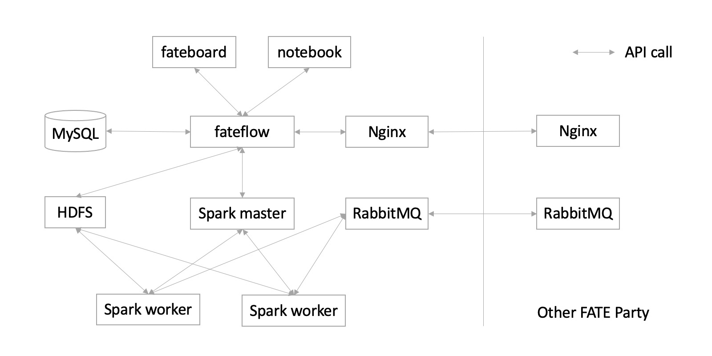

# KubeFATE 部署FATE支持后端介绍

FATE支持的计算引擎eggroll和spark

## 支持后端

FATE支持选择不同的计算引擎，存储引擎和数据传输引擎，现在KubeFATE支持快捷的部署不同引擎组合的FATE集群。

目前支持的组合包括以下几种：

- Eggroll
- Spark + hdfs + RabbitMQ
- Spark + hdfs + Pulsar
- Spark-local + localfs + Pulsar

### Eggroll

Eggroll是FATE支持计算存储引擎，包括rollsite，nodemanager，clustermanager三个组件

rollsite负责数据传输，nodemanager负责存储和计算，clustermanager负责管理。

docker-compose使用的时候修改`parties.conf`配置

```bash
backend=eggroll
```

k8s使用的时候修改`cluster.yaml`配置

```yaml
backend: eggroll
```

架构图：

<div align="center">
  
</div>

### spark_rabbitmq

当backend使用spark_rabbitmq的时候，会部署spark + hdfs + rabbitmq的引擎组合的FATE集群。

spark是计算组件，hdfs是存储组件，rabbitmq是数据传输组件。

docker-compose使用的时候修改`parties.conf`配置

```bash
backend=spark_rabbitmq
```

k8s使用的时候修改`cluster.yaml`配置

```yaml
backend: spark_rabbitmq
```

架构图：

<div align="center">
  
</div>

### spark_pulsar

当backend使用spark_pulsar的时候，会部署Spark + Hdfs + Pulsar的引擎组合的FATE集群。

Spark是计算组件，Hdfs是存储组件，Pulsar是数据传输组件。

docker-compose使用的时候修改`parties.conf`配置

```bash
backend=spark_pulsar
```

k8s使用的时候修改`cluster.yaml`配置

```yaml
backend: spark_pulsar
```

架构图：

<div align="center">
  
</div>

### spark_local_pulsar (slim FATE)

当backend使用spark_local_pulsar的时候，会部署一个slim的FATE集群。所有的计算和存储部分都在一起，通过Spark local和localfs来实现，数据传输是通过Pulsar完成。

Spark local是计算组件，localfs是存储组件，Pulsar是数据传输组件。

docker-compose使用的时候修改`parties.conf`配置

```bash
backend=spark_local_pulsar
```

k8s使用的时候修改`cluster.yaml`配置

```yaml
backend: spark_local_pulsar
```

架构图：

<div align="center">
  
</div>

## Exchange架构模式

当使用rollsite和Pulsar传输数据的时候，可以使用Exchange的架构来部署联邦学习网络。

也就是说backend是eggroll、spark_pulsar和spark_local_pulsar三种模式的时候可以支持Exchange的使用。

**rollsite只能和其他rollsite的FATE通过exchange链接，Pulsar也只能和其他Pulsar的FATE通过exchange链接。**


参考文档：

- [使用KubeFATE部署一个多成员参与的联邦学习网络](https://github.com/FederatedAI/KubeFATE/wiki/%E4%BD%BF%E7%94%A8KubeFATE%E9%83%A8%E7%BD%B2%E4%B8%80%E4%B8%AA%E5%A4%9A%E6%88%90%E5%91%98%E5%8F%82%E4%B8%8E%E7%9A%84%E8%81%94%E9%82%A6%E5%AD%A6%E4%B9%A0%E7%BD%91%E7%BB%9C)
