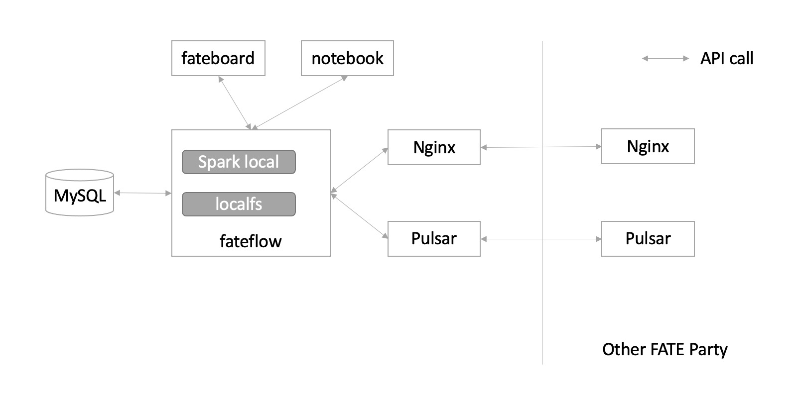

# Introducing KubeFATE to deploy FATE supported engines

FATE supports two computing engines: eggroll and spark

## Supported engine

FATE supports multiple computing engines, storage engines and federation engines, and KubeFATE supports quick deployment of FATE clusters with different combination of engines.

List of supported engine combinations:

- **Eggroll**
- **Spark + hdfs + RabbitMQ**
- **Spark + hdfs + Pulsar**
- **Spark-local + localfs + Pulsar**

### Eggroll

Eggroll is a computing storage engine natively supported by FATE, including three components: rollsite, nodemanager, and clustermanager.

Rollsite is responsible for data transmission, nodemanager is responsible for storage and computing, and clustermanager is responsible for managing nodemanager.

Modify the `parties.conf` configuration when using docker-compose:

```bash
computing=Eggroll
federation=Eggroll
storage=Eggroll
```

Modify the `cluster.yaml` configuration when using Kubernetes:

```yaml
computing: Eggroll
federation: Eggroll
storage: Eggroll
```

Architecture diagram:

<div align="center">
  
</div>

To enabled TLS for the eggroll federation between different FATE parties, check this [doc](/docs/Eggroll_with_TLS.md).

### spark_rabbitmq

spark_rabbitmq, a FATE cluster of spark + hdfs + rabbitmq engine combination will be deployed.

spark is the computing component, hdfs is the storage component, rabbitmq is the federation component.

Modify the `parties.conf` configuration when using docker-compose:

```bash
computing=Spark
federation=RabbitMQ
storage=HDFS
```

Modify the `cluster.yaml` configuration when using Kubernetes:

```yaml
computing: Spark
federation: RabbitMQ
storage: HDFS
```

Architecture diagram:

<div align="center">
  
</div>

### spark_pulsar

spark_pulsar, it will deploy a FATE cluster of Spark + Hdfs + Pulsar engine combination.

Spark is the computing component, Hdfs is the storage component, and Pulsar is the federation component.

Modify the `parties.conf` configuration when using docker-compose:

```bash
computing=Spark
federation=Pulsar
storage=HDFS
```

Modify the `cluster.yaml` configuration when using Kubernetes:

```yaml
computing: Spark
federation: Pulsar
storage: HDFS
```

Architecture diagram:

<div align="center">
  
</div>

### spark_local_pulsar (slim FATE)

spark_local_pulsar, a slim FATE cluster is deployed. All computing and storage parts are together, implemented through Spark local and localfs, and data transfer is done through Pulsar.

Spark local is the computing component, localfs is the storage component, and Pulsar is the federation component.

Modify the `parties.conf` configuration when using docker-compose:

```bash
computing=Spark_local
federation=Pulsar
storage=LocalFS
```

Modify the `cluster.yaml` configuration when using Kubernetes:

```yaml
computing: Spark_local
federation: Pulsar
storage: LocalFS
```

Architecture diagram:

<div align="center">
  
</div>

## Comparison of different engines

Eggroll can be used as FATE's computing, storage and transmission engine. Eggroll is a simple and high-performance [federation] machine learning computing framework that supports multiple federated network architectures: straight-chain mode, star and ring, etc. Eggroll also supports being used between different organizations with TLS, Eggroll is an open source project on github owned by WeBank.
repository: <https://github.com/WeBankFinTech/eggroll.git>

Rabbitmq is a simple and easy-to-use Message Queue. It has a long history and is supported on many cloud platform. It is suitable for FATE with Spark as the computing engine.

Compared with Rabbitmq, Pulsar can support large-scale cluster deployment, so it is suitable for larger-scale federated learning. This mode also supports "star mode" (deployment with FATE-Exchange).

Compared with other modes, spark_local_pulsar can use this mode to minimize the number of components required for the cluster. It can also run FATE clusters with less resources, and can be used in small-scale federated learning, on IOT devices, etc.

## Exchange Architecture

When using the rollsite or Pulsar architecture, a federated learning framework can be deployed using FATE-Exchange.

That is to say, when the federation is Eggroll and Pulsar, it can support the use of Exchange.

**Through FATE-Exchange, rollsite parties can only do FML with other rollsite parties, and Pulsar parties can only do FML with other Pulsar parties.**

Reference:

- [Deploy an exchange central multi parties federated learning network with KubeFATE](https://github.com/FederatedAI/KubeFATE/wiki/Deploy-an-exchange-central-multi-parties-federated-learning-network-with-KubeFATE)
