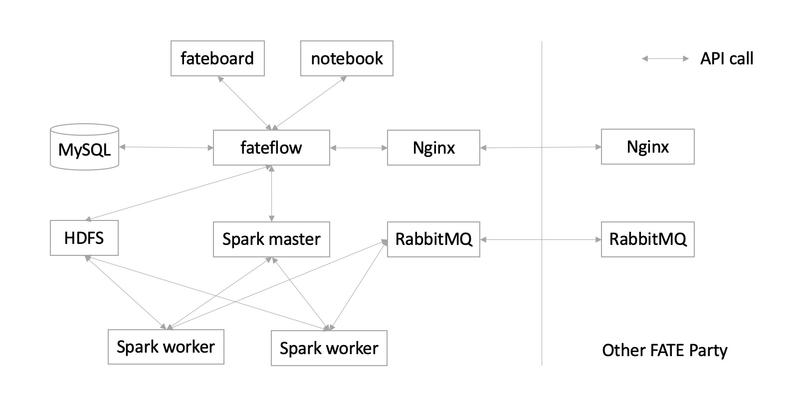
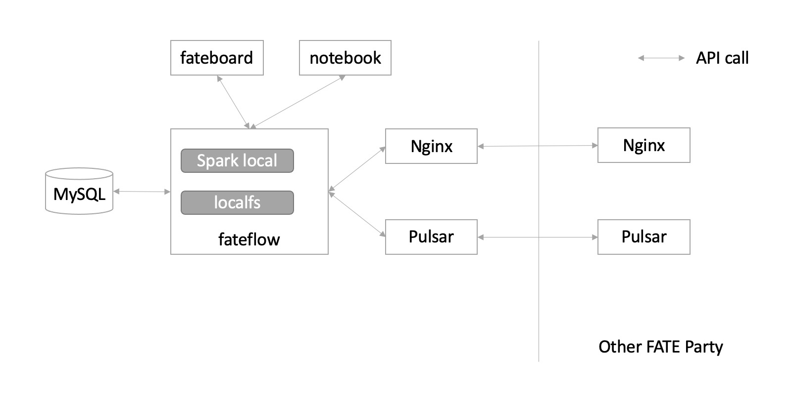

# KubeFATE 部署FATE支持引擎介绍

FATE支持eggroll和spark两种计算引擎

## 支持引擎组合

FATE支持选择不同的计算引擎，存储引擎和数据传输引擎，现在KubeFATE支持快捷的部署不同引擎组合的FATE集群。

目前支持的组合包括以下几种：

- **Eggroll**
- **Spark + HDFS + RabbitMQ**
- **Spark + HDFS + Pulsar**
- **Spark-local + LocalFS + Pulsar**
- **Spark-local + LocalFS + RabbitMQ**

### Eggroll

Eggroll是FATE原生支持的计算存储引擎，包括了rollsite，nodemanager，clustermanager三个组件

rollsite负责数据传输，nodemanager负责存储和计算，clustermanager负责管理nodemanager。

docker-compose使用的时候修改`parties.conf`配置

```bash
computing=Eggroll
federation=Eggroll
storage=Eggroll
```

***当使用Eggroll计算引擎的时候，federation和storage也必须是Eggroll***

k8s使用的时候修改`cluster.yaml`配置

```yaml
computing: Eggroll
federation: Eggroll
storage: Eggroll
```

架构图：

<div align="center">
  
</div>

### spark_rabbitmq

当使用Spark + HDFS + RabbitMQ的时候，会部署Spark + HDFS + RabbitMQ的引擎组合的FATE集群。

spark是计算组件，HDFS是存储组件，RabbitMQ是数据传输组件。

docker-compose使用的时候修改`parties.conf`配置

```bash
computing=Spark
federation=RabbitMQ
storage=HDFS
```

k8s使用的时候修改`cluster.yaml`配置

```yaml
computing: Spark
federation: RabbitMQ
storage: HDFS
```

架构图：

<div align="center">
  
</div>

### spark_pulsar

当使用Spark + HDFS + Pulsar的时候，会部署Spark + HDFS + Pulsar的引擎组合的FATE集群。

Spark是计算组件，HDFS是存储组件，Pulsar是数据传输组件。

docker-compose使用的时候修改`parties.conf`配置

```bash
computing=Spark
federation=Pulsar
storage=HDFS
```

k8s使用的时候修改`cluster.yaml`配置

```yaml
computing: Spark
federation: Pulsar
storage: HDFS
```

架构图：

<div align="center">
  
</div>

### spark_local (Slim FATE)

当使用Spark_local + LocalFS + Pulsar/RabbitMQ的时候，会部署一个slim的FATE集群。所有的计算和存储部分都在一起，通过Spark_local和LocalFS来实现，数据传输是通过Pulsar或者RabbitMQ完成。

Spark local是计算组件，localfs是存储组件，Pulsar或者RabbitMQ是数据传输组件。

docker-compose使用的时候修改`parties.conf`配置

```bash
computing=Spark_local
federation=Pulsar
storage=LocalFS
```

***这里federation也可以替换为RabbitMQ***

k8s使用的时候修改`cluster.yaml`配置

```yaml
computing: Spark_local
federation: Pulsar
storage: LocalFS
```

架构图：

<div align="center">
  
</div>

## 不同引擎的比较

Eggroll可以作为FATE的计算，存储和传输引擎，Eggroll是一个简单高性能[联邦]机器学习的计算框架，支持多种联邦网络架构：直链模式、星型和环形等，支持不同组织之间使用证书加密，Eggroll是微众银行主导的github的开源项目。
项目地址：<https://github.com/WeBankFinTech/eggroll.git>

RabbitMQ是一个简单易上手的MQ(Message Queue)，发展较早，有较多的云平台支持，适合上手Spark计算引擎的FATE进行联邦学习的时候使用。

Pulsar相比RabbitMQ，可以支持更大规模的集群化部署，也支持exchange模式的网络结构。使用集群化部署，适合较大规模的联邦学习计算。

Slim FATE相比其他模式，使用这个模式可以最大化减少集群所需的组件，在较少资源多情况下也可以运行FATE集群，可以使用在小规模联邦学习计算，IOT设备等情况。

## Exchange架构模式

当使用rollsite和Pulsar传输数据的时候，可以使用Exchange的架构来部署联邦学习网络。

也就是说federation是Eggroll和Pulsar的时候可以支持Exchange的使用。

**rollsite只能和其他rollsite的FATE通过exchange链接，Pulsar也只能和其他Pulsar的FATE通过exchange链接。**

参考文档：

- [使用KubeFATE部署一个多成员参与的联邦学习网络](https://github.com/FederatedAI/KubeFATE/wiki/%E4%BD%BF%E7%94%A8KubeFATE%E9%83%A8%E7%BD%B2%E4%B8%80%E4%B8%AA%E5%A4%9A%E6%88%90%E5%91%98%E5%8F%82%E4%B8%8E%E7%9A%84%E8%81%94%E9%82%A6%E5%AD%A6%E4%B9%A0%E7%BD%91%E7%BB%9C)
