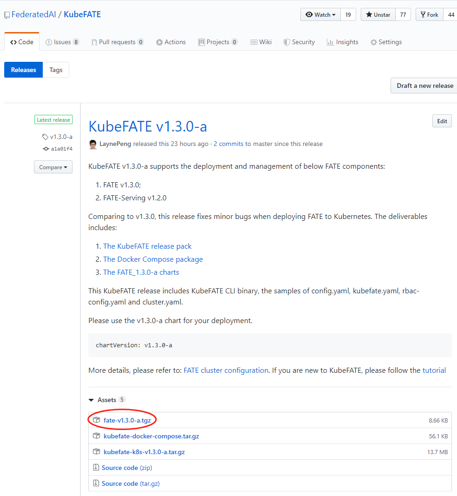

# Manage FATE and FATE-Serving Version
In KubeFATE, we can deploy and manage multiple clusters including FATE and FATE-serving with multiple versions. We reuse the features of [Helm](https://helm.sh/), and fully compatiable with Helm Chart. It means the charts can be:
1. Deploy directly with Helm;
2. Can be customized to fit different requirements.

## Sync chart when deploy a cluster
The KubeFATE service set a default chart repo for getting the charts if not present.

To set the default chart repo in kubefate.yml,
```
- name: FATECLOUD_REPO_URL
  value: "https://federatedai.github.io/KubeFATE/"
```

In the sample config file is set to our address hosted in github. It can be customized to self repo which follow [The Chart Repository Guide](https://helm.sh/docs/topics/chart_repository/). 

## Manage charts in KubeFATE manually
KubeFATE provides commands to manage the charts, which include:
1. Upload a new chart;
2. List existed charts;
3. Delete a existed chart;
4. Show the details of a chart.

The chart can be downloaded in each KubeFATE release, with name `fate-{release_version}.tgz`: https://github.com/FederatedAI/KubeFATE/releases

<div align="center">
  
</div>
&nbsp;

Download it and copy it to the folder to upload.
```
$ kubefate chart upload -f ./fate-v1.8.0.tgz
Upload file success

$ kubefate chart ls
UUID                                    NAME    VERSION         APPVERSION
ca3f7843-749a-4f69-9f6b-4c544a7623ac    fate    v1.8.0        v1.8.0
```

Then, we can deploy the fate cluster of v1.8.0 version. The detail of cluster.yaml please refer to: [FATE Cluster Configuration](./configurations/FATE_cluster_configuration.md)
```
chartName: fate
chartVersion: v1.8.0
```

We can delete the chart with:
```
$ kubefate chart delete ca3f7843-749a-4f69-9f6b-4c544a7623ac
deleteChart success
$ kubefate chart ls
not find HelmChart
```
