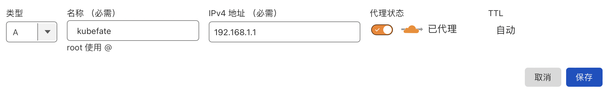
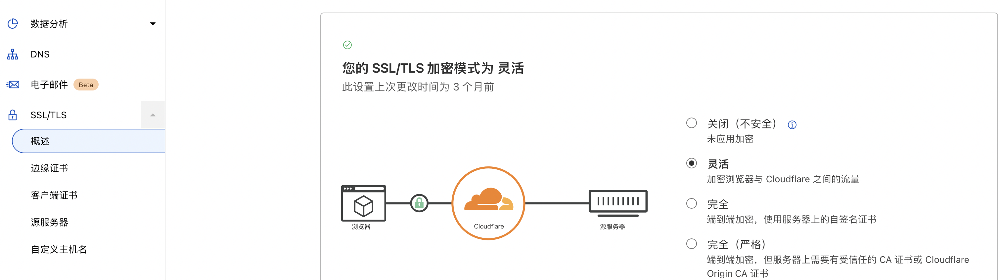

# How to enable TLS for KubeFATE service

This artical will discuss some method to config the KubeFATE service to support calling its API, both RESTFul API and the cli, with TLS (HTTPS).

## The Best Practice
The best way to turn KubeFATE service into HTTPS from HTTP is using CDN or reverse proxy.
- **CDN**   
Take the Cloudflare as an example, you need to make sure you've aleady exposed the kubefate's nginx-ingress to 80 port. Then you can add item in the Cloudflare DNS and set the TLS option as below:   
   
   
   
- **Reverse Proxy**   
You can set up a reverse proxy ([Nginx](https://www.nginx.com), [Caddy](https://caddyserver.com), etc) in front of your nginx-ingress. You need using them to proxy your domain's 443 port to the nginx-ingress exposed port. After that, config the TLS/SSL with server certificate. You can get that from CA, [Let's Encrypt](https://letsencrypt.org) or [sign by yourself]()  
There're many useful tutorials on the Internet and you can also use some tools ([NginxProxyManager](https://nginxproxymanager.com)) to help you finishing the configuration.  

## Config in Nginx-ingress
This section we'll talk about how to config the TLS in your YAML of nginx-ingress.   
All below happens in Linux enviroment and takes *example.com* as the domain.   
1. Sign yourself a server certificate   
   ```bash   
   openssl genrsa -out ca.key 2048
   openssl req -sha256 -new -x509 -days 3650 -key ca.key -out ca.crt -subj "/C=CN/ST=BJ/L=BJ/O=ca/OU=test/CN=demoCA"
   openssl genrsa -out server.key 2048
   openssl req -new -sha256 -key server.key -subj "/C=CN/ST=BJ/L=BJ/O=ca/OU=test/CN=example.com" -reqexts SAN -config <(cat /etc/ssl/openssl.cnf <(printf "[SAN]\nsubjectAltName=DNS:example.com")) -out server.csr
   mkdir demoCA/newcerts -p
   touch demoCA/index.txt
   echo "01" > demoCA/serial
   openssl ca -in server.csr -md sha256 -keyfile ca.key -cert ca.crt -extensions SAN -config <(cat /etc/ssl/openssl.cnf  <(printf "[SAN]\nsubjectAltName=DNS:example.com")) -out server.crt
   ```   
   You'll get the server.key & server.crt under your current directory.   
2. Set the TLS with certificate in nginx-ingress   
   ```bash   
   kubectl create secret -n kube-fate tls ingress-cert --key ./server.key --cert ./server.crt
   ```   
   Then add the TLS config in your kubefate.yaml ingress part as below (last 4 lines):   
   ```yaml
    spec:
    ingressClassName: nginx
    rules:
        - host: example.com
        http:
            paths:
            - backend:
                service:
                    name: kubefate
                    port:
                    number: 8080
                path: /
                pathType: Prefix
    tls:
        - hosts:
            - example.com
        secretName: ingress-cert
   ```   
## CLI config 
Before we run the cli, due to it's a self-signed cert, we need to add our own CA root cert into the trust-store of the Linux where the kubefate cli will be run.
```bash   
cp ca.crt /etc/ssl/certs/
```   
Then we set the *safeconnect* to be **true** in the config.yaml of kubefate cli.
```yaml
safeconnect: true
```   
About the kubefate cli config file, you can refer to [Preparing cluster configuration and deploying FATE](../../k8s-deploy/README.md#preparing-cluster-configuration-and-deploying-fate).