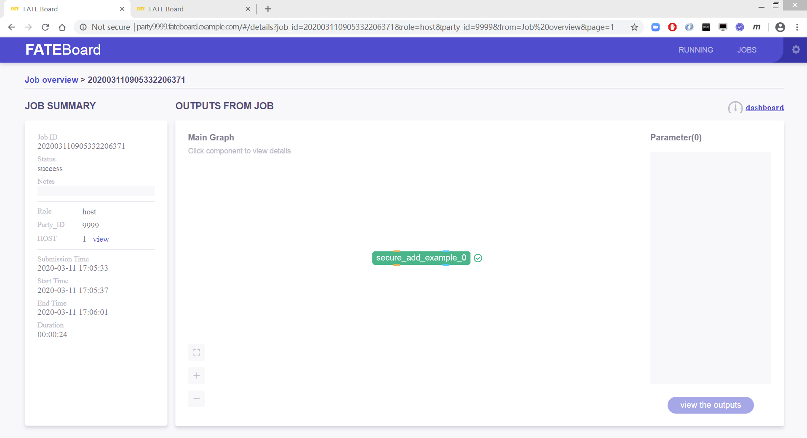
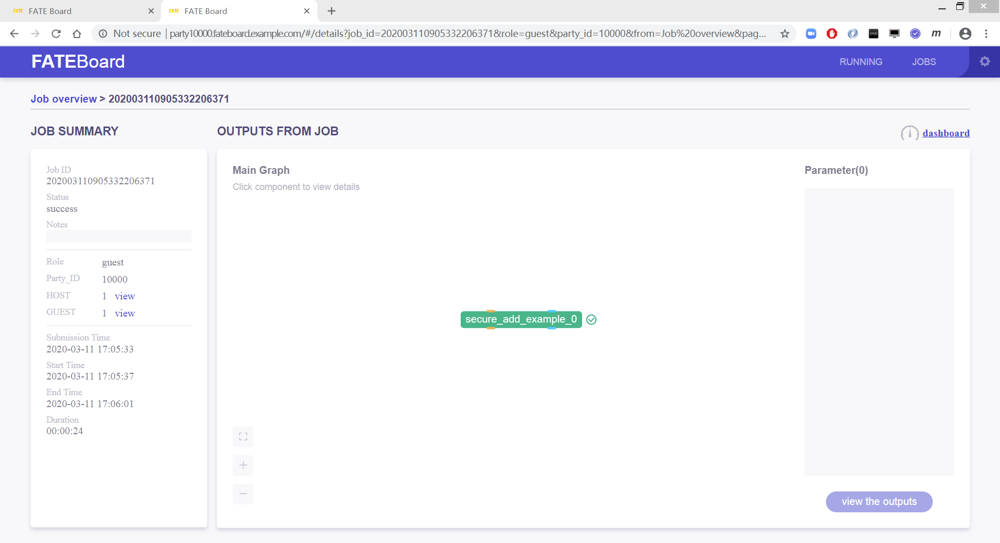

# Tutorial Goal
In this tutorial, we will from scratch to install a MiniKube for Kubernetes and deploy KubeFATE sevice on it. Then, we will install a two parties FATE clusters. Each of them is deployed in a given namespace. We are able to run federated learning with these two parties, and check FATE-Dashboard for the status of learning job.

After the tutorial, the deployment architecture looks like following diagram.

<div align="center">
  
</div>

# Prerequisites
1. A Linux machine. The verified OS is Ubuntu 18.04 LTS. <font color="red">* The demo machine is 8 core, 32G memory.</font>
2. A domain name for ingress of KubeFATE service and FATE-Dashboard. A alternative is set host both to deploying machine and client to access FATE-Dashboard. In this tutorial, we suppose to the latter case.  
3. Docker have been installed in the Linux machine. To install a Docker, please refer to [Install Docker in Ubuntu](https://docs.docker.com/install/linux/docker-ce/ubuntu/)
4. Network connectivity to dockerhub, and google storage
5. Create a folder for whole tutorial
	```
	cd ~ && mkdir demo && cd demo
	```

**<div align="center"><font color="red">!!!Note: in this tutorial, the IP of machine we used is 10.160.112.145. Please change it to your machine's IP in all following commands and config files.</font></div>**

# Start Tutorial
## Install related tools
The following tools and version have been verified, which are the latest version by the date drafting this tutorial.
1. MiniKube: v1.7.3
2. kubectl: v1.17.3
3. kubefate:
	* Release: v1.3.1-a
	* Service version: v1.0.2
	* Commandline version: v1.0.2

### Install kubectl
```
curl -LO https://storage.googleapis.com/kubernetes-release/release/v1.17.3/bin/linux/amd64/kubectl && chmod +x ./kubectl && sudo mv ./kubectl /usr/bin
```
Try to verify if kubectl installed,
```
layne@machine:~/demo$ kubectl version
Client Version: version.Info{Major:"1", Minor:"17", GitVersion:"v1.17.3", GitCommit:"06ad960bfd03b39c8310aaf92d1e7c12ce618213", GitTreeState:"clean", BuildDate:"2020-02-11T18:14:22Z", GoVersion:"go1.13.6", Compiler:"gc", Platform:"linux/amd64"}
The connection to the server localhost:8080 was refused - did you specify the right host or port?
```
### Install MiniKube
```
curl -LO minikube https://storage.googleapis.com/minikube/releases/latest/minikube-linux-amd64 && chmod +x minikube && sudo mv ./minikube /usr/bin
```
Try to verify if MiniKube installed,
```
layne@machine:~/demo$ minikube version
minikube version: v1.7.3
commit: 436667c819c324e35d7e839f8116b968a2d0a3ff
```
### Download KubeFATE Release Pack and Install KubeFATE Command Lines
Go to [KubeFATE Release](https://github.com/FederatedAI/KubeFATE/releases), and find the latest kubefate-k8s release pack. 
```
curl -LO https://github.com/FederatedAI/KubeFATE/releases/download/v1.3.0/kubefate-k8s-v1.3.0-a.tar.gz && tar -xzf ./kubefate-k8s-v1.3.0-a.tar.gz
```
Then we will get the release pack of KubeFATE, verify it,
```
layne@machine:~/demo$ ls
cluster.yaml  config.yaml  kubefate  kubefate-k8s-v1.3.0-a.tar.gz  kubefate.yaml  rbac-config.yaml
```
Move the kubefate executable binary to path,
```
chmod +x ./kubefate && sudo mv ./kubefate /usr/bin
```
Try to verify if kubefate works,
```
layne@machine:~/demo$ kubefate version
* kubefate service connection error, Get http://kubefate.net/v1/version: dial tcp: lookup kubefate.net: no such host
* kubefate commandLine version=v1.0.2
```
It is fine only command line version shows and get error on KubeFATE service's version, because we have not deployed KubeFATE service yet.

## Install Kubernetes with MiniKube
In a Linux machine, we suggest use Docker as hypervisor, which is easy. The details related to [Install MiniKube - Install a Hypervisor](https://kubernetes.io/docs/tasks/tools/install-minikube/#install-a-hypervisor). It is only one command,
```
sudo minikube start --vm-driver=none
```
Wait a few seconds for the command finish. Verify it, 
```
layne@machine:~/demo$ sudo minikube status
host: Running
kubelet: Running
apiserver: Running
kubeconfig: Configured
```
It means Kubernetes has been installed in your machine!

However, by default MiniKube will not enable Ingress addon, which KubeFATE required, we need to enable it manually,
```
sudo minikube addons enable ingress
```
Till now, Kubernetes have been ready. 

## Deploy KubeFATE service
### Create kube-fate namespace and account for KubeFATE service
We have prepared the yaml for creating kube-fate namespace, as well as creating a service account in rbac-config.yaml in your working folder. Just apply it,
```
kubectl apply -f ./rbac-config.yaml
```
### Deploy KubeFATE serving to kube-fate Namespace
The yaml files are also prepared in working folder, just apply it,
```
kubectl apply -f ./kubefate.yaml
```

We can verify it with `kubectl get all,ingress -n kube-fate`, if everything looks like,
```

layne@machine:~/demo$ kubectl get all,ingress -n kube-fate
NAME                            READY   STATUS    RESTARTS   AGE
pod/kubefate-6d576d6c88-mz6ds   1/1     Running   0          16s
pod/mongo-56684d6c86-4ff5m      1/1     Running   0          16s

NAME               TYPE        CLUSTER-IP       EXTERNAL-IP   PORT(S)     AGE
service/kubefate   ClusterIP   10.111.165.189   <none>        8080/TCP    16s
service/mongo      ClusterIP   10.98.194.57     <none>        27017/TCP   16s

NAME                       READY   UP-TO-DATE   AVAILABLE   AGE
deployment.apps/kubefate   1/1     1            1           16s
deployment.apps/mongo      1/1     1            1           16s

NAME                                  DESIRED   CURRENT   READY   AGE
replicaset.apps/kubefate-6d576d6c88   1         1         1       16s
replicaset.apps/mongo-56684d6c86      1         1         1       16s

NAME                          HOSTS          ADDRESS          PORTS   AGE
ingress.extensions/kubefate   kubefate.net   10.160.112.145   80      16s
```

It means KubeFATE service have been deployed. 

### Add kubefate.net to host file
Note: if we have the domain name setup, this step can be skipped.
```
sudo -- sh -c "echo \"10.160.112.145 kubefate.net\"  >> /etc/hosts"
```
Verify it as,
```
layne@machine:~/demo$ ping -c 2 kubefate.net
PING kubefate.net (10.160.112.145) 56(84) bytes of data.
64 bytes from kubefate.net (10.160.112.145): icmp_seq=1 ttl=64 time=0.080 ms
64 bytes from kubefate.net (10.160.112.145): icmp_seq=2 ttl=64 time=0.054 ms

--- kubefate.net ping statistics ---
2 packets transmitted, 2 received, 0% packet loss, time 1006ms
rtt min/avg/max/mdev = 0.054/0.067/0.080/0.013 ms
```
And the KubeFATE service version can be shown,
```
layne@machine:~/demo$ kubefate version
* kubefate service version=v1.0.2
* kubefate commandLine version=v1.0.2
```
Okay. The preparation have been done. Let's install FATE.

## Install two FATE parties: fate-9999 and fate-10000
Firstly, we need to prepare two namespaces: fate-9999 for party 9999, while fate-10000 for party 10000.
```
kubectl create namespace fate-9999
kubectl create namespace fate-10000
```
Then copy the cluster.yaml sample in the working folder. One for party 9999, the other one for party 10000,
```
cp ./cluster.yaml fate-9999.yaml && cp ./cluster.yaml fate-10000.yaml
```
They are how FATE cluster will be deployed. Open each of them. 

For fate-9999.yaml, modify it as following,
```
name: fate-9999
namespace: fate-9999
version: v1.3.0-a
partyId: 9999
modules:
  - proxy
  - egg
  - fateboard
  - fateflow
  - federation
  - metaService
  - mysql
  - redis
  - roll
  - python

proxy:
  type: NodePort
  nodePort: 30009
  partyList:
    - partyId: 10000
      partyIp: 10.160.112.145
      partyPort: 30010

egg:
  count: 1
```

We change following things:
1. Remove the exchange part, and use p2p mode;
2. Change the proxy part setting, which set the nodePort to 30009. This is the port proxy of party 9999 listen to;
3. Change the partyList setting according to the proxy setting in party 10000. In my case, partyId is 10000, partyIp is 10.160.112.145 and partyPort is 30010;
4. Change the count of egg setting from 3 to 1.

For fate-10000, modify it as following,
```
name: fate-10000
namespace: fate-10000
version: v1.3.0-a
partyId: 10000
modules:
  - proxy
  - egg
  - fateboard
  - fateflow
  - federation
  - metaService
  - mysql
  - redis
  - roll
  - python

proxy:
  type: NodePort
  nodePort: 30010
  partyList:
    - partyId: 9999
      partyIp: 10.160.112.145
      partyPort: 30009

egg:
  count: 1
```

We change the following things:
1. Change name to fate-10000;
2. Namespace use fate-10000;
3. partId use 10000;
4. Remove exchange part;
5. nodePort of proxy part, set to 30010, which can be connected by proxy 9999;
6. Change the partyList according to proxy setting in party 9999;
7. Change the count of egg setting from 3 to 1.

Okay, we can start to install these two FATE cluster via KubeFATE with following command,
```

layne@machine:~/demo$ kubefate cluster install -f ./fate-9999.yaml
create job success, job id=a3dd184f-084f-4d98-9841-29927bdbf627
layne@machine:~/demo$ kubefate cluster install -f ./fate-10000.yaml
create job success, job id=370ed79f-637e-482c-bc6a-7bf042b64e67
```

There are two jobs created for deploying the FATE clusters, we can list all job and if saw the to jobs status changed to `Success`, the FATE have been deployed.
```

layne@machine:~/demo$ kubefate job ls
UUID                                    CREATOR METHOD          STATUS  STARTTIME               CLUSTERID
a3dd184f-084f-4d98-9841-29927bdbf627    admin   ClusterInstall  Success 2020-03-10 12:26:39     2a15d783-67cd-4723-8a5c-50eb6355b6b0
370ed79f-637e-482c-bc6a-7bf042b64e67    admin   ClusterInstall  Success 2020-03-10 12:27:06     16270e8a-20b1-43c7-9c6c-385977d8dfc8
```

## Verify the deployment
### Run min_test_task
We use the [toy_example](https://github.com/FederatedAI/FATE/blob/master/examples/toy_example) in FATE/examples to quick verify the deployment. Let the party 10000 as the host, while party 9999 as guest, use cluster mode. The details of this example, please refer to [toy_example README](https://github.com/FederatedAI/FATE/blob/master/examples/toy_example/README.md).

Firstly, find the python container of party 10000 with kubectl
```
layne@machine:~/demo$ kubectl get pod -n fate-10000|grep python*
python-dc94c9786-8jsgh          2/2     Running   0          3m13s
```
The `python-dc94c9786-8jsgh` is the name of python pod <font color="red">(please replace it as your result)</font>, we enter its shell with command,
```
kubectl exec -it python-dc94c9786-8jsgh -n fate-10000 -- /bin/bash
```
then run the toy_example,
```

(venv) [root@python-dc94c9786-8jsgh python]# cd examples/toy_example/ && python run_toy_example.py 10000 9999 1
stdout:{
    "data": {
        "board_url": "http://fateboard:8080/index.html#/dashboard?job_id=202003110905332206371&role=guest&party_id=10000",
        "job_dsl_path": "/data/projects/fate/python/jobs/202003110905332206371/job_dsl.json",
        "job_runtime_conf_path": "/data/projects/fate/python/jobs/202003110905332206371/job_runtime_conf.json",
        "logs_directory": "/data/projects/fate/python/logs/202003110905332206371",
        "model_info": {
            "model_id": "guest-10000#host-9999#model",
            "model_version": "202003110905332206371"
        }
    },
    "jobId": "202003110905332206371",
    "retcode": 0,
    "retmsg": "success"
}


job status is running
job status is running
job status is running
job status is running
job status is running
job status is running
job status is running
"2020-03-11 09:05:39,911 - secure_add_guest.py[line:101] - INFO: begin to init parameters of secure add example guest"
"2020-03-11 09:05:39,911 - secure_add_guest.py[line:104] - INFO: begin to make guest data"
"2020-03-11 09:05:42,576 - secure_add_guest.py[line:107] - INFO: split data into two random parts"
"2020-03-11 09:05:51,661 - secure_add_guest.py[line:110] - INFO: share one random part data to host"
"2020-03-11 09:05:52,444 - secure_add_guest.py[line:113] - INFO: get share of one random part data from host"
"2020-03-11 09:05:57,566 - secure_add_guest.py[line:116] - INFO: begin to get sum of guest and host"
"2020-03-11 09:05:58,571 - secure_add_guest.py[line:119] - INFO: receive host sum from guest"
"2020-03-11 09:05:58,643 - secure_add_guest.py[line:126] - INFO: success to calculate secure_sum, it is 2000.0"
(venv) [root@python-dc94c9786-8jsgh toy_example]#
```
We can find the success calculation result in return, which means these two parties FATE-Cluster have worked as expect. 

### Check the FATE-Dashboard
As the FATE-Dashboard is exposed as `http://${party_id}.fateboard.${serviceurl}` in KubeFATE deployments. In our case, should be:
* Party 9999 FATE-Dashboard: http://9999.fateboard.kubefate.net/
* Party 10000 FATE-Dashboard: http://10000.fateboard.kubefate.net/

If no DNS service configured, we have to add these two url to our hosts file. In a Linux or macOS machine, 

```
sudo -- sh -c "echo \"10.160.112.145 9999.fateboard.kubefate.net\"  >> /etc/hosts"
sudo -- sh -c "echo \"10.160.112.145 10000.fateboard.kubefate.net\"  >> /etc/hosts"
```

In a Windows machine, you have to add them to `C:\WINDOWS\system32\drivers\etc\hosts`, please refer to related documents. After changing the hosts, we are able to open the browser see the jobs in each party: 

#### FATE-Dashboad 9999 as host,
<div align="center">
  
</div>

#### FATE-Dashboad 10000 as guest,
<div align="center">
  
</div>