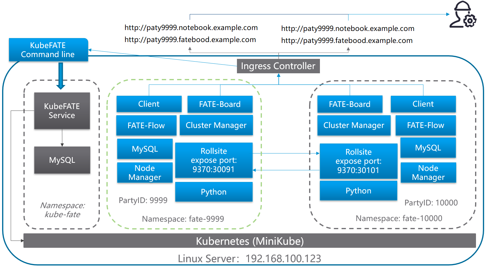
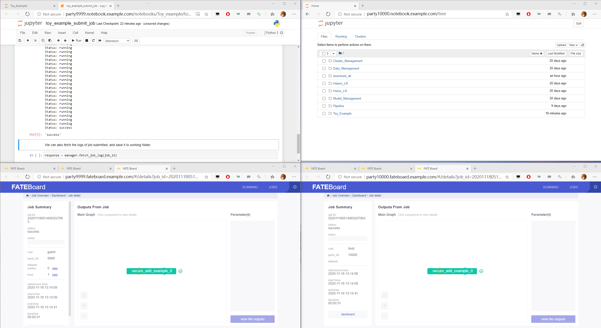

# Tutorial Goal
In this tutorial, we will from scratch to install a MiniKube for Kubernetes and deploy KubeFATE service on it. Then, we will install a two-parties FATE cluster. Each of them is deployed in a given namespace. We are able to run federated learning with these two parties, and check FATE-Dashboard for the status of the learning job.

After the tutorial, the deployment architecture looks like the following diagram.

<div align="center">
  
</div>

# Prerequisites
1. A Linux machine. The verified OS is Ubuntu 18.04 LTS. <font color="red">* The demo machine is 8 core, 32G memory.</font>
2. A domain name for ingress of KubeFATE service, Jupyter Notebook, and FATE-Dashboard. An alternative is to set host both to deploying machine and client to access these endpoints. In this tutorial, we suppose to the latter case.  
3. Docker has been installed in the Linux machine. To install a Docker, please refer to [Install Docker in Ubuntu](https://docs.docker.com/install/linux/docker-ce/ubuntu/)
4. Network connectivity to dockerhub or 163 Docker Image Registry, and google storage
5. Setup the global KubeFATE version using in the tutorial and create a folder for the whole tutorial. We use KubeFATE v1.5.0 in this tutorial, other versions should be similar.
```
export version=v1.5.0 && kubefate_version=v1.2.0 && cd ~ && mkdir demo && cd demo
```

**<font color="red">!!!Note: in this tutorial, the IP of the machine we used is 192.168.100.123. Please change it to your machine's IP in all the following commands and config files.</font></div>**

# Start Tutorial
## Install related tools
The following tools and versions have been verified, which are the latest version by the date of drafting this tutorial.
1. MiniKube: v1.7.3
2. kubectl: v1.17.3
3. kubefate:
	* Release: v1.5.0
	* Service version: v1.2.0
	* Commandline version: v1.2.0

### Install kubectl
```
curl -LO https://storage.googleapis.com/kubernetes-release/release/v1.17.3/bin/linux/amd64/kubectl && chmod +x ./kubectl && sudo mv ./kubectl /usr/bin
```
Try to verify if kubectl installed,
```
layne@machine:~/demo$ kubectl version
Client Version: version.Info{Major:"1", Minor:"17", GitVersion:"v1.17.3", GitCommit:"06ad960bfd03b39c8310aaf92d1e7c12ce618213", GitTreeState:"clean", BuildDate:"2020-02-11T18:14:22Z", GoVersion:"go1.13.6", Compiler:"gc", Platform:"linux/amd64"}
The connection to the server localhost:8080 was refused - did you specify the right host or port?
```
### Install MiniKube
```
curl -LO https://github.com/kubernetes/minikube/releases/download/v1.7.3/minikube-linux-amd64 && mv minikube-linux-amd64 minikube && chmod +x minikube && sudo mv ./minikube /usr/bin
```
Try to verify if MiniKube installed,
```
layne@machine:~/demo$ minikube version
minikube version: v1.7.3
commit: 436667c819c324e35d7e839f8116b968a2d0a3ff
```

### Download KubeFATE Release Pack, KubeFATE Server Image v1.2.0 and Install KubeFATE Command Lines
Go to [KubeFATE Release](https://github.com/FederatedAI/KubeFATE/releases), and find the latest kubefate-k8s release pack. 
```
curl -LO https://github.com/FederatedAI/KubeFATE/releases/download/${version}/kubefate-k8s-${version}.tar.gz && tar -xzf ./kubefate-k8s-${version}.tar.gz
```
Then we will get the release pack of KubeFATE, verify it,
```
layne@machine:~/demo$ ls
cluster-serving.yaml  cluster.yaml  config.yaml  examples  kubefate  kubefate-k8s-v1.5.0.tar.gz  kubefate.yaml  rbac-config.yaml
```
Move the kubefate executable binary to path,
```
chmod +x ./kubefate && sudo mv ./kubefate /usr/bin
```
Try to verify if kubefate works,
```
layne@machine:~/demo$ kubefate version
* kubefate service connection error, Post http://kubefate.net/v1/user/login: dial tcp: lookup kubefate.net: no such host
* kubefate commandLine version=v1.2.0
```
It is fine only the command line version shows and get an error on KubeFATE service's version because we have not deployed KubeFATE service yet.

Then, we download the KubeFATE Server Image v1.2.0,
```
curl -LO https://github.com/FederatedAI/KubeFATE/releases/download/${version}/kubefate-${kubefate_version}.docker
```
and load into local Docker. Please note that, because we are using MiniKube, which is an all-in-one deployment of Kubernetes, loading image to local is work for this tutorial. If you are running a cluster-installed Kubernetes, the image needs to be loaded into [Docker Registry](https://docs.docker.com/registry/introduction/) or [Harbor](https://goharbor.io/). For the details of using Harbor as a local image registry, please refer to: https://github.com/FederatedAI/KubeFATE/blob/master/registry/README.md.
```
layne@machine:~/demo$ docker load < ./kubefate-v1.2.0.docker
7a5b9c0b4b14: Loading layer [==================================================>]  3.031MB/3.031MB
8edfcca02080: Loading layer [==================================================>]  44.02MB/44.02MB
b7ffb386319e: Loading layer [==================================================>]  2.048kB/2.048kB
Loaded image: federatedai/kubefate:v1.2.0
```

## Install Kubernetes with MiniKube
In a Linux machine, we suggest using Docker as the hypervisor, which is easy. The details related to [Install MiniKube - Install a Hypervisor](https://kubernetes.io/docs/tasks/tools/install-minikube/#install-a-hypervisor). It is only one command,
```
sudo minikube start --vm-driver=none
```
Wait a few seconds for the command finish. Verify it, 
```
layne@machine:~/demo$ sudo minikube status
host: Running
kubelet: Running
apiserver: Running
kubeconfig: Configured
```
It means Kubernetes has been installed on your machine!

However, by default MiniKube will not enable the Ingress addon, which KubeFATE required, we need to enable it manually,
```
sudo minikube addons enable ingress
```
Till now, Kubernetes have been ready. 

## Deploy KubeFATE service
### Create kube-fate namespace and account for KubeFATE service
We have prepared the yaml for creating kube-fate namespace, as well as creating a service account in rbac-config.yaml in your working folder. Just apply it,
```
kubectl apply -f ./rbac-config.yaml
```

### (Optional) Use 163 Image Registory instead of Dockerhub
**Because the [Dockerhub latest limitation](https://docs.docker.com/docker-hub/download-rate-limit/), I suggest using 163 Image Repository instead.**
```
sed 's/mariadb:10/hub.c.163.com\/federatedai\/mariadb:10/g' kubefate.yaml > kubefate_163.yaml
sed 's/registry: ""/registry: "hub.c.163.com\/federatedai"/g' cluster.yaml > cluster_163.yaml
```


### Deploy KubeFATE serving to kube-fate Namespace

Apply the kubefate deployment YAML,
```
kubectl apply -f ./kubefate_163.yaml
```

We can verify it with `kubectl get all,ingress -n kube-fate`, if everything looks like,
```

layne@machine:~/demo$ kubectl get all,ingress -n kube-fate
NAME                            READY   STATUS    RESTARTS   AGE
pod/kubefate-5d97d65947-7hb2q   1/1     Running   0          51s
pod/mariadb-69484f8465-44dlw    1/1     Running   0          51s

NAME               TYPE        CLUSTER-IP      EXTERNAL-IP   PORT(S)    AGE
service/kubefate   ClusterIP   192.168.0.111   <none>        8080/TCP   50s
service/mariadb    ClusterIP   192.168.0.112   <none>        3306/TCP   50s

NAME                       READY   UP-TO-DATE   AVAILABLE   AGE
deployment.apps/kubefate   1/1     1            1           51s
deployment.apps/mariadb    1/1     1            1           51s

NAME                                  DESIRED   CURRENT   READY   AGE
replicaset.apps/kubefate-5d97d65947   1         1         1       51s
replicaset.apps/mariadb-69484f8465    1         1         1       51s

NAME                          HOSTS          ADDRESS          PORTS   AGE
ingress.extensions/kubefate   kubefate.net   192.168.100.123   80      50s
```

It means KubeFATE service has been deployed. 

### (Optional) Add kubefate.net to host file
Note: if we have the domain name setup, this step can be skipped.

Map the machine IP `192.168.100.123` （which is also the 'ADDRESS' field of 'ingress.extensions/kubefate'） above to `kubefate.net`

```
sudo -- sh -c "echo \"192.168.100.123 kubefate.net\"  >> /etc/hosts"
```

Verify if it works,
```
layne@machine:~/demo$ ping -c 2 kubefate.net
PING kubefate.net (192.168.100.123) 56(84) bytes of data.
64 bytes from kubefate.net (192.168.100.123): icmp_seq=1 ttl=64 time=0.080 ms
64 bytes from kubefate.net (192.168.100.123): icmp_seq=2 ttl=64 time=0.054 ms

--- kubefate.net ping statistics ---
2 packets transmitted, 2 received, 0% packet loss, time 1006ms
rtt min/avg/max/mdev = 0.054/0.067/0.080/0.013 ms
```

### Verify KubeFATE service
When `kubefate.net` well set, KubeFATE service version can be shown,
```
layne@machine:~/demo$ kubefate version
* kubefate service version=v1.2.0
* kubefate commandLine version=v1.2.0
```
Okay. The preparation has been done. Let's install FATE.

## Install two FATE parties: fate-9999 and fate-10000
Firstly, we need to prepare two namespaces: fate-9999 for party 9999, while fate-10000 for party 10000.
```
kubectl create namespace fate-9999
kubectl create namespace fate-10000
```
Then copy the cluster.yaml sample in the working folder. One for party 9999, the other one for party 10000,
```
cp ./cluster_163.yaml fate-9999.yaml && cp ./cluster_163.yaml fate-10000.yaml
```
They are how FATE cluster will be deployed. 

**NOTE: strongly recommend read following document**
For more what each field means, please refer to: https://github.com/FederatedAI/KubeFATE/blob/master/docs/configurations/FATE_cluster_configuration.md

For fate-9999.yaml, modify it as following,
```
name: fate-9999
namespace: fate-9999
chartName: fate
chartVersion: v1.5.0
partyId: 9999
registry: "hub.c.163.com/federatedai"
pullPolicy: 
persistence: false
istio:
  enabled: false
modules:
  - rollsite
  - clustermanager
  - nodemanager
  - mysql
  - python
  - fateboard
  - client

backend: eggroll

rollsite: 
  type: NodePort
  nodePort: 30091
  partyList:
  - partyId: 10000
    partyIp: 192.168.100.123
    partyPort: 30101

python:
  type: NodePort
  httpNodePort: 30097
  grpcNodePort: 30092
```

and for fate-10000:
```
name: fate-10000
namespace: fate-10000
chartName: fate
chartVersion: v1.5.0
partyId: 10000
registry: "hub.c.163.com/federatedai"
pullPolicy: 
persistence: false
istio:
  enabled: false
modules:
  - rollsite
  - clustermanager
  - nodemanager
  - mysql
  - python
  - fateboard
  - client

backend: eggroll

rollsite: 
  type: NodePort
  nodePort: 30101
  partyList:
  - partyId: 9999
    partyIp: 192.168.100.123
    partyPort: 30091

python:
  type: NodePort
  httpNodePort: 30107
  grpcNodePort: 30102
```

Okay, we can start to install these two FATE cluster via KubeFATE with the following command,
```
layne@machine:~/demo$ kubefate cluster install -f ./fate-9999.yaml
create job success, job id=2c1d926c-bb57-43d3-9127-8cf3fc6deb4b
layne@machine:~/demo$ kubefate cluster install -f ./fate-10000.yaml
create job success, job id=7752db70-e368-41fa-8827-d39411728d1b
```

There are two jobs created for deploying the FATE clusters. we can check the status of them with `kubefate job ls`. Or watch the clusters till their STATUS changing to `Running`. 
```

layne@machine:~/demo$ watch kubefate cluster ls
UUID                                    NAME            NAMESPACE       REVISION        STATUS  CHART   ChartVERSION    AGE
51476469-b473-4d41-b2d5-ea7241d5eac7    fate-9999       fate-9999       1               Running fate    v1.5.0          88s
dacc0549-b9fc-463f-837a-4e7316db2537    fate-10000      fate-10000      1               Running fate    v1.5.0          69s
```
We have about 10G Docker images that need to be pulled, this step will take a while for the first time. An alternative way is offline loading the images to the local environment.

## Verify the deployment
### Access the cluster
From above `kubefate cluster ls` command, we know the cluster UUID of `fate-9999` is `51476469-b473-4d41-b2d5-ea7241d5eac7`, while cluster UUID of `fate-10000` is `dacc0549-b9fc-463f-837a-4e7316db2537`. Then, we can query there access information by,
```
layne@machine:~/demo$ kubefate cluster describe 51476469-b473-4d41-b2d5-ea7241d5eac7
UUID            51476469-b473-4d41-b2d5-ea7241d5eac7
Name            fate-9999
NameSpace       fate-9999
ChartName       fate
ChartVersion    v1.5.0
Revision        1
Age             2m22s
Status          Running
Spec            backend: eggroll
                chartName: fate
                chartVersion: v1.5.0
                istio:
                  enabled: false
                modules:
                - rollsite
                - clustermanager
                - nodemanager
                - mysql
                - python
                - fateboard
                - client
                name: fate-9999
                namespace: fate-9999
                partyId: 9999
                persistence: false
                pullPolicy: null
                python:
                  grpcNodePort: 30092
                  httpNodePort: 30097
                  type: NodePort
                registry: hub.c.163.com/federatedai
                rollsite:
                  nodePort: 30091
                  partyList:
                  - partyId: 10000
                    partyIp: 10.184.103.163
                    partyPort: 30101
                  type: NodePort

Info            dashboard:
                - 9999.notebook.kubefate.net
                - 9999.fateboard.kubefate.net
                ip: 10.184.103.163
                pod:
                - clustermanager-5fcbd4ccc6-fj6tq
                - mysql-7cf4d4dcb8-wvl4j
                - nodemanager-0-6cbbc86769-fk77x
                - nodemanager-1-5c6dd78f99-bgt2w
                - python-57668d4497-qwnbb
                - rollsite-f7476746-5cxh8
                status:
                  modules:
                    client: Running
                    clustermanager: Running
                    fateboard: Running
                    mysql: Running
                    nodemanager-0: Running
                    nodemanager-1: Running
                    python: Running
                    rollsite: Running
```
In `Spec->dashboard` field, we can find there are two dashboards in current deployment: 
* Notebook in `9999.notebook.kubefate.net`, which is Jupyter Notebook integrated, where data scientists can write python or access shell in. We have pre-install FATE-clients to the Notebook.
* FATEBoard in `9999.fateboard.kubefate.net`, which we can inspect the status, job flows in FATE.

With similar command, we find Notebook for `fate-10000` is `10000.notebook.kubefate.net`, and FATEBoard for `fate-10000` is `10000.fateboard.kubefate.net`.

### (Optional) Config dashboard's URLs in hosts
**Note: if we have the domain name setup, this step can be skipped.**

If no DNS service configured, we have to add these two url to our hosts file. In a Linux or macOS machine, 

```
sudo -- sh -c "echo \"192.168.100.123 9999.notebook.kubefate.net\"  >> /etc/hosts"
sudo -- sh -c "echo \"192.168.100.123 9999.fateboard.kubefate.net\"  >> /etc/hosts"
sudo -- sh -c "echo \"192.168.100.123 10000.notebook.kubefate.net\"  >> /etc/hosts"
sudo -- sh -c "echo \"192.168.100.123 10000.fateboard.kubefate.net\"  >> /etc/hosts"
```

In a Windows machine, you have to add them to `C:\WINDOWS\system32\drivers\etc\hosts`, please refer to related documents.

### Run Toy_Example
If everything go well, you can access 4 dashboards now via the browser,
<div align="center">
  
</div>

then, click the RUNNING button of two FATEBoards for observing the JOBs status. And Click Toy_Example in `Notebook of FATE-9999`. We saw `toy_example_submit_job.ipynb` in it. `ipynb` is the format of Jupyter Notebook. For more info, please refer to: https://jupyter-notebook.readthedocs.io/en/stable/

Open it. In the 2nd code block, change
```
role = RoleBuilder()\
    .add_guest(9999)\
    .add_host(9999).build()
```
to
```
role = RoleBuilder()\
    .add_guest(9999)\
    .add_host(10000).build()
```
Because we would like to do multiple parties’ co-training. 

In the 5th code block, change
```
manager.query_job_status(query_condition, max_tries=20)
```
to
```
manager.query_job_status(query_condition, max_tries=100)
```

Then, click the first block, which is `Submit Training Job Demo`, then click `Run` button in the toolbar to make it run step by step. 
**Note: each step is one click to `Run`**
After we run the 5th code block, we will find there is a job running of each FATEBoard,
<div align="center">
  
</div>

And wait a while, when we see the output of 5th block shows `Success`. Go to the Job list of FATEBoard, and check both guest and host job are successful.
<div align="center">
  
</div>

## Next Steps
1. Toy_Example is the simplest of FATE's example. Please explore other Job examples in Notebook. But note that, the example is written in one party. You should modify it, and make sure the host party has run the `load_data` to upload data to the host party;
2. The FML_Manager will be merged to FATE-Clients soon, please check the FATE-Clients document: https://fate.readthedocs.io/en/latest/_build_temp/python/fate_client/flow_sdk/README.html. FATE-Clients has been installed and also can run in Jupyter Notebook;
3. Now you have deployed your first FATE cluster. We prepared example YAML files (https://github.com/FederatedAI/KubeFATE/tree/master/k8s-deploy/examples) for:
  * Deploy FATE-Serving
  * Deploy Spark-based FATE cluster

Check them, and we will publish more documents for above contents soon.