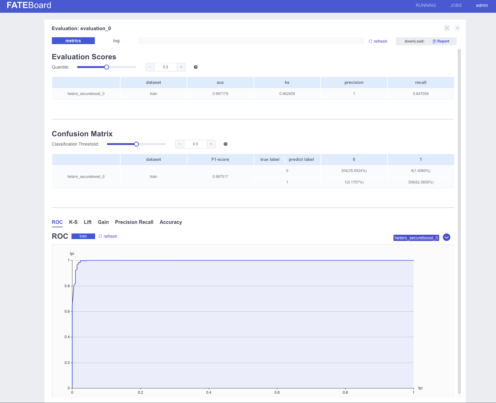
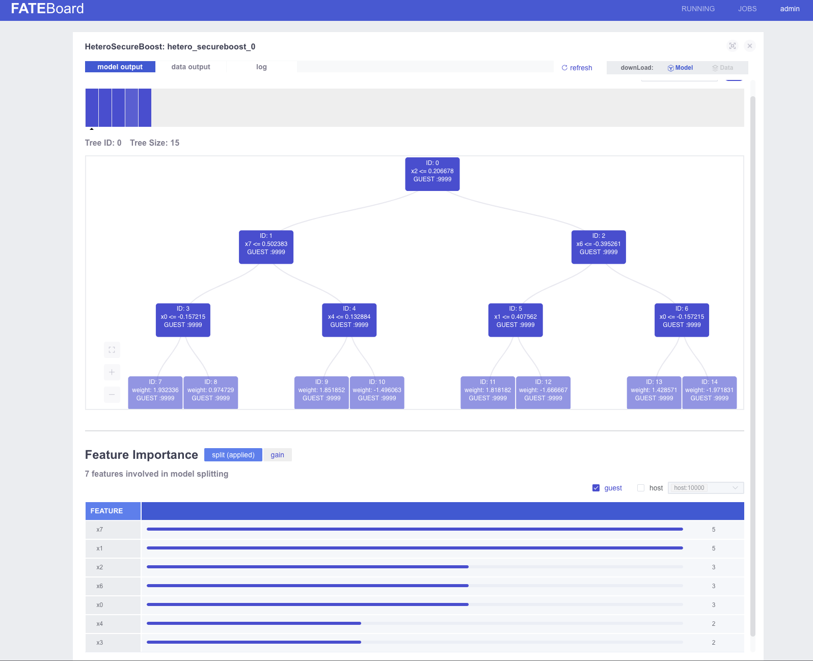
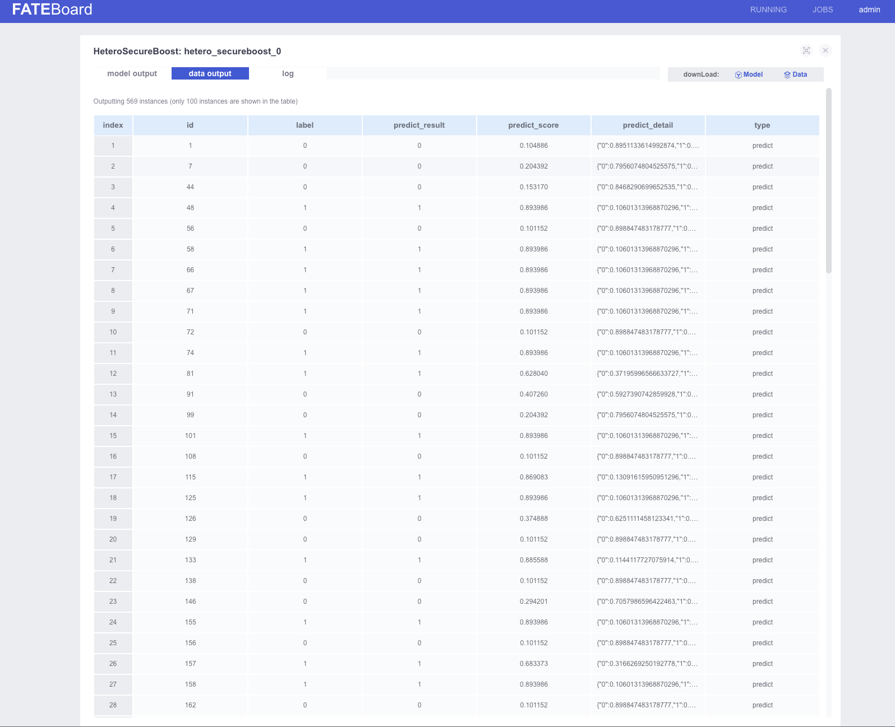

# Tutorial Goal
In this tutorial, we will from scratch to install a MiniKube for Kubernetes and deploy KubeFATE service on it. Then, we 
will install a two-parties FATE cluster. Each of them is deployed in a given namespace. We are able to run federated 
learning with these two parties, and check FATE-Dashboard for the status of the learning job.

After the tutorial, the deployment architecture looks like the following diagram.

<div align="center">
  
</div>

# Prerequisites
1. A Linux machine. The verified OS is CentOS Linux release 7.9.2009 (Core). <font color="red">* The demo machine is 
   8 core, 16G memory.</font>
2. A domain name for ingress of KubeFATE service, Jupyter Notebook, and FATE-Dashboard. An alternative is to set host 
   both to deploying machine and client to access these endpoints. In this tutorial, we suppose to the latter case.  
3. Docker has been installed in the Linux machine. To install a Docker, please refer to [Install Docker in Ubuntu]
   (https://www.digitalocean.com/community/tutorials/how-to-install-and-use-docker-on-centos-7)
4. Configure username and password for a images repository/registry after the docker has been installed, please refer to
   [use image pull secrets](https://github.com/federatedai/KubeFATE/blob/master/docs/Use_image_pull_secrets.md).
5. Network connectivity to dockerhub or 163 Docker Image Registry, and google gcr.
6. Setup the global KubeFATE version using in the tutorial and create a folder for the whole tutorial. We use 
   KubeFATE v1.8.0 in this tutorial, other versions should be similar.
```
export release_version=v1.8.0 && export kubefate_version=v1.4.4 && cd ~ && mkdir demo && cd demo
```

**<font color="red">!!!Note: in this tutorial, the IP of the machine we used is 192.168.100.123. Please change it to your machine's IP in all the following commands and config files.</font></div>**

# Start Tutorial
## Install the dependencies
The following tools and versions have been verified, we assume any versions larger than below versions can also work, 
if these dependencies can align the forward compatible principle.
1. MiniKube: v1.19.0
2. kubectl: v1.19.0

### Install kubectl
```
curl -LO https://storage.googleapis.com/kubernetes-release/release/v1.19.0/bin/linux/amd64/kubectl && chmod +x ./kubectl && sudo mv ./kubectl /usr/bin
```
Try to verify if kubectl installed,
```
kubefate@machine:~/demo$ kubectl version
Client Version: version.Info{Major:"1", Minor:"19", GitVersion:"v1.19.0", GitCommit:"e19964183377d0ec2052d1f1fa930c4d7575bd50", GitTreeState:"clean", BuildDate:"2020-08-26T14:30:33Z", GoVersion:"go1.15", Compiler:"gc", Platform:"linux/amd64"}
```
### Install MiniKube
```
curl -LO https://github.com/kubernetes/minikube/releases/download/v1.19.0/minikube-linux-amd64 && mv minikube-linux-amd64 minikube && chmod +x minikube && sudo mv ./minikube /usr/bin
```
Try to verify if MiniKube installed,
```
kubefate@machine:~/demo$ minikube version
minikube version: v1.21.0
commit: 76d74191d82c47883dc7e1319ef7cebd3e00ee11
```

### Install Kubernetes with MiniKube
In a Linux machine, we suggest using Docker as the hypervisor, which is easy. The details related to
[Install MiniKube - Install a Hypervisor](https://kubernetes.io/docs/tasks/tools/install-minikube/#install-a-hypervisor).
It is only one command,
```
sudo minikube start --vm-driver=none --kubernetes-version v1.19.0
```
Wait a few seconds until the command finishes, then try to verify if Kubernetes installed,
```
kubefate@machine:~/demo$ sudo minikube status
host: Running
kubelet: Running
apiserver: Running
kubeconfig: Configured
```
It means Kubernetes has been installed on your machine!

However, by default MiniKube will not enable the Ingress addon, which KubeFATE required, we need to enable it by 
another command.
```
sudo minikube addons enable ingress
```
Till now, Kubernetes have been ready. 

## Setup Kubefate
### Install KubeFATE CLI
Go to [KubeFATE Release](https://github.com/FederatedAI/KubeFATE/releases), and find the latest kubefate-k8s release 
pack, which is `v1.8.0` as set to ENVs before. (replace ${release_version} with the newest version available)
```
curl -LO https://github.com/FederatedAI/KubeFATE/releases/download/${release_version}/kubefate-k8s-${release_version}.tar.gz && tar -xzf ./kubefate-k8s-${release_version}.tar.gz
```
Then we will get the release pack of KubeFATE, verify it,
```
kubefate@machine:~/demo cd kubefate
kubefate@machine:~/kubefate ls
cluster-serving.yaml cluster-spark-rabbitmq.yaml cluster.yaml examples rbac-config.yaml
cluster-spark-pulsar.yaml cluster-spark-slim.yaml config.yaml kubefate.yaml
```
Move the kubefate executable binary to path,
```
chmod +x ./kubefate && sudo mv ./kubefate /usr/bin
```
Try to verify if kubefate works,
```
kubefate@machine:~/kubefate$ kubefate version
* kubefate commandLine version=v1.4.4
* kubefate service connection error, resp.StatusCode=404, error: <?xml version="1.0" encoding="iso-8859-1"?>
<!DOCTYPE html PUBLIC "-//W3C//DTD XHTML 1.0 Transitional//EN"
         "http://www.w3.org/TR/xhtml1/DTD/xhtml1-transitional.dtd">
<html xmlns="http://www.w3.org/1999/xhtml" xml:lang="en" lang="en">
        <head>
                <title>404 - Not Found</title>
        </head>
        <body>
                <h1>404 - Not Found</h1>
                <script type="text/javascript" src="//wpc.75674.betacdn.net/0075674/www/ec_tpm_bcon.js"></script>
        </body>
</html>
```
It is fine only the command line version shows and get an error on KubeFATE service's version because we have not 
deployed the KubeFATE service yet.

### Deploy KubeFATE service
#### 1. Load the docker image of the KubeFATE service
Download the KubeFATE Server v1.4.4's docker image,
```
curl -LO https://github.com/FederatedAI/KubeFATE/releases/download/${release_version}/kubefate-${kubefate_version}.docker
```
and load into local Docker. Please note that, because we are using MiniKube, which is an all-in-one deployment of
Kubernetes, loading image to local is work for this tutorial. If you are running a cluster-installed Kubernetes,
the image needs to be loaded into [Docker Registry](https://docs.docker.com/registry/introduction/) or
[Harbor](https://goharbor.io/). For the details of using Harbor as a local image registry, please refer to:
https://github.com/FederatedAI/KubeFATE/blob/master/registry/README.md.
```
docker load < kubefate-v1.4.4.docker
```
#### 2. Create kube-fate namespace and account for KubeFATE service
We have prepared the yaml for creating kube-fate namespace, as well as creating a service account in rbac-config.yaml in your working folder. Just apply it,
```
kubefate@machine:~/kubefate kubectl apply -f ./rbac-config.yaml
```

#### 3. (Optional) Use 163 Image Registory instead of Dockerhub
**Because the [Dockerhub latest limitation](https://docs.docker.com/docker-hub/download-rate-limit/), we suggest 
using the 163 Image Repository instead.**
```
sed 's/mariadb:10/hub.c.163.com\/federatedai\/mariadb:10/g' kubefate.yaml > kubefate_163.yaml
sed 's/registry: ""/registry: "hub.c.163.com\/federatedai"/g' cluster.yaml > cluster_163.yaml
```

#### 4. Deploy KubeFATE serving to kube-fate Namespace

Apply the KubeFATE deployment YAML.
```
kubectl apply -f ./kubefate_163.yaml
```
or 
```
kubectl apply -f ./kubefate.yaml
```
if not using the 163 image hub (**same for all the below commands**). 


We can verify it with `kubectl get all,ingress -n kube-fate`, if everything looks like,
```

kubefate@machine:~/demo$ kubectl get all,ingress -n kube-fate
NAME                            READY   STATUS    RESTARTS   AGE
pod/kubefate-5d97d65947-7hb2q   1/1     Running   0          51s
pod/mariadb-69484f8465-44dlw    1/1     Running   0          51s

NAME               TYPE        CLUSTER-IP      EXTERNAL-IP   PORT(S)    AGE
service/kubefate   ClusterIP   192.168.0.111   <none>        8080/TCP   50s
service/mariadb    ClusterIP   192.168.0.112   <none>        3306/TCP   50s

NAME                       READY   UP-TO-DATE   AVAILABLE   AGE
deployment.apps/kubefate   1/1     1            1           51s
deployment.apps/mariadb    1/1     1            1           51s

NAME                                  DESIRED   CURRENT   READY   AGE
replicaset.apps/kubefate-5d97d65947   1         1         1       51s
replicaset.apps/mariadb-69484f8465    1         1         1       51s

NAME                          HOSTS          ADDRESS          PORTS   AGE
ingress.extensions/kubefate   example.com   192.168.100.123   80      50s
```

It means KubeFATE service has been deployed. 

#### 5. (Optional) Add example.com to host file
Note: if we have a dns service (such as AWS Route53) setup, which can help to mapping
`example.com` to`192.168.100.123`, then this step can be skipped.

Map the machine IP `192.168.100.123` （which is also the 'ADDRESS' field of 'ingress.extensions/kubefate'） above to `example.com`

```
sudo -- sh -c "echo \"192.168.100.123 example.com\"  >> /etc/hosts"
```

Verify if it works,
```
kubefate@machine:~/demo$ ping -c 2 example.com
PING example.com (192.168.100.123) 56(84) bytes of data.
64 bytes from example.com (192.168.100.123): icmp_seq=1 ttl=64 time=0.080 ms
64 bytes from example.com (192.168.100.123): icmp_seq=2 ttl=64 time=0.054 ms

--- example.com ping statistics ---
2 packets transmitted, 2 received, 0% packet loss, time 1006ms
rtt min/avg/max/mdev = 0.054/0.067/0.080/0.013 ms
```

When `example.com` well set, KubeFATE service version can be shown,
```
kubefate@machine:~/kubefate$ kubefate version
* kubefate service version=v1.4.4
* kubefate commandLine version=v1.4.4
```
Note: The `kubefate` CLI can only work in the same directory of config.yaml

Okay. The preparation has been done. Let's install FATE.

## Install the Fate clusters
### Preparation
Firstly, we need to prepare two namespaces: fate-9999 for party 9999, while fate-10000 for party 10000.
```
kubectl create namespace fate-9999
kubectl create namespace fate-10000
```

We have 2 preset examples in `/kubefate/examples/party-9999/` and `/kubefate/examples/party-10000`.

For `/kubefate/examples/party-9999/cluster.yaml`, modify it as following:
```
name: fate-9999
namespace: fate-9999
chartName: fate
chartVersion: v1.8.0
partyId: 9999
registry: "hub.c.163.com/federatedai"
imageTag: "1.8.0-release"
pullPolicy:
imagePullSecrets:
- name: myregistrykey
persistence: false
istio:
  enabled: false
podSecurityPolicy:
  enabled: false
ingressClassName: nginx
modules:
  - rollsite
  - clustermanager
  - nodemanager
  - mysql
  - python
  - fateboard
  - client

backend: eggroll

ingress:
  fateboard:
    hosts:
    - name: party9999.fateboard.example.com
  client:  
    hosts:
    - name: party9999.notebook.example.com

rollsite:
  type: NodePort
  nodePort: 30091
  partyList:
  - partyId: 10000
    partyIp: 192.168.100.123
    partyPort: 30101

python:
  type: NodePort
  httpNodePort: 30097
  grpcNodePort: 30092
  logLevel: INFO

servingIp: 192.168.100.123
servingPort: 30095
```
and for fate-10000:
```
name: fate-10000
namespace: fate-10000
chartName: fate
chartVersion: v1.8.0
partyId: 10000
registry: "hub.c.163.com/federatedai"
imageTag: "1.8.0-release"
pullPolicy:
imagePullSecrets:
- name: myregistrykey
persistence: false
istio:
  enabled: false
podSecurityPolicy:
  enabled: false
ingressClassName: nginx
modules:
  - rollsite
  - clustermanager
  - nodemanager
  - mysql
  - python
  - fateboard
  - client

backend: eggroll

ingress:
  fateboard:
    hosts:
    - name: party10000.fateboard.example.com
  client:  
    hosts:
    - name: party10000.notebook.example.com

rollsite:
  type: NodePort
  nodePort: 30101
  partyList:
  - partyId: 9999
    partyIp: 192.168.100.123
    partyPort: 30091

python:
  type: NodePort
  httpNodePort: 30107
  grpcNodePort: 30102
  logLevel: INFO

servingIp: 192.168.100.123
servingPort: 30105
```
For the two files, pay extra attention of modify the partyId to the correct number otherwise you are not able to access
the notebook or the fateboard.

**NOTE: strongly recommend read following document**
For more what each field means, please refer to: 
https://githubcom/FederatedAI/KubeFATE/blob/master/docs/configurations/FATE_cluster_configuration.md.

### Install the FATE clusters
Okay, we can start to install these two FATE cluster via KubeFATE with the following command:
```
kubefate@machine:~/kubefate$ kubefate cluster install -f examples/party-9999/cluster.yaml
create job success, job id=2c1d926c-bb57-43d3-9127-8cf3fc6deb4b
kubefate@machine:~/kubefate$ kubefate cluster install -f examples/party-10000/cluster.yaml
create job success, job id=7752db70-e368-41fa-8827-d39411728d1b
```

There are two jobs created for deploying the FATE clusters. we can check the status of them with `kubefate job ls`,
or watch the clusters till their STATUS changing to `Running`:
```
kubefate@machine:~/kubefate$ watch kubefate cluster ls
UUID                                    NAME            NAMESPACE       REVISION        STATUS  CHART   ChartVERSION    AGE
51476469-b473-4d41-b2d5-ea7241d5eac7    fate-9999       fate-9999       1               Running fate    v1.8.0          88s
dacc0549-b9fc-463f-837a-4e7316db2537    fate-10000      fate-10000      1               Running fate    v1.8.0          69s
```
We have about 10G Docker images that need to be pulled, this step will take a while for the first time.
An alternative way is offline loading the images to the local environment.

To check the status of the loading, use the command,
```
kubectl get po -n fate-9999
kubectl get po -n fate-10000
```

When finished applying the image, the result will be similar to this,
```
NAME                             READY   STATUS    RESTARTS   AGE
clustermanager-bcfc6866d-nfs6c   1/1     Running   0          12m
mysql-c77b7b94b-zblt5            1/1     Running   0          12m
nodemanager-0-5599db57f4-2khcg   2/2     Running   0          12m
nodemanager-1-7c986f9454-qcscd   2/2     Running   0          12m
python-57b66d96bd-vj8kq          3/3     Running   0          12m
rollsite-7846898d6d-j2gb9        1/1     Running   0          12m
```

### Verify the deployment
From above `kubefate cluster ls` command, we know the cluster UUID of `fate-9999` is 
`51476469-b473-4d41-b2d5-ea7241d5eac7`, while cluster UUID of `fate-10000` is `dacc0549-b9fc-463f-837a-4e7316db2537`.
Thus, we can query there access information by:
```
kubefate@machine:~/demo$ kubefate cluster describe 51476469-b473-4d41-b2d5-ea7241d5eac7
UUID            51476469-b473-4d41-b2d5-ea7241d5eac7
Name            fate-9999                                  
NameSpace       fate-9999                                  
ChartName       fate                                       
ChartVersion    v1.8.0                                     
Revision        1                                          
Age             15h                                        
Status          Running                                    
Spec            backend: eggroll                           
                chartName: fate                            
                chartVersion: v1.8.0                       
                imagePullSecrets:                          
                - name: myregistrykey                      
                imageTag: 1.8.0-release                    
                ingress:                                   
                  client:                                  
                    annotations:                           
                      kubernetes.io/ingress.class: nginx   
                    hosts:                                 
                    - name: party9999.notebook.example.com 
                  fateboard:                               
                    annotations:                           
                      kubernetes.io/ingress.class: nginx   
                    hosts:                                 
                    - name: party9999.fateboard.example.com
                istio:                                     
                  enabled: false                           
                modules:                                   
                - rollsite                                 
                - clustermanager                           
                - nodemanager                              
                - mysql                                    
                - python                                   
                - fateboard                                
                - client                                   
                name: fate-9999                            
                namespace: fate-9999                       
                partyId: 9999                              
                persistence: false                         
                podSecurityPolicy:                         
                  enabled: false                           
                pullPolicy: null                           
                python:                                    
                  grpcNodePort: 30092                      
                  httpNodePort: 30097                      
                  type: NodePort                           
                registry: ""                               
                rollsite:                                  
                  nodePort: 30091                          
                  partyList:                               
                  - partyId: 10000                         
                    partyIp: 10.192.173.64                 
                    partyPort: 30101                       
                  type: NodePort                           
                servingIp: 10.192.173.64                   
                servingPort: 30095                         
                                                           
Info            dashboard:                                 
                - party9999.notebook.example.com           
                - party9999.fateboard.example.com          
                ip: 10.192.173.64                          
                port: 30091                                
                status:                                    
                  containers:                              
                    client: Running                        
                    clustermanager: Running                
                    fateboard: Running                     
                    mysql: Running                         
                    nodemanager-0: Running                 
                    nodemanager-0-eggrollpair: Running     
                    nodemanager-1: Running                 
                    nodemanager-1-eggrollpair: Running     
                    python: Running                        
                    rollsite: Running                      
                  deployments:                             
                    client: Available                      
                    clustermanager: Available              
                    mysql: Available                       
                    nodemanager-0: Available               
                    nodemanager-1: Available               
                    python: Available                      
                    rollsite: Available          
```
In `Info->dashboard` field, we can see there are two dashboards in the current deployment: 
* Notebook in `party9999.notebook.example.com`, which is the Jupyter Notebook integrated, 
where data scientists can write python or access shell. We have pre-installed FATE-clients to the Notebook.
* FATEBoard in `party9999.fateboard.example.com`, which we can use to check the status, job flows in FATE.

With similar command, we can see that the Notebook for `fate-10000` is `party10000.notebook.example.com`,
and the FATEBoard for `fate-10000` is `party10000.fateboard.example.com`.

### (Optional) Configure the dashboards' URLs in hosts
#### Note: if we have the dns service setup, this step can be skipped.

If no DNS service configured, we have to add these two url to our hosts file. In a Linux or macOS machine, 

```
sudo -- sh -c "echo \"192.168.100.123 party9999.notebook.example.com\"  >> /etc/hosts"
sudo -- sh -c "echo \"192.168.100.123 party9999.fateboard.example.com\"  >> /etc/hosts"
sudo -- sh -c "echo \"192.168.100.123 party10000.notebook.example.com\"  >> /etc/hosts"
sudo -- sh -c "echo \"192.168.100.123 party10000.fateboard.example.com\"  >> /etc/hosts"
```

In a Windows machine, you have to add them to `C:\WINDOWS\system32\drivers\etc\hosts`, please refer to
[add host for Windows](https://github.com/ChrisChenSQ/KubeFATE/blob/master/docs/tutorials/Windows_add_host_tutorial.md).

### Run a FATE example
If everything go well, you can access 4 dashboards now via the browser,
<div align="center">
  
</div>

Click `pipeline/pipeline_tutorial_upload.ipynb` to run the upload data job first, we need to do this for both the 
client party (9999) and the host party (10000).

Then click
`pipeline/pipeline_tutorial_hetero_sbt.ipynb` on the client (9999)'s fateboard to run the training and predicting job.
For more details, check the words in the notebook script.

More notebook examples can be found here: https://github.com/FederatedAI/FATE/tree/master/doc/tutorial/pipeline

A screenshot of the notebook is like: 
<div align="center">
  
</div>


When the training job is done, we can check the workflow on fateboard. 
<div align="center">
  
</div>

The output of the evaluation component of the training job. 
<div align="center">
  
</div>

When the predicting job is done, we can check the model outputs on fateboard.
<div align="center">
  
</div>

Also the data output.
<div align="center">
  
</div>


This means that the job is successfully processed and KubeFate is running properly.

## Next Steps
1. The example showed above is the simplest of FATE's example. Please explore other Job examples in Notebook.
2. Now you have deployed your first FATE cluster based on eggroll. We also have prepared example YAML files 
   (https://github.com/FederatedAI/KubeFATE/tree/master/k8s-deploy/examples) for:
  * Deploy FATE-Serving
  * Deploy Spark-based FATE cluster, and try different message queues: rabbitmq and pulsar.