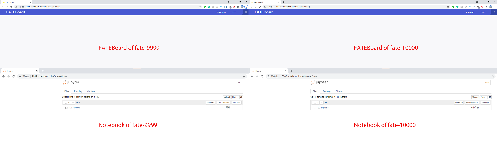
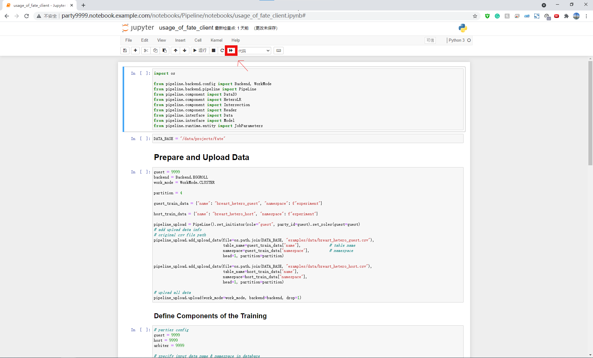
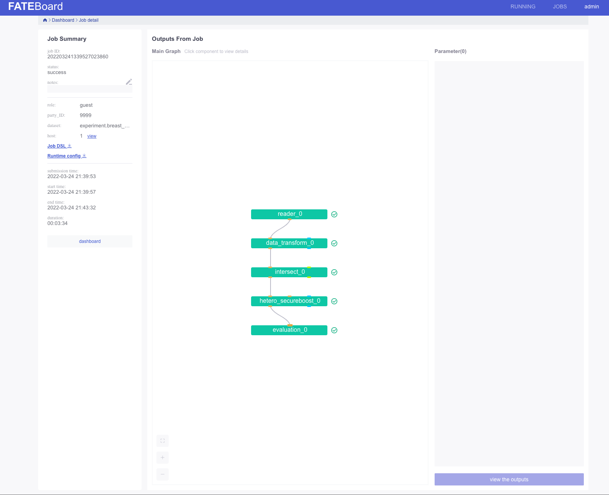
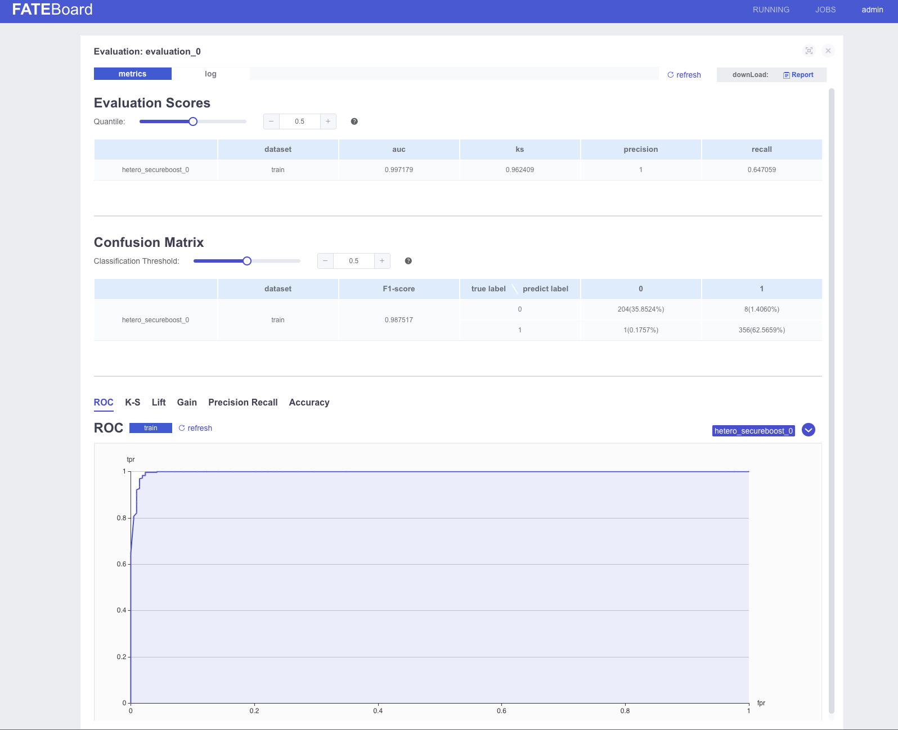
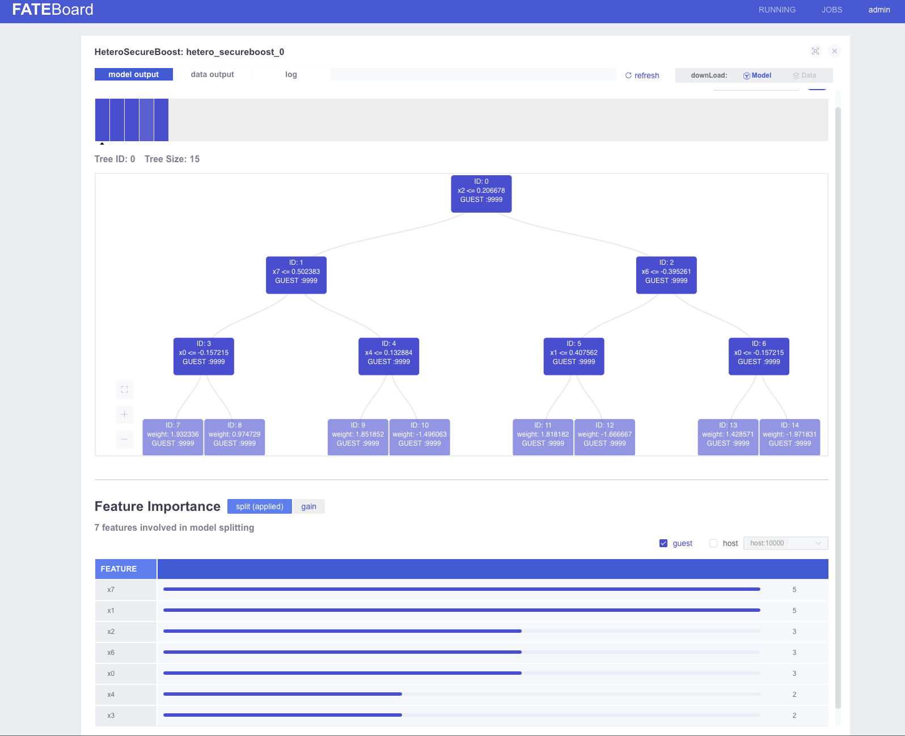
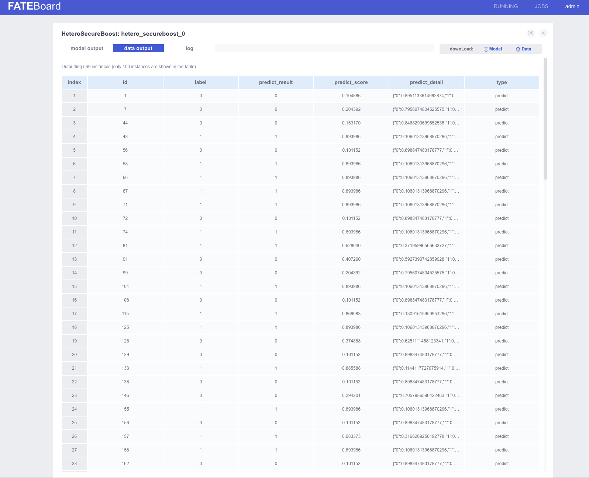

# 目标
本文我们会介绍如何在一台Linux的机器上通过安装MiniKube，然后使用KubeFATE部署一个两方的联邦学习集群，并在上面跑一个测试的联邦学习训练任务。

我们的总体架构如下:


本文共出现两台机器：
1. 用来做Demo的机器，是一台Linux机器，参照前置条件第一点；
2. 使用浏览器访问Jupyter Notebook, FATE-Board的机器，要求可以访问用来执行Demo的机器。可以是任何客户端。

# 前置条件
1. 一台Linux的服务器，我们测试好的OS版本是CentOS Linux release 7.9.2009 (Core). 由于需要跑多方计算，服务器的推荐配置为：8核，16G内存以上；
2. 三个域名分别给KubeFATE服务，Jupyter Notebook和FATE-board使用。如果没有DNS解析条件，可以通过设置hosts方式，后面的介绍基于这种情况； 
3. Linux服务器需要预先安装好Docker环境，具体参考[Install Docker in Ubuntu](https://docs.docker.com/install/linux/docker-ce/ubuntu/)；
4. 预先给image pull secrets设置好用户名和密码，具体参考[use image pull secrets](https://github.com/FederatedAI/KubeFATE/blob/master/docs/Use_image_pull_secrets.md);
5. 要保证安装机器可以正常访问Docker Hub或者网易云镜像仓库，以及Google gcr； 
6. 预先创建一个目录，以便整个过程使用该目录作为工作目录，命令如下：
```
export release_version=v1.8.0 && export kubefate_version=v1.4.4 && cd ~ && mkdir demo && cd demo
```

**注意：下文介绍的MiniKube机器IP地址是192.168.100.123。请修改为你准备的实验机器IP地址！！！**

# 开始安装
## 安装需要的工具
为了使用KubeFATE部署FATE，我们需要以下工具。以下版本是经过验证的版本。基于向前兼容原则，我们假设高于以下版本的Minikube和kubectl也能够正常工作。
1. MiniKube: v1.19.0
2. kubectl: v1.19.0

### 安装kubectl
```
curl -LO https://storage.googleapis.com/kubernetes-release/release/v1.19.0/bin/linux/amd64/kubectl && chmod +x ./kubectl && sudo mv ./kubectl /usr/bin
```
执行完后可以验证是否成功,
```
kubefate@machine:~/demo$ kubectl version
Client Version: version.Info{Major:"1", Minor:"19", GitVersion:"v1.19.0", GitCommit:"e19964183377d0ec2052d1f1fa930c4d7575bd50", GitTreeState:"clean", BuildDate:"2020-08-26T14:30:33Z", GoVersion:"go1.15", Compiler:"gc", Platform:"linux/amd64"}
```
### 安装MiniKube
```
curl -LO https://github.com/kubernetes/minikube/releases/download/v1.19.0/minikube-linux-amd64 && mv minikube-linux-amd64 minikube && chmod +x minikube && sudo mv ./minikube /usr/bin
```
验证安装结果:
```
kubefate@machine:~/demo$ minikube version
minikube version: v1.21.0
commit: 76d74191d82c47883dc7e1319ef7cebd3e00ee11
```

### 使用MiniKube安装Kubernetes
MiniKube支持使用不同的虚拟机来部署Kubernetes，但是在Linux环境下，我们建议直接使用Docker方式。更多的说明参考：[Install MiniKube - Install a Hypervisor](https://kubernetes.io/docs/tasks/tools/install-minikube/#install-a-hypervisor).
```
sudo minikube start --vm-driver=none --kubernetes-version v1.19.0
```
待到命令执行完成，我们可以验证下，
```
kubefate@machine:~/demo$ sudo minikube status
host: Running
kubelet: Running
apiserver: Running
kubeconfig: Configured
```
如果你的显示和上面一样，那恭喜你，一个单节点的Kubernetes已经部署好在你的服务器里了！但是，还有一个小步骤要做，因为我们KubeFATE通过Ingress向外提供服务，而MiniKube默认并没有启动Ingress模块，所以需要手动启动，

```
sudo minikube addons enable ingress
```
到此，我们的Kubernetes也准备好了。

## 安装Kubefate
### 下载KubeFATE命令行工具
我们从Github上 [KubeFATE Release](https://github.com/FederatedAI/KubeFATE/releases)页面找到Kuberetes部署的下载包，并下载对应版本，如前面环境变量设置`v1.8.0`，
```
curl -LO https://github.com/FederatedAI/KubeFATE/releases/download/${release_version}/kubefate-k8s-${release_version}.tar.gz && tar -xzf ./kubefate-k8s-${release_version}.tar.gz
```
然后我们可以查看下下载解压的安装包内容，
```
kubefate@machine:~/demo cd kubefate
kubefate@machine:~/kubefate ls
cluster-serving.yaml cluster-spark-rabbitmq.yaml cluster.yaml examples rbac-config.yaml
cluster-spark-pulsar.yaml cluster-spark-slim.yaml config.yaml kubefate.yaml
```
由于KubeFATE命令行是可执行二进制文件，可以直接移动到path目录方便使用，
```
chmod +x ./kubefate && sudo mv ./kubefate /usr/bin
```
然后我们测试下kubefate命令是否可用，
```
kubefate@machine:~/kubefate$ kubefate version
* kubefate commandLine version=v1.4.4
* kubefate service connection error, resp.StatusCode=404, error: <?xml version="1.0" encoding="iso-8859-1"?>
<!DOCTYPE html PUBLIC "-//W3C//DTD XHTML 1.0 Transitional//EN"
         "http://www.w3.org/TR/xhtml1/DTD/xhtml1-transitional.dtd">
<html xmlns="http://www.w3.org/1999/xhtml" xml:lang="en" lang="en">
        <head>
                <title>404 - Not Found</title>
        </head>
        <body>
                <h1>404 - Not Found</h1>
                <script type="text/javascript" src="//wpc.75674.betacdn.net/0075674/www/ec_tpm_bcon.js"></script>
        </body>
</html>
```
我们发现获取KubeFATE服务版本报了个错，这是因为我们还没部署KubeFATE的服务；而命令行工具的版本已经正常显示出来了。

### 部署Kubefate服务
#### 1.载入Kubefate服务镜像
接着，我们下载KubeFATE服务镜像v1.4.4：
```
curl -LO https://github.com/FederatedAI/KubeFATE/releases/download/${release_version}/kubefate-${kubefate_version}.docker
```
然后读入本地Docker环境。请注意，因为本文使用的MiniKube，是all-in-one的Kubernetes环境，所以只需要导入本地Docker环境即可给kubelet拉取。如果你运行的是集群形式的Kubernetes，容器镜像需要读入[Docker Registry](https://docs.docker.com/registry/introduction/)或者[Harbor](https://goharbor.io/)。关于如何集成使用Harbor，可以参考：https://github.com/FederatedAI/KubeFATE/blob/master/registry/README.md
```
docker load < kubefate-v1.4.4.docker
```

#### 2.创建kube-fate的命名空间以及账号
在我们的安装包里已经包含了相关的yaml文件`rbac-config.yaml`，并且前面的准备工作已解压这个文件到你的工作目录。我们只需要直接执行，
```
kubefate@machine:~/kubefate kubectl apply -f ./rbac-config.yaml
```

#### 3.（可选）使用网易云镜像仓库
**因为近期Dockerhub调整了下载限制服务条例 [Dockerhub latest limitation](https://docs.docker.com/docker-hub/download-rate-limit/), 我建议使用国内网易云的镜像仓库代替官方Dockerhub**
```
sed 's/mariadb:10/hub.c.163.com\/federatedai\/mariadb:10/g' kubefate.yaml > kubefate_163.yaml
sed 's/registry: ""/registry: "hub.c.163.com\/federatedai"/g' cluster.yaml > cluster_163.yaml
```


#### 4.在kube-fate命名空间里部署KubeFATE服务

相关的yaml文件也已经准备在工作目录，直接使用`kubectl apply`，
```
kubectl apply -f ./kubefate_163.yaml
```
或（如果可以使用Dockerhub）
```
kubectl apply -f ./kubefate.yaml
```

稍等一会，大概10几秒后用下面命令看下KubeFATE服务是否部署好`kubectl get all,ingress -n kube-fate`。如果返回类似下面的信息（特别是pod的STATUS显示的是Running状态），则KubeFATE的服务就已经部署好并正常运行：
```

kubefate@machine:~/demo$ kubectl get all,ingress -n kube-fate
NAME                            READY   STATUS    RESTARTS   AGE
pod/kubefate-5d97d65947-7hb2q   1/1     Running   0          51s
pod/mariadb-69484f8465-44dlw    1/1     Running   0          51s

NAME               TYPE        CLUSTER-IP      EXTERNAL-IP   PORT(S)    AGE
service/kubefate   ClusterIP   192.168.0.111   <none>        8080/TCP   50s
service/mariadb    ClusterIP   192.168.0.112   <none>        3306/TCP   50s

NAME                       READY   UP-TO-DATE   AVAILABLE   AGE
deployment.apps/kubefate   1/1     1            1           51s
deployment.apps/mariadb    1/1     1            1           51s

NAME                                  DESIRED   CURRENT   READY   AGE
replicaset.apps/kubefate-5d97d65947   1         1         1       51s
replicaset.apps/mariadb-69484f8465    1         1         1       51s

NAME                          HOSTS          ADDRESS          PORTS   AGE
ingress.extensions/kubefate   example.com   192.168.100.123   80      50s
```

#### 5.添加example.com到hosts文件
因为我们要用 example.com 域名来访问KubeFATE服务（该域名在ingress中定义，有需要可自行修改），需要在运行kubefate命令行所在的机器配置hosts文件（注意不一定是Kubernetes所在的机器）。
另外下文中部署的FATE集群默认也是使用`example.com`作为默认域名，在部署的时候可以参考：[FATE cluster configuration](https://github.com/FederatedAI/KubeFATE/blob/master/docs/configurations/FATE_cluster_configuration.md#host-mappings)部分进行修改。
如果网络环境有域名解析服务，可配置example.com域名指向MiniKube机器的IP地址，这样就不用配置hosts文件。注意：下面地址192.168.100.123 要替换为你的MiniKube机器地址。

```
sudo -- sh -c "echo \"192.168.100.123 example.com\"  >> /etc/hosts"
```

添加完毕后，可以验证是否生效：
```
kubefate@machine:~/demo$ ping -c 2 example.com
PING example.com (192.168.100.123) 56(84) bytes of data.
64 bytes from example.com (192.168.100.123): icmp_seq=1 ttl=64 time=0.080 ms
64 bytes from example.com (192.168.100.123): icmp_seq=2 ttl=64 time=0.054 ms

--- example.com ping statistics ---
2 packets transmitted, 2 received, 0% packet loss, time 1006ms
rtt min/avg/max/mdev = 0.054/0.067/0.080/0.013 ms
```

### 验证KubeFATE服务
当 `example.com` 顺利设置, KubeFATE服务的版本号应该就可以正常显示,
```
kubefate@machine:~/kubefate$ kubefate version
* kubefate service version=v1.4.4
* kubefate commandLine version=v1.4.4
```
到此，所有准备工作完毕，下面我们可以开始安装FATE了。需要注意的是，上面的工作只需要做一次，后面如果添加、删除、更新FATE集群，上面的不需要重新执行。

## 使用KubeFATE安装FATE
### 准备步骤
按照前面的计划，我们需要安装两联盟方，ID分别9999与10000。现实情况，这两方应该是完全独立、隔绝的组织，为了模拟现实情况，所以我们需要先为他们在Kubernetes上创建各自独立的命名空间(namespace)。
我们创建命名空间fate-9999用来部署9999，fate-10000部署10000
```
kubectl create namespace fate-9999
kubectl create namespace fate-10000
```

在exmaple目录下，我们已经预先设置了两个例子：`/kubefate/examples/party-9999/` 和 `/kubefate/examples/party-10000`
对于`/kubefate/examples/party-9999/cluster.yaml`，我们可以将其修改如下：
```
name: fate-9999
namespace: fate-9999
chartName: fate
chartVersion: v1.8.0
partyId: 9999
registry: "hub.c.163.com/federatedai"
imageTag: "1.8.0-release"
pullPolicy:
imagePullSecrets:
- name: myregistrykey
persistence: false
istio:
  enabled: false
podSecurityPolicy:
  enabled: false
ingressClassName: nginx
modules:
  - rollsite
  - clustermanager
  - nodemanager
  - mysql
  - python
  - fateboard
  - client

backend: eggroll

ingress:
  fateboard:
    hosts:
    - name: party9999.fateboard.example.com
  client:  
    hosts:
    - name: party9999.notebook.example.com

rollsite:
  type: NodePort
  nodePort: 30091
  partyList:
  - partyId: 10000
    partyIp: 192.168.100.123
    partyPort: 30101

python:
  type: NodePort
  httpNodePort: 30097
  grpcNodePort: 30092
  logLevel: INFO

servingIp: 192.168.100.123
servingPort: 30095
```

对于`/kubefate/examples/party-10000/cluster.yaml`，我们可以将其修改如下：
```
name: fate-10000
namespace: fate-10000
chartName: fate
chartVersion: v1.8.0
partyId: 10000
registry: "hub.c.163.com/federatedai"
imageTag: "1.8.0-release"
pullPolicy:
imagePullSecrets:
- name: myregistrykey
persistence: false
istio:
  enabled: false
podSecurityPolicy:
  enabled: false
ingressClassName: nginx
modules:
  - rollsite
  - clustermanager
  - nodemanager
  - mysql
  - python
  - fateboard
  - client

backend: eggroll

ingress:
  fateboard:
    hosts:
    - name: party10000.fateboard.example.com
  client:  
    hosts:
    - name: party10000.notebook.example.com

rollsite:
  type: NodePort
  nodePort: 30101
  partyList:
  - partyId: 9999
    partyIp: 192.168.100.123
    partyPort: 30091

python:
  type: NodePort
  httpNodePort: 30107
  grpcNodePort: 30102
  logLevel: INFO

servingIp: 192.168.100.123
servingPort: 30105
```

**注意： 我们强烈建议阅读以下文档**
`cluster.yaml`中具体配置的含义，请参考: https://github.com/FederatedAI/KubeFATE/blob/master/docs/configurations/FATE_cluster_configuration.md

### 安装FATE集群
如果一切没有问题，那就可以使用`kubefate cluster install`来部署两个fate集群了，
```
kubefate@machine:~/kubefate$ kubefate cluster install -f examples/party-9999/cluster.yaml
create job success, job id=2c1d926c-bb57-43d3-9127-8cf3fc6deb4b
kubefate@machine:~/kubefate$ kubefate cluster install -f examples/party-10000/cluster.yaml
create job success, job id=7752db70-e368-41fa-8827-d39411728d1b
```

这时候，KubeFATE会创建两个任务去分别部署两个FATE集群。我们可以通过`kubefate job ls`来查看任务，或者直接`watch` KubeFATE中集群的状态，直至变成`Running`
```
kubefate@machine:~/kubefate$ watch kubefate cluster ls
UUID                                    NAME            NAMESPACE       REVISION        STATUS  CHART   ChartVERSION    AGE
51476469-b473-4d41-b2d5-ea7241d5eac7    fate-9999       fate-9999       1               Running fate    v1.8.0          88s
dacc0549-b9fc-463f-837a-4e7316db2537    fate-10000      fate-10000      1               Running fate    v1.8.0          69s
```
因为这个步骤需要到网易云镜像仓库去下载约10G的镜像，所以第一次执行视乎你的网络情况需要一定时间。
检查下载的进度可以用
```
kubectl get po -n fate-9999
kubectl get po -n fate-10000
```
全部的镜像下载完成后，结果会呈现如下样子，
```
NAME                             READY   STATUS    RESTARTS   AGE
clustermanager-bcfc6866d-nfs6c   1/1     Running   0          12m
mysql-c77b7b94b-zblt5            1/1     Running   0          12m
nodemanager-0-5599db57f4-2khcg   2/2     Running   0          12m
nodemanager-1-7c986f9454-qcscd   2/2     Running   0          12m
python-57b66d96bd-vj8kq          3/3     Running   0          12m
rollsite-7846898d6d-j2gb9        1/1     Running   0          12m
```

### 验证FATE的部署
通过以上的 `kubefate cluster ls` 命令, 我们得到 `fate-9999` 的集群ID是 `51476469-b473-4d41-b2d5-ea7241d5eac7`, 而 `fate-10000` 的集群ID是 `dacc0549-b9fc-463f-837a-4e7316db2537`. 我们可以通过`kubefate cluster describe`查询集群的具体访问信息，
```
kubefate@machine:~/demo$ kubefate cluster describe 51476469-b473-4d41-b2d5-ea7241d5eac7
UUID            51476469-b473-4d41-b2d5-ea7241d5eac7
Name            fate-9999                                  
NameSpace       fate-9999                                  
ChartName       fate                                       
ChartVersion    v1.8.0                                     
Revision        1                                          
Age             15h                                        
Status          Running                                    
Spec            backend: eggroll                           
                chartName: fate                            
                chartVersion: v1.8.0                       
                imagePullSecrets:                          
                - name: myregistrykey                      
                imageTag: 1.8.0-release                    
                ingress:                                   
                  client:                                  
                    annotations:                           
                      kubernetes.io/ingress.class: nginx   
                    hosts:                                 
                    - name: party9999.notebook.example.com 
                  fateboard:                               
                    annotations:                           
                      kubernetes.io/ingress.class: nginx   
                    hosts:                                 
                    - name: party9999.fateboard.example.com
                istio:                                     
                  enabled: false                           
                modules:                                   
                - rollsite                                 
                - clustermanager                           
                - nodemanager                              
                - mysql                                    
                - python                                   
                - fateboard                                
                - client                                   
                name: fate-9999                            
                namespace: fate-9999                       
                partyId: 9999                              
                persistence: false                         
                podSecurityPolicy:                         
                  enabled: false                           
                pullPolicy: null                           
                python:                                    
                  grpcNodePort: 30092                      
                  httpNodePort: 30097                      
                  type: NodePort                           
                registry: ""                               
                rollsite:                                  
                  nodePort: 30091                          
                  partyList:                               
                  - partyId: 10000                         
                    partyIp: 10.192.173.64                 
                    partyPort: 30101                       
                  type: NodePort                           
                servingIp: 10.192.173.64                   
                servingPort: 30095                         
                                                           
Info            dashboard:                                 
                - party9999.notebook.example.com           
                - party9999.fateboard.example.com          
                ip: 10.192.173.64                          
                port: 30091                                
                status:                                    
                  containers:                              
                    client: Running                        
                    clustermanager: Running                
                    fateboard: Running                     
                    mysql: Running                         
                    nodemanager-0: Running                 
                    nodemanager-0-eggrollpair: Running     
                    nodemanager-1: Running                 
                    nodemanager-1-eggrollpair: Running     
                    python: Running                        
                    rollsite: Running                      
                  deployments:                             
                    client: Available                      
                    clustermanager: Available              
                    mysql: Available                       
                    nodemanager-0: Available               
                    nodemanager-1: Available               
                    python: Available                      
                    rollsite: Available          
```
从返回的内容中，我们看到`Info->dashboard`里包含了:
* Jupyter Notebook的访问地址： `party9999.notebook.example.com`。这个是我们准备让数据科学家进行建模分析的平台。已经集成了FATE-Clients； 
* FATEBoard的访问地址： `party9999.fateboard.example.com`。我们可以通过FATEBoard来查询当前训练的状态。

类似的命令我们得到，`fate-10000`的Jupyter Notebook和FATEBoard地址分别是：`party10000.notebook.example.com` 以及`party10000.fateboard.example.com`。

### 在浏览器访问FATE集群的机器上配置相关的Host信息
**注意: 如果DNS已经配置了相关的解析，这步可以跳过**

在准备打开浏览器的Linux或MacOS机器通过以下命令配置，
```
sudo -- sh -c "echo \"192.168.100.123 party9999.notebook.example.com\"  >> /etc/hosts"
sudo -- sh -c "echo \"192.168.100.123 party9999.fateboard.example.com\"  >> /etc/hosts"
sudo -- sh -c "echo \"192.168.100.123 party10000.notebook.example.com\"  >> /etc/hosts"
sudo -- sh -c "echo \"192.168.100.123 party10000.fateboard.example.com\"  >> /etc/hosts"
```

如果是Windows机器，我们需要把相关域名解析配置到`C:\WINDOWS\system32\drivers\etc\hosts`，请查阅[修改Windows电脑host文件](https://github.com/ChrisChenSQ/KubeFATE/blob/master/docs/tutorials/Windows_add_host_tutorial.md)。

### 执行例子进行验证
如果一切顺利，我们可以通过浏览器访问`fate-9999`和`fate-10000`各自的Jupyter Notebook与FATEBoard，共4个Dashboards,

<div align="center">
  
</div>

打开`pipeline/pipeline_tutorial_upload.ipynb`并执行这个脚本来上传数据。我们需要在`9999`和`10000`两方的

然后打开
`pipeline/pipeline_tutorial_hetero_sbt.ipynb` 并执行训练和预测任务。具体信息可以参考脚本上的注释。

这里收录了更多的Jupyter notebook脚本：https://github.com/FederatedAI/FATE/tree/master/doc/tutorial/pipeline

notebook截图:
<div align="center">
  
</div>


当训练任务结束是，我们可以在fateboard上查看训练任务的流程图：
<div align="center">
  
</div>

我们也可以在fateboard上查看训练任务的结果：
<div align="center">
  
</div>

当预测任务结束时，我们可以在fateboard上查看训练好的模型，以及特征重要的度等信息：
<div align="center">
  
</div>

当然还包括模型对每一条测试数据的预测结果：
<div align="center">
  
</div>


这表示FATE已经完全安装好，并且KubeFate的功能一切正常。

## 后续
1. 上面的联邦学习例子是最简单的一个例子，请自行探索其他的例子。
2. 本文只介绍了基于eggroll的FATE集群架构，在`https://github.com/FederatedAI/KubeFATE/tree/master/k8s-deploy/examples`目录中，我们还准备了其他的YAML文件，用来：
* 部署FATE-Serving。
* 部署基于Spark的FATE集群，以及基于两种消息队列的FATE集群：rabbitmq和pulsar。