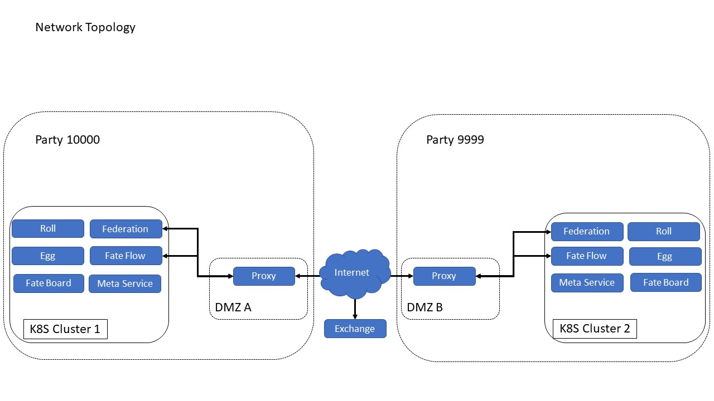

## DMZ Deployment

Many enterprises will establish DMZ when considering network security, and FATE also supports this deployment mode.



The proxy component is deployed in DMZ by docker compose, and other components are deployed in k8s cluster by helm.

### Prerequisites

- kubernetes cluster [v1.9+].
- Docker compose is supported in DMZ.
- helm.

### Deploying

#### Modify profile

configuration file  `KubeFATE/k8s-deploy/kube.cfg`.

```bash
partylist=(10000)
proxyIpList=(192.168.13.1)    # DMZ host IP, leave it empty if you don't need a splitting proxy.
```

#### Kubernetes Deployment

Generate helm chart deployment file according to `kube.cfg` .

```bash
$ cd KubeFATE/k8s-deploy/
$ bash create-helm-deploy.sh
```

helm deploy FATE.

```bash
$ helm install --name=fate-10000 --namespace=fate-10000 ./fate-10000/
```

Check whether the deployment is successful.

```bash
$ kubectl get pod -n fate-10000
```

Deployment succeeded. All pod statuses are running.

#### DMZ deployment

View kubernetes node IP.

```bash
$ kubectl get node -o wide
NAME     STATUS   ROLES    AGE   VERSION   INTERNAL-IP      EXTERNAL-IP   OS-IMAGE                KERNEL-VERSION           CONTAINER-RUNTIME
master   Ready    master   26d   v1.16.2   192.168.12.1   <none>        CentOS Linux 7 (Core)   3.10.0-1062.el7.x86_64   docker://19.3.4
node-0   Ready    <none>   26d   v1.16.2   192.168.12.2   <none>        CentOS Linux 7 (Core)   3.10.0-1062.el7.x86_64   docker://19.3.4
```

The IP of the current cluster work node is 192.168.12.2.

Get nodePort of Federation and Fateflow.

```bash
$ export Fedetation_NODE_PORT=$(kubectl get services/federation -n fate-10000 -o go-template='{{(index .spec.ports 0).nodePort}}')
$ echo Fedetation_NODE_PORT=$Fedetation_NODE_PORT
Fedetation_NODE_PORT=30792
$ export Fateflow_NODE_PORT=$(kubectl get services/fateflow -n fate-10000 -o go-template='{{(index .spec.ports 0).nodePort}}')
$ echo Fateflow_NODE_PORT=$Fateflow_NODE_PORT
Fateflow_NODE_PORT=31840
```

Generate proxy deployment.

```bash
$ bash ../docker-deploy/generate_config.sh splitting_proxy 10000 192.168.12.2 30792 192.168.12.2 31840 192.168.13.1
Handle Splitting Proxy
Splitting proxy of 10000 done!
```

Deploying proxy.

```bash
$ bash ../docker-deploy/docker_deploy.sh splitting_proxy 10000 192.168.13.1
...
party 10000 deploy is ok!
```

Normal communication of test components.

```bash
$ kubectl exec -it -c python svc/python -n fate-10000 -- bash
$ source /data/projects/python/venv/bin/activate
$ cd examples/toy_example/
$ python run_toy_example.py 10000 10000 1
...
"2019-11-27 06:30:17,232 - secure_add_guest.py[line:134] - INFO: success to calculate secure_sum, it is 1999.9999999999998"
```

Deployment success.
