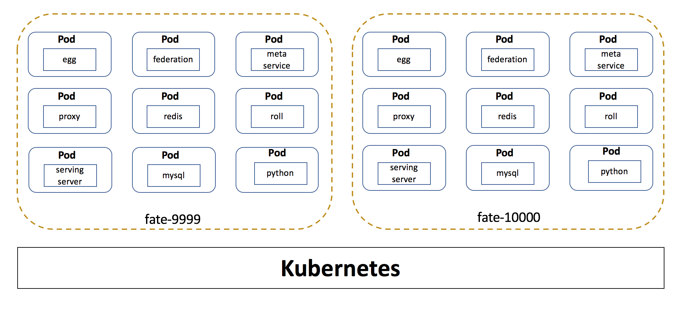
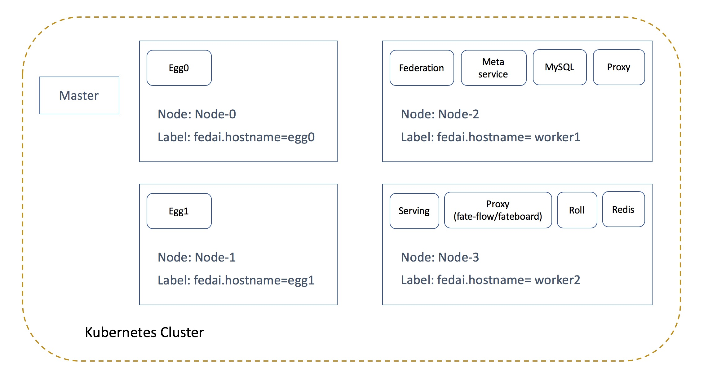

# Deployment on Kubernetes
In a multi-node deployment scenario, a user can use [Kubernetes](https://kubernetes.io/) as their underlying infrastructure to create and manage the FATE cluster. To facilitate the deployment on Kubernetes, FATE provides scripts to generate deployment files automatically for users.

## Summary

<div style="text-align:center", align=center>

</div>

Package the FATE component into a Pod, deploy two FATE parties to two namespaces, and each party has 8 pods.
The relationship between the FATE component and the pod is as follows:

Pod            | Service URL                 | FATE component          | Expose Port
---------------|-----------------------------|-------------------------|------------
egg            | egg.\<namespace>            | egg/Storage-Service-cxx | 7888,7778
federation     | federation.\<namespace>     | federation              | 9394
meta-service   | meta-service.\<namespace>   | meta-service            | 8590
proxy          | proxy.\<namespace>          | proxy                   | 9370
roll           | roll.\<namespace>           | roll                    | 8011
redis          | redis.\<namespace>          | redis                   | 6379
mysql          | mysql.\<namespace>          | mysql                   | 3306
python         | fateflow.\<namespace><br/>fateboard.\<namespace> | fate-flow/fateboard     | 9360,9380,8080

## Prerequisites
- A Linux laptop can run the installation command
- A working Kubernetes cluster(v1.9+).
- [The FATE Images](https://github.com/FederatedAI/FATE/tree/contributor_1.0_docker/docker-build) have been built and downloaded by nodes of Kubernetes cluster.
- Helm v2.14.0 or above installed

## Helm Introduction
The Helm is a package management tool of Kubernetes, it simplifies the deployment and management of applications on Kubernetes. Before using the script, a user needs to install on his machine first. For more details about Helm and installation please refer to the [official page](https://helm.sh/docs/using_helm/).

## Deploying FATE
Download KubeFATE from [releases pages](https://github.com/FederatedAI/KubeFATE/releases), unzip it into folder KubeFATE

By default, the script pulls the images from [Docker Hub](https://hub.docker.com/search?q=federatedai&type=image) during the deployment.

### Use Third Party Registry (Optional)
It is recommended that non-Internet clusters use [Harbor](https://goharbor.io/) as a third-party registry. Please refer to [this guide](https://github.com/FederatedAI/KubeFATE/blob/master/registry/install_harbor.md) to install Harbor. Change the `THIRDPARTYPREFIX` to Harbor hostname in the `.env` file. `192.168.10.1` is an example of Harbor ip.

```bash
$ cd KubeFATE/k8s-deploy/
$ vi .env

RegistryURI=192.168.10.1/federatedai
```

### Configure Parties
Before deployment, a user needs to define the FATE parties in `KubeFATE/k8s-deploy/kube.cfg`, a sample is as follows:
```bash
partylist=(10000 9999)                              # partyid
partyiplist=(192.168.11.2:30010 192.168.11.3:30009) # deploy parties Cluster any node iP/Port
exchangeip=192.168.11.4:30000                       # deploy exchange Cluster any node iP/Port
```
The above sample defines two parties, these parties will be deployed on the same Kubernetes cluster but isolated by the namespace. Moreover, each party contains one Egg service.

### Generating Deployment Files
After finished the definition, use the following command to generate deployment files:
```bash
$ cd KubeFATE/k8s-deploy/
$ bash create-helm-deploy.sh
```
According to the `kube.cfg`, the script creates three directories “fate-10000” 、“fate-9999”  and “fate-exchange” under the current path. The structure of each directory is as follows:
```
fate-*
|-- templates   
|-- Chart.yaml   
|-- values.yaml
```

- The "templates" directory contains template files to deploy FATE components. 
- The "Chart.yaml" file describes the Chart's information.
- The "values.yaml" file defines the value used to render the templates.

### Launching Deployment

First make sure that the Kubernetes cluster has three namespaces, fate-9999 fate-10000 and fate-exchange. If there is no corresponding namespace, you can create it with the following command：
```bash
$ kubectl create namespace fate-9999
$ kubectl create namespace fate-10000
$ kubectl create namespace fate-exchange
```
Then check if you have permission to deploy tiller. If not, please add an account for it with the following command:
```bash
kubectl --namespace kube-system create serviceaccount tiller

kubectl create clusterrolebinding tiller-cluster-rule \
--clusterrole=cluster-admin --serviceaccount=kube-system:tiller

kubectl --namespace kube-system patch deploy tiller-deploy \
-p '{"spec":{"template":{"spec":{"serviceAccount":"tiller"}}}}' 
```
the console output should be:
```
serviceaccount "tiller" created
clusterrolebinding "tiller-cluster-rule" created
deployment "tiller-deploy" patched
```
Then run command to update:
```bash
helm repo update
```

After successfully updated, use the following commands to deploy parties.

- Party-10000:
```
$ helm install --name=fate-10000 --namespace=fate-10000 ./fate-10000/ 
```

- Party-9999:
```
$ helm install --name=fate-9999 --namespace=fate-9999 ./fate-9999/ 
```

- Party-exchange:
```
$ helm install --name=fate-exchange --namespace=fate-exchange ./fate-exchange/ 
```

After the command returns, use `helm list` to fetch the status of deployment, an example output is as follows:
```
NAME         	REVISION	UPDATED                 	STATUS  	CHART              	APP VERSION	NAMESPACE    
fate-10000   	1       	Tue Oct 29 03:47:05 2019	DEPLOYED	fate-party-1.2.0   	1.2.0      	fate-10000   
fate-9999    	1       	Tue Oct 29 03:46:58 2019	DEPLOYED	fate-party-1.2.0   	1.2.0      	fate-9999    
fate-exchange	1       	Tue Oct 29 03:46:53 2019	DEPLOYED	fate-exchange-1.2.0	1.2.0      	fate-exchange
```

In the above deployment, the data of "mysql", "redis" and "egg" will be persisted to the worker node that hosting the services(Pod). Which means if a service shifted to the other worker node, the service will be unable to read the previous data.

A simple solution to persist the data is to use a NFS as the shared storage, so that the services can read/wirte data from/to the NFS directly. An user need to setup [NFS](https://help.ubuntu.com/lts/serverguide/network-file-system.html) first, then use the following command to deploy FATE:
```
$ helm install --set nfspath=${NfsPath} --set nfsserver=${NfsIp} --name=fate-* --namespace=fate-* ./fate-*/

# NfsPath: The NFS exposed the path
# NfsIp: The NFS IP address
```

### Verifying the Deployment
To verify the deployment, the user can log in the `python` pod of his or her party and runs example cases.
The following steps illustrate how to perform a test on `party-10000`:
1. Log into the python container
```bash
$ kubectl exec -it -c python svc/fateflow bash -n fate-10000
```
2. Run the test toy_example
```bash
$ cd /data/projects/fate/python/examples/toy_example/
$ python run_toy_example.py 10000 9999 1
```
3. Verify the output, a successful example is as follows:
```
"2019-08-29 07:21:34,118 - secure_add_guest.py[line:121] - INFO: success to calculate secure_sum, it is 2000.0000000000002"
```
The above example also shows that communication between two parties is working as intended, since the guest and the host of the example are `party-10000` and `party-9999`, respectively.

## Custom Deployment (Optional)
By default, the Kubernetes scheduler will balance the workload among the whole Kubernetes cluster. However, a user can deploy a service to a specified node by using [Node Selector](https://kubernetes.io/docs/concepts/configuration/assign-pod-node/#nodeselector). This is useful when a service requires resources like GPU, or large size hard disk which are only available on some hosts.

View your nodes by this command:  
`$ kubectl get nodes -o wide`

```bash
NAME      STATUS    AGE       VERSION       INTERNAL-IP
master    Ready     5d        v1.16.3       192.168.11.1
node-0    Ready     5d        v1.16.3       192.168.11.2
node-1    Ready     5d        v1.16.3       192.168.11.3
node-2    Ready     5d        v1.16.3       192.168.11.4
node-3    Ready     5d        v1.16.3       192.168.11.5
```

A user can tag a specified node with labels, for example:  
```bash
$ kubectl label nodes node-0 fedai.hostname=fate-node-0

node "node-0" labeled
```
The above command tagged node-0 with a label `fedai.hostname=fate-node-0`.

After tagging all nodes, verify that they are worked by running:  
`$ kubectl get nodes --show-labels`
```bash
NAME      STATUS    AGE       VERSION   LABELS
master    Ready     5d        v1.16.3   kubernetes.io/arch=amd64,kubernetes.io/hostname=master,kubernetes.io/os=linux,name=master,node-role.kubernetes.io/master=
node-0    Ready     5d        v1.16.3   ..., fedai.hostname=fate-node-0, ...
node-1    Ready     5d        v1.16.3   ..., fedai.hostname=fate-node-1, ...
node-2    Ready     5d        v1.16.3   ..., fedai.hostname=fate-node-2, ...
node-3    Ready     5d        v1.16.3   ..., fedai.hostname=fate-node-3, ...
```

With the use of node labels, a user can customize the deployment by configuring the "KubeFATE/k8s-deploy/kube.cfg". A sample is as follows:
```bash
...

# Specify k8s node selector, default use fedai.hostname
nodeLabel=fedai.hostname
# Please fill in multiple label value for multiple eggs, and split with spaces
eggList=(fate-node-0 fate-node-1) # This will deploy an egg service in node-0 and an egg service in node-1. If you only need one egg service, just fill one value.
federation=fate-node-2
metaService=fate-node-2
mysql=fate-node-2
proxy=fate-node-2
python=fate-node-3
redis=fate-node-3
roll=fate-node-3
```

<div style="text-align:center", align=center>

</div>

The above sample will deploy an `egg` service in node-0 and, an `egg` service in node-1, `federation`, `metaService`, `mysql`, `proxy` services to node-2 and `python`, `redis`, `roll` services to node-3. If no value is given, a service will be deployed in the cluster according to the strategy of the scheduler.

By default, only one egg service will be deployed. To deploy multiple egg services, please fill in the `eggList` with the label of the Kubernetes nodes (Separated with spaces). Helm will deploy one egg service to each node.

### Multi module deployment

DMZ deployment reference document [DMZ deployment](DMZ-deploy_zh.md).

### **The Visualizations**

if you kubernetes cluster deployment Ingress controller ( [ingress-nginx](https://kubernetes.github.io/ingress-nginx/deploy/) ), you can also access the FATEBoard through http://\<party-id\>.fateboard.fedai.org 

You have to modify hosts before that

```bash
<node-ip> <party-id>.fateboard.fedai.org     # Add this record to hosts
```

