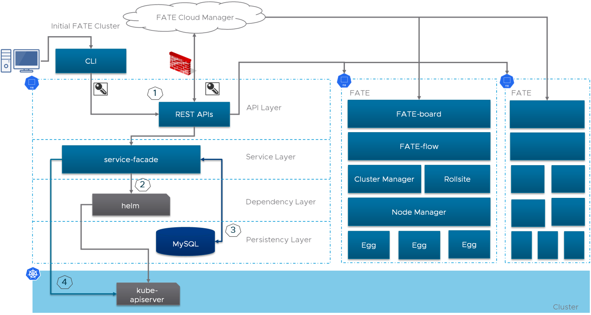
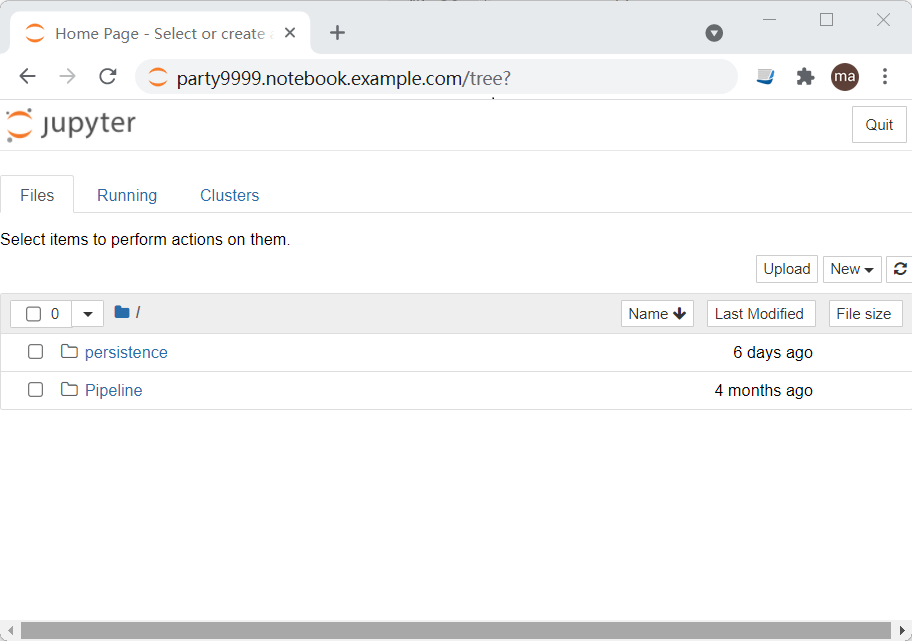

# Kubernetes Deployment
We recommend using [Kubernetes](https://kubernetes.io/) as a underlying infrastructure to create and manage the FATE clusters in a production environment. KubeFATE supports deploying multiple FATE clusters in an instance of Kubernetes with different namespaces for the purposes of development, testing and production. Considering the different IT designs and standards in each company, the actual deployment should be customized. KubeFATE is flexibile for the FATE configuration.

If you focus on how to quickly use KubeFATE, please jump to [Use Scenarios](#use-scenarios).

## High-level architecture of multiple federated learning parties
The hig-hlevel architecture of a multi-party federated learning deployment (e.g. two parties) is shown as follows:
<div align="center">
  
</div>

* KubeFATE: Orchestrates a FATE cluster of a party. It offers APIs for FATE-Cloud Manager and other management portals.
* Harbor (Optional): Versioned FATE deployments and images management.
* Kubernetes: Container orchestration engine.

KubeFATE is responsible for:
* Day 1 initialization: Provision a FATE cluster on Kubernetes
* Day 2 operations: Provides RESTful APIs to manage FATE clusters

## High-level architecture of KubeFATE
The high-level architecture of KubeFATE is shwon as follows:
<div align="center">
  
</div>

The numbers depicted in the diagram:
1. Accepting external API calls of Authentication & authorization
2. Rendering templates via Helm;
3. Storing jobs and configuration of a FATE deployment
4. KubeFATE is running as a service of Kubernetes

There are two parts of KubeFATE:
* The KubeFATE CLI. KubeFATE CLI is an executable helps to quickly initialize and manage a FATE cluster in an interactive mode. It does not rely on Kubernetes. Eventually, KubeFATE CLI calls KubeFATE Service for operations with a KubeFATE user token.
* The KubeFATE Service. The KubeFATE service provides RESTful APIs for managing FATE clusters. The KubeFATE service is deployed in Kubernetes, and exposes APIs via [Ingress](https://kubernetes.io/docs/concepts/services-networking/ingress/). For the authentication and authorization, the KubeFATE service implements [JWT](https://jwt.io/introduction/), and neutral to other security solutions which can be added to Kubernetes ingress.

KubeFATE is designed to handle different versions FATE. Normally, KubeFATE CLI and KubeFATE service can work with several FATE releases.

## User scenarios
Suppose in an organization, there are two roles:
* System Admin: who is responisble for the infrastructure management as well as Kubernetes administration
* ML Infrastructure Operators: who is responsible for managing the machine learning cluster like FATE

<div align="center">
  
</div>

### Initializing a FATE deployment
#### Creating role, namespace and other resource in Kubernetes
The sample yaml can be found in [rbac-config.yaml](./rbac-config.yaml). In this sample, we create a kube-fate namespace for KubeFATE service. Resource constraints can be applied to kube-fate namespace, refer to [Kubernetes Namespace](https://kubernetes.io/docs/concepts/overview/working-with-objects/namespaces/), [Configure Memory and CPU Quotas for Namespace](https://kubernetes.io/docs/tasks/administer-cluster/manage-resources/quota-memory-cpu-namespace/).

Run the following command to create the namespace:
```
$ kubectl apply -f ./rbac-config.yaml
```
Note that, the default username and password of KubeFATE service can be set in `rbac-config.yaml` Secret->kubefate-secret->stringData :

```
stringData:
  kubefateUsername: admin
  kubefatePassword: admin
```

#### Preparing domain name and deploying KubeFATE in Kubernetes
Because KubeFATE service exposes RESTful APIs for external access, system admin needs to prepare a domain name for KubeFATE service. In our sample, the domain name is `kubefate.net` . Moreover, system admin should create a namespace (e.g. fate-9999) for FATE deployment.
```
$ kubectl apply -f ./kubefate.yaml
$ kubectl create namespace fate-9999
```
For more about the configuration of KubeFATE service, please refer to: [KubeFATE service Configuration Guild](../docs/configurations/kubefate_service_configuration.md).

#### Preparing cluster configuration and deploying FATE
After the system admin deployed the KubeFATE service and prepared the namespace for FATE. The ML Infrastructure Operator is able to start the deployment of FATE. The `config.yaml` for `kubefate` CLI is required. It contains the username and password of KubeFATE access, and the KubeFATE service URL:

```
log:
  level: info
user:
  username: admin
  password: admin

serviceurl: kubefate.net
```

|Name       |Type    |Description                                                       |
|-----------|--------|------------------------------------------------------------------|
|log        |scalars |The log level of command line.                                    |
|user       |mappings|User name and password when logging into KubeFATE service.        |
|serviceurl |scalars |KubeFATE service's ingress domain name, defined in kubefate.yaml. |

Create a `cluster.yaml` for FATE cluster configuration. The details of configuration can be found here: [FATE Cluster Configuration Guide](../docs/configurations/FATE_cluster_configuration.md). 

**NOTE:** For Chinese user, specifying a local image registry in `cluster.yaml` can accelerate the download of images. The details is as follows:
```
registry: "hub.c.163.com/federatedai"
```

Next, install the FATE cluster,

```
$ kubefate cluster install -f ./cluster.yaml
create job success, job id=fe846176-0787-4879-9d27-622692ce181c
```
*NOTE: If you want to deploy **FATE on Spark**, you can use `cluster-spark.yaml`.*

#### Checking the status of "Installing Cluster" job
After the above command has finished, a job is created for installing a FATE cluster. Run the command `kubefate job describe` to check the status of the job, util the "Status" turns to `Success`.

```
$ kubefate job describe fe846176-0787-4879-9d27-622692ce181c
StartTime       2020-11-13 07:22:53
EndTime         2020-11-13 07:23:35
Duration        42s
Status          Success
Creator         admin
ClusterId       27e37a60-fffb-4031-a76f-990b2ff43cf2
States          - update job status to Running
                - create cluster in DB Success
                - overwrite current installation
                - helm install success
                - checkout cluster status [28]
                - job run Success
SubJobs         clustermanager       PodStatus: Running, SubJobStatus: Success, Duration:     6s, StartTime: 2020-11-13 07:22:53, EndTime: 2020-11-13 07:22:59
                fateboard            PodStatus: Running, SubJobStatus: Success, Duration:     1s, StartTime: 2020-11-13 07:22:53, EndTime: 2020-11-13 07:22:55
                mysql                PodStatus: Running, SubJobStatus: Success, Duration:     8s, StartTime: 2020-11-13 07:22:53, EndTime: 2020-11-13 07:23:01
                nodemanager-0        PodStatus: Running, SubJobStatus: Success, Duration:     8s, StartTime: 2020-11-13 07:22:53, EndTime: 2020-11-13 07:23:01
                nodemanager-1        PodStatus: Running, SubJobStatus: Success, Duration:     8s, StartTime: 2020-11-13 07:22:53, EndTime: 2020-11-13 07:23:01
                python               PodStatus: Running, SubJobStatus: Success, Duration:     1s, StartTime: 2020-11-13 07:22:53, EndTime: 2020-11-13 07:22:55
                rollsite             PodStatus: Running, SubJobStatus: Success, Duration:     8s, StartTime: 2020-11-13 07:22:53, EndTime: 2020-11-13 07:23:01
                client               PodStatus: Running, SubJobStatus: Success, Duration:    42s, StartTime: 2020-11-13 07:22:53, EndTime: 2020-11-13 07:23:35
```
#### Describing the cluster and finding FATE access information
After the `installing cluster` job succeeded, use `kubefate cluster describe` to check the FATE access information:
```
$ kubefate cluster describe 27e37a60-fffb-4031-a76f-990b2ff43cf2
UUID            27e37a60-fffb-4031-a76f-990b2ff43cf2
Name            fate-9999
NameSpace       fate-9999
ChartName       fate
ChartVersion    v1.5.0
REVISION        1
Age             92s
Status          Running
Spec            name: fate-9999
                namespace: fate-9999
                chartName: fate
                chartVersion: v1.5.0
                partyId: 9999
                ......
                
Info            dashboard:
                - 9999.notebook.kubefate.net
                - 9999.fateboard.kubefate.net
                ip: 192.168.0.1
                pod:
                - clustermanager-78f98b85bf-ph2hv
                ......
                status:
                  modules:
                    client: Running
                    clustermanager: Running
                    fateboard: Running
                    mysql: Running
                    nodemanager-0: Running
                    nodemanager-1: Running
                    python: Running
                    rollsite: Running
```

#### Access the UI of FATEBoard and Notebook

If the components of fateboard and client are installed, you can use the information `9999.fateboard.kubefate.net` and `9999.notebook.kubefate.net` obtained in the previous step to access FATEBoard and Notebook UI, and configure the resolution of these two domain names It can be opened in the browser.

##### FATEBoard

 http://9999.fateboard.kubefate.net

Access to FATEBoard UI requires a login user name and password, which can be found in `cluster.yaml` [Configuration](../docs/configurations/FATE_cluster_configuration.md#fateboard mappings).


##### Notebook

 http://9999.fateboard.kubefate.net



### Other user scenarios
#### [Manage FATE and FATE-Serving Version](../docs/Manage_FATE_and_FATE-Serving_Version.md)
#### [Update and Delete a FATE Cluster](../docs/Update_and_Delete_a_FATE_Cluster.md)
#### [KubeFATE Examples](examples)

#### [KubeFATE Command Line User Guide](../docs/KubeFATE_command_line_user_guide.md)

## KubeFATE service RESTful APIs reference
#### [API Reference](docs/KubeFATE_API_Reference_Swagger.md)
