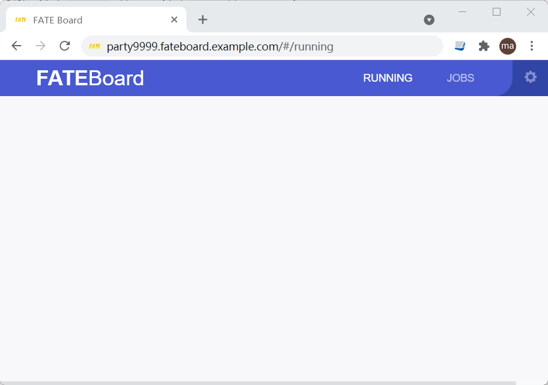

# Kubernetes部署方案
我们推荐在生产环境中使用[Kubernetes](https://kubernetes.io/) 作为底层的基础平台支撑FATE集群的创建、管理。KubeFATE目前支持在一个Kubernetes平台上以不同的namespace部署多个FATE集群，用于开发、测试和产品等场景。考虑到不同企业的IT设计和标准各异，KubeFATE提供灵活的机制支持定制化安装、配置FATE。KubeFATE的设计架构分离了主程序服务与FATE的具体配置。

如果您想快速了解如何使用KubeFATE，可以跳转到[用户场景](#use-scenarios)章节。

## 多方联邦学习高层架构
抽象从高层去表现多方（譬如两方）联邦学习的机构，如下图：
<div align="center">
  
</div>

* KubeFATE： 负责在一方内编排FATE集群，提供管理API给FATE-CLoud做总体调控管理
* Harbor (可选)： 负责FATE部署，相关镜像的版本管理
* Kubernetes：编排引擎

KubeFATE负责：
* Day 1初始化： 可执行二进制文件负责部署、配置FATE集群；
* Day 2运维管理：提供可执行二进制工具进行日常运维，且提供RESTful APIs以供与FATE-Cloud或者企业管理系统进行整合。

## KubeFATE架构图
KubeFATE的架构可表现如下图：
<div align="center">
  
</div>

图中所标为：
1. 请求进行授权认证；
2. 渲染Helm模板；
3. 持久化任务及配置FATE的部署规范；
4. KubeFATE作为Kubernetes的应用部署提供服务

所以，KubeFATE由两大部分构成：
* KubeFATE命令行工具。KubeFATE命令行为可执行二进制，用作快速初始化、部署、管理FATE集群。它设计为可以在Kubernetes集群外使用，并使用独立的授权机制。在底层实现中，命令行会调用KubeFATE服务实行Kuberentes的操作；
* KubeFATE服务。KubeFATE服务向外提供RESTful APIs供管理FATE集群。它的API服务建立在Kubernetes的[Ingress](https://kubernetes.io/docs/concepts/services-networking/ingress/)技术上，可以轻易与各种管理平台、网络设备进行整合。KubeFATE实现了独立的授权认证机制，基于[JWT](https://jwt.io/introduction/)。

KubeFATE在设计上分离了服务与FATE集群的配置(基于Helm Chart)，譬如版本升级等。所以在大多版本下，KubeFATE可以实现FATE集群的独立升级，往往只需要配置一行修改。

## 用户场景
假设在一个组织内部，有两个不同角色：
* 系统管理员： 负责基础设施的管理，包括Kubernetes的管理；
* 机器学习的系统运维： 负责管理机器学习相关服务，譬如FATE的管理。
<div align="center">
  
</div>
### 初始化新的FATE集群

依赖软件的建议版本：

Kubernetes: [v1.23.5](https://github.com/kubernetes/kubernetes/releases/tag/v1.23.5)

Ingress-nginx: [v1.1.3](https://github.com/kubernetes/ingress-nginx/releases/tag/controller-v1.1.3)

#### 创建Kubernetes服务账号、namespace等
我们的发布包提供了[rbac-config.yaml](./rbac-config.yaml)作为样例。但是现实使用请与系统管理员确认权限问题，以及商量资源配额。更多请参考[Kubernetes Namespace](https://kubernetes.io/docs/concepts/overview/working-with-objects/namespaces/)和[Configure Memory and CPU Quotas for Namespace](https://kubernetes.io/docs/tasks/administer-cluster/manage-resources/quota-memory-cpu-namespace/)。

```
kubectl apply -f ./rbac-config.yaml
```

请务必注意，默认的用户名密码，设置在```Secret->kubefate-secret->stringData```:
```
stringData:
  kubefateUsername: admin
  kubefatePassword: admin
```

具体参考：[Overview of Cloud Native Security](https://kubernetes.io/docs/concepts/security/)。

#### 准备域名及部署KubeFATE服务
因为KubeFATE服务向外暴露RESTful APIs，所以系统管理员需要为此准备域名的DNS解析。在我们的配置样例里，使用```example.com```作为域名。同时，系统管理员需要为每个FATE集群创建一个namespace，譬如party_id为9999的FATE集群，创建一个fate-9999的namespace，然后进行配额控制。准备好后，把这些信息反馈给机器学习的系统运维。

```
kubectl apply -f ./kubefate.yaml
kubectl create namespace fate-9999
```

具体创建KubeFATE服务的配置，可以参考： [KubeFATE service Configuration Guild](../docs/configurations/kubefate_service_configuration.md)。

#### 准备FATE的安装配置文件并部署FATE
当系统管理员成功部署了KubeFATE服务，并准备好新的FATE集群namespace，机器学习的系统运维可以根据这些信息开始部署FATE集群。`config.yaml`是使用KubeFATE命令行的配置文件，包含KubeFATE服务的访问用户名密码，以及log配置，域名。

```
log:
  level: info
user:
  username: admin
  password: admin

serviceurl: example.com
```

|名字       |种类    |描述                                                       |
|---------- |--------|-------------------------------------------------------   |
|log        |scalars |命令行的log级别.debug级别包含REST通信信息                    |
|user       |mappings|KubeFATE的认证用户名、密码                                  |
|serviceurl |scalars |KubeFATE服务使用的域名                                     |

我们的配置样例里还包含了`cluster.yaml`，是FATE集群的部署计划。更多自定义内容参考：[FATE Cluster Configuration Guild](../docs/configurations/FATE_cluster_configuration.md)

**注意:** 对于中国的用户，可以通过在`cluster.yaml`修改`registry`来加速镜像的下载，具体设置内容如下：
```
registry: "hub.c.163.com/federatedai"
```

准备好后，通过```kubefate cluster install```命令进行部署FATE集群：

```
$ kubefate cluster install -f ./cluster.yaml
create job success, job id=d92d7a56-7002-46a4-9363-da9c7346e05a
```

*如果想要部署使用 **Spark** 计算引擎的FATE集群，可以使用`cluster-spark.yaml`。*

#### 检查安装集群任务的状态
上面的命令会创建一个安装FATE集群的任务，用于异步部署。使用```kubefate job describe```命令可以检查任务的状态，直到看到结果为`install success`

```bash
$ kubefate job describe d92d7a56-7002-46a4-9363-da9c7346e05a
UUID     	d92d7a56-7002-46a4-9363-da9c7346e05a
StartTime	2022-04-12 07:34:09
EndTime  	2022-04-12 07:48:14
Duration 	14m
Status   	Success
Creator  	admin
ClusterId	24bb75ff-f636-4c64-8c04-1b9073f89a2f
States   	- update job status to Running
         	- create Cluster in DB Success
         	- helm install Success
         	- checkout Cluster status [794]
         	- job run Success

SubJobs  	nodemanager-0        ModuleStatus: Available, SubJobStatus: Success, Duration:    13m, StartTime:
         	2022-04-12 07:34:09, EndTime: 2022-04-12 07:47:26
         	nodemanager-1        ModuleStatus: Available, SubJobStatus: Success, Duration:    13m, StartTime:
         	2022-04-12 07:34:09, EndTime: 2022-04-12 07:47:18
         	python               ModuleStatus: Available, SubJobStatus: Success, Duration:    14m, StartTime:
         	2022-04-12 07:34:09, EndTime: 2022-04-12 07:48:14
         	rollsite             ModuleStatus: Available, SubJobStatus: Success, Duration:    13m, StartTime:
         	2022-04-12 07:34:09, EndTime: 2022-04-12 07:47:24
         	client               ModuleStatus: Available, SubJobStatus: Success, Duration:    11m, StartTime:
         	2022-04-12 07:34:09, EndTime: 2022-04-12 07:45:22
         	clustermanager       ModuleStatus: Available, SubJobStatus: Success, Duration:    13m, StartTime:
         	2022-04-12 07:34:09, EndTime: 2022-04-12 07:47:11
         	mysql                ModuleStatus: Available, SubJobStatus: Success, Duration:    13m, StartTime:
         	2022-04-12 07:34:09, EndTime: 2022-04-12 07:47:11
```

#### 描述集群的情况，以及FATE集群访问信息
当我们看到上面命令的返回结果出现`install success`，就可以使用```kubefate cluster describe```查看FATE集群的访问信息
```bash
$ kubefate cluster describe 24bb75ff-f636-4c64-8c04-1b9073f89a2f
UUID        	24bb75ff-f636-4c64-8c04-1b9073f89a2f
Name        	fate-9999
NameSpace   	fate-9999
ChartName   	fate
ChartVersion	v1.8.0
Revision    	1
Age         	44h
Status      	Running
Spec        	backend: eggroll
            	chartName: fate
            	chartVersion: v1.8.0
            	imagePullSecrets:
            	- name: myregistrykey
            	imageTag: 1.8.0-release
            	ingress:
            	  client:
            	    hosts:
            	    - name: party9999.notebook.example.com
            	  fateboard:
            	    hosts:
            	    - name: party9999.fateboard.example.com
            	ingressClassName: nginx
            	istio:
            	  enabled: false
            	modules:
            	- rollsite
            	- clustermanager
            	- nodemanager
            	- mysql
            	- python
            	- fateboard
            	- client
            	name: fate-9999
            	namespace: fate-9999
            	partyId: 9999
            	persistence: false
            	podSecurityPolicy:
            	  enabled: false
            	pullPolicy: null
            	python:
            	  grpcNodePort: 30092
            	  httpNodePort: 30097
            	  logLevel: INFO
            	  type: NodePort
            	registry: ""
            	rollsite:
            	  nodePort: 30091
            	  partyList:
            	  - partyId: 10000
            	    partyIp: 192.168.10.1
            	    partyPort: 30101
            	  type: NodePort
            	servingIp: 192.168.9.2
            	servingPort: 30095

Info        	dashboard:
            	- party9999.notebook.example.com
            	- party9999.fateboard.example.com
            	ip: 192.168.9.1
            	port: 30091
            	status:
            	  containers:
            	    client: Running
            	    clustermanager: Running
            	    fateboard: Running
            	    mysql: Running
            	    nodemanager-0: Running
            	    nodemanager-0-eggrollpair: Running
            	    nodemanager-1: Running
            	    nodemanager-1-eggrollpair: Running
            	    python: Running
            	    rollsite: Running
            	  deployments:
            	    client: Available
            	    clustermanager: Available
            	    mysql: Available
            	    nodemanager-0: Available
            	    nodemanager-1: Available
            	    python: Available
            	    rollsite: Available
```

#### 访问 FATEBoard 和 Notebook UI

假如安装了fateboard 和client 的组件就可以通过上一步得到的信息`party9999.fateboard.example.com` 和`party9999.notebook.example.com`来访问 FATEBoard 和 Notebook UI，配置下这两个域名的解析就可以在浏览器打开。

##### FATEBoard

 http://party9999.fateboard.example.com

访问FATEBoard UI需要登录用户名和密码，这个可以在`cluster.yaml`里[配置](../docs/configurations/FATE_cluster_configuration.md#fateboard mappings)。



##### Notebook

 http://party9999.fateboard.example.com


### 其他常用用户场景
#### [Manage FATE and FATE-Serving Version](../docs/Manage_FATE_and_FATE-Serving_Version.md)
#### [Update and Delete a FATE Cluster](../docs/Update_and_Delete_a_FATE_Cluster.md)
#### [KubeFATE Examples](examples)

#### [KubeFATE Command Line User Guide](../docs/KubeFATE_command_line_user_guide.md)

## KubeFATE服务的API参考
#### [API Reference](docs/KubeFATE_API_Reference_Swagger.md)

