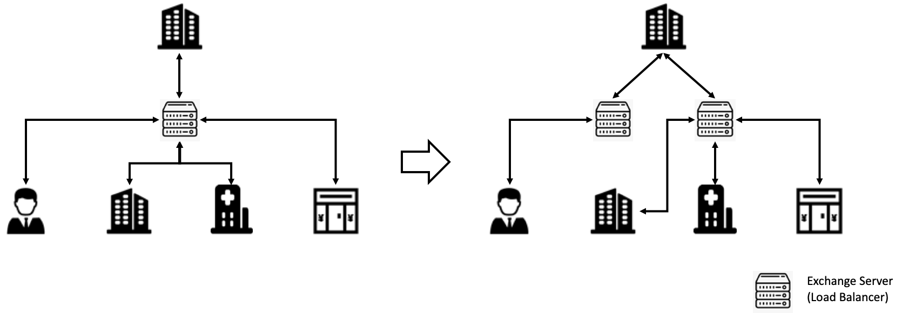

[TOC]

## Motivation

Load balancing across multiple application instances, here refers to Federated Learning jobs, is a commonly used technique for optimizing resource utilization, maximizing throughput, reducing latency, and ensuring fault‑tolerant configurations. In actual industrial use, we found that deploying only one exchange server will cause the data of multiple tasks to be forwarded through the single exchange server, resulting in lower performance and possible single point of failure. Therefore, we propose to add the load balancing mechanism of the exchange server on the original basis to avoid the above problems.

## Goals

+ Solve the single point of failure of the exchange server
+ Improve the performance of running multiple tasks when using a single exchange server

## Non-Goals
+ Solve the single point of failure of rollsite and its performance problems in each party.

## UI or API
Helm Charts `yaml` file

~~~yaml
module:
  ...
  - exchange
 
exchange:
  ip: xxx.xxx.xxx.xxx
  port: 9360
  fedlist:
    - name: party_1
      ip: xxx.xxx.xxx.xxx
      port: xxxx
    - name: party_2
      ip: xxx.xxx.xxx.xxx
      port: xxxx
~~~

## Design

We set the original only one exchange server to multiple, and add the load balancer of the exchange server to the Nginx module, which can load balance multiple tasks among different users to different exchange servers, improve transmission efficiency and avoid single points malfunction. For implementation, we should start multiple exchange servers, and add the nginx module to the  configuration `yaml` file.

### Exchange module

We can start a Nginx service in each party and server as a load balancer, which will forward the data to different exchange servers.

~~~
http {
 		...
    upstream exchange_lb {
        least_conn;
        {{- range .Values.exchangeList }}
        server {{ .ip }}:{{ .port }};
        {{ end }}
    }

    server {
        listen       9390 http2;
        location / {
            grpc_pass grpc://exchange_lb;
        }
    }
}
~~~