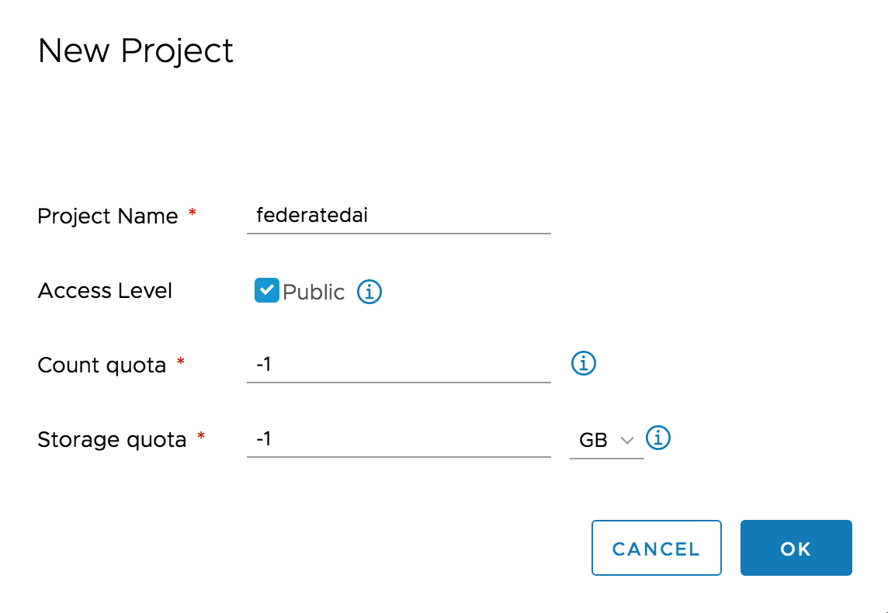
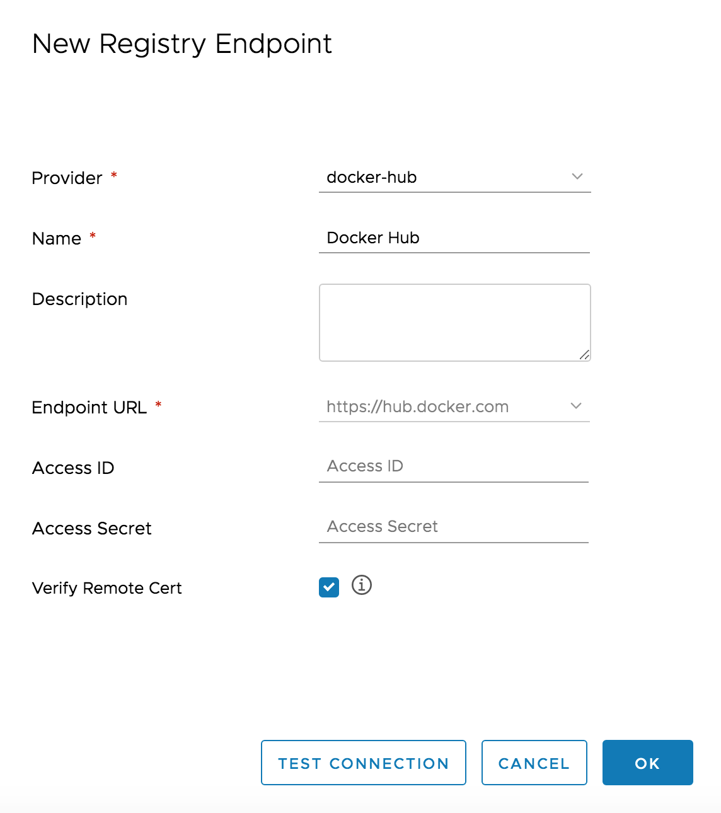
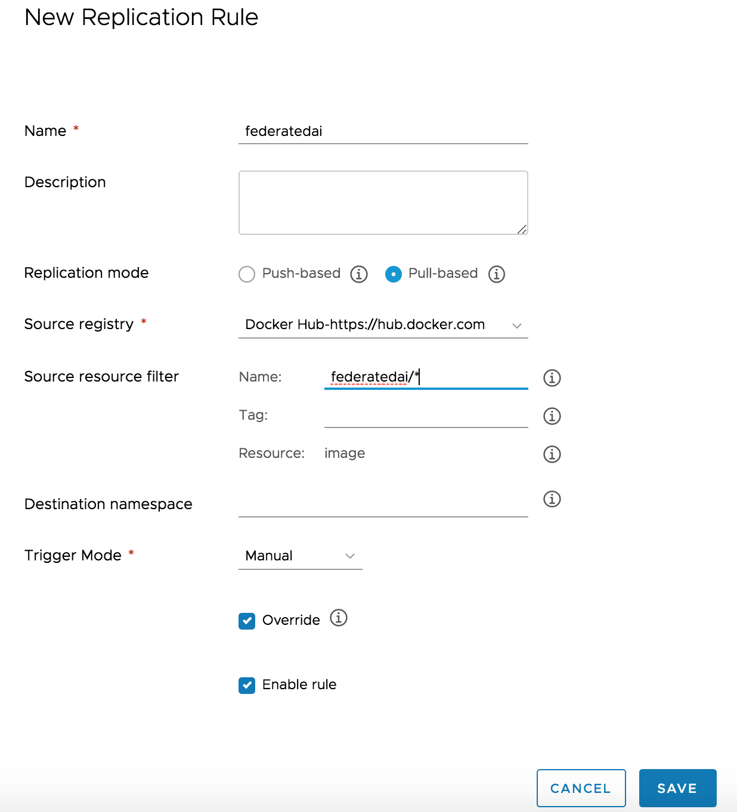
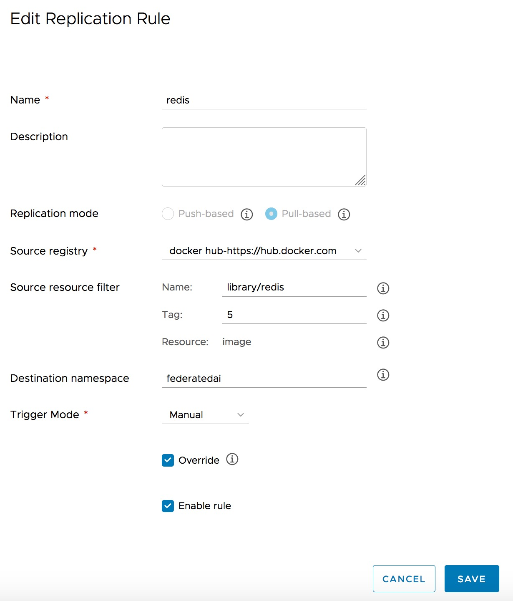

# Installing Harbor as a local Registry
Harbor is an open source trusted cloud native registry project that stores, signs, and scans content. Harbor extends the open source Docker Distribution by adding the functionalities usually required by users such as security, identity and management. Having a registry closer to the build and run environment can improve the image transfer efficiency.

Detailed document please refer to [here](https://github.com/goharbor/harbor/blob/master/docs/installation_guide.md).

## Prerequisites
The requirements of the host to install Harbor are as follows:
1. A Linux host
2. Docker: 18+
3. Docker-Compose: 1.18+
 

### Downloading the installer

The binary of the offline installer can be downloaded from the release page of [Harbor](https://github.com/goharbor/harbor/releases/tag/v1.9.3). Use *tar* command to extract the package.

```bash
    $ tar xvf harbor-offline-installer-v1.9.3.tgz
```

### Configuring Harbor

Configuration parameters are located in the file `harbor.yml`. Change hostname the local IP adress of your Harbor host, such as 192.168.0.1:

```bash
    hostname: 192.168.10.1
```

### Installing Harbor
Run the below command to install Harbor. After installation, Harbor registry service should be up and running:

```bash
    $ sudo ./install.sh
```

### Configuring docker client:
The default installation of Harbor uses HTTP - as such, you need to add the option `--insecure-registry` to your client's Docker daemon and restart the Docker service.

```bash
    $ sudo vi /etc/docker/daemon.json

    {  
        "insecure-registries" : [ "192.168.10.1" ]  
    }
```

Restart docker daemon:

```bash
    $ sudo service docker restart
```


### Preparing FATE Images in Harbor

After Harbor has been installed, FATE docker images must be pushed to Harbor registry so that other nodes can pull FATE images from Harbor. There are basically two ways to obtain the FATE images:

- Build images from FATE source code and push to Harbor

- Replicate FATE imges from Docker Hub to Harbor

#### Build images from FATE source code

Refer to [Build Document](https://github.com/FederatedAI/FATE/blob/master/docker-build/README.md) to create FATE iamges. Once images are built, push them to Harbor.

Usually, a user does not need to take the lenghty time to build images from source. It is recommended to use te pre-built docker images of FATE directly. Refer to te below section to for more details.

#### Replicating images from Docker Hub

Log into Harbor's management portal using the URL `http://<your_harbor_host_ip`. The default username and password is admin / Harbor12345.

Go to `Projects` tab and click the `+ New Project` button.

<div style="text-align:left", align=left>

</div>

- Create a new project and name the project `federatedai`. Check on the "Access Level" checkbox to make this a public project.

Go to `Registries` tab and click the `+ New Endpoint` button to add Docker Hub for the replication of FATE images.

<div style="text-align:left", align=left>

</div>

- Choose `docker-hub` as `provider` .

Go to `Replications` and click the `+ New Replication Rule` to create a rule to replicate container images from Docker Hub.

<div style="text-align:left", align=left>

</div>

Choose pull-based `Replication mode` and docker hub endpoint as source registry.  

In thhe Source resource filters, under **Name**, enter `federatedai/* `. Click `Save` to create the rule.

Next, select the newly created replication rule and click `REPLICATE`, the FATE images from Docker Hub will be replicated to Harbor immediately. Depending on the network bandwidth, the images will appear under porject `federatedai` after the images have been replicated. Now FATE images are ready for local environment to pull from.

For KubeFATE, you also need to replicate the `MySQL` and `Redis` images.

<div style="text-align:left", align=left>

</div>

<div style="text-align:left", align=left>

</div>

MySQL version is `8` and Redis version is `5`. They both need to specify the **Destination namespace** as `federatedai`.

**NOTE:** The replication rule continues to take effect until it is disabled or cancelled. If FATE images are avaiable for a new release, they will be replicated to Harbor automatically. 

