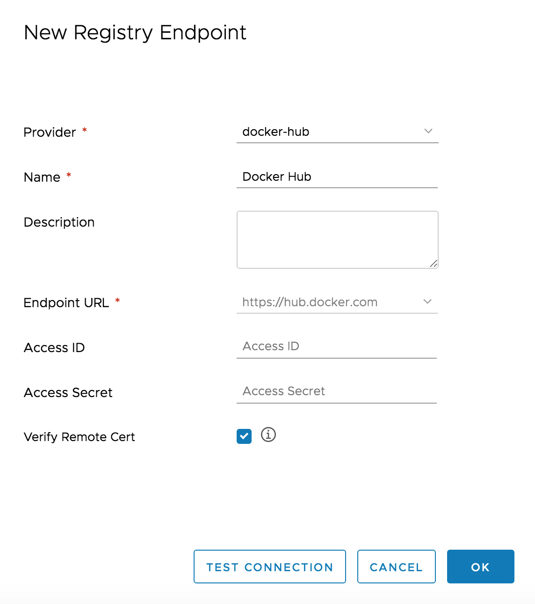

# Installing Harbor as a local Registry
Harbor is an open source trusted cloud native registry project that stores, signs, and scans content. Harbor extends the open source Docker Distribution by adding the functionalities usually required by users such as security, identity and management. Having a registry closer to the build and run environment can improve the image transfer efficiency.

Detailed document please refer to [here](https://github.com/goharbor/harbor/blob/master/docs/installation_guide.md)

### Downloading the installer

The binary of the installer can be downloaded from the [Harbor](https://github.com/goharbor/harbor/releases/tag/v1.9.1). Use *tar* command to extract the package.

Offline installer:

```bash
    $ tar xvf harbor-offline-installer-v1.9.1.tgz
```

### Configuring Harbor

Configuration parameters are located in the file harbor.yml. Change hostname to local ip, such as 192.168.0.1.

```bash
    hostname: 192.168.10.1
```

### Configuring docker client:
The default installation of Harbor uses HTTP - as such, you will need to add the option `--insecure-registry` to your client's Docker daemon and restart the Docker service.

```bash
    $ sudo vi /etc/docker/daemon.json

    {  
        "insecure-registries" : [ "192.168.10.1" ]  
    }
```

Restart docker daemon:

```bash
    $ sudo service docker restart
```

### Installing Harbor

```bash
    $ sudo ./install.sh
```

### Preparing FATE Images

There are two ways to manage images:

- Build image from FATE source code

- Replicate from Docker Hub

#### Build image from FATE source code

Detailed build document please refer to [here](https://github.com/FederatedAI/FATE/blob/master/docker-build/README.md).

#### Replicating images from Docker Hub

Go to Projects and click the + New Project button.

<div style="text-align:left", align=left>

</div>

- Name the project `federatedai`. Check on the "Access Level" checkbox will make this project public.

Go to Registries and click the + New Endpoint button.

<div style="text-align:left", align=left>

</div>

- Choose provider to docker-hub.

Go to Replications and click the + New Replication Rule.

<div style="text-align:left", align=left>

</div>

Replication mode selection pull-based and docker hub endpoint.  
Three resource filters are supported:
* **Name**: Filter resources according to the name.
* **Tag**: Filter resources according to the tag.
* **Resource**: Filter images according to the resource type.

The terms supported in the pattern used by name filter and tag filter are as follows:
* **\***: Matches any sequence of non-separator characters `/`.
* **\*\***: Matches any sequence of characters, including path separators `/`.
* **?**: Matches any single non-separator character `/`.
* **{alt1,...}**: Matches a sequence of characters if one of the comma-separated alternatives matches.

Select a replication rule and click REPLICATE, the resources which the rule is applied to will be replicated from the source registry to the destination immediately. Depending on the network bandwidth, the resources will appear under porject `federatedai` after the images have been replicated.
